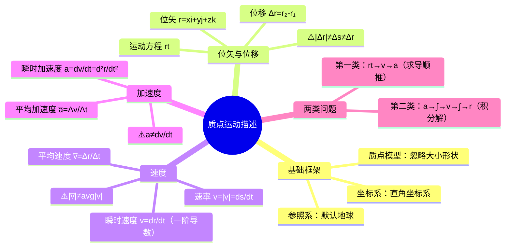

# 大物：质点运动描述的物理量

> 📌 重构说明：本笔记是大学物理第一章的开篇，建立质点运动学的基本概念体系。已按「参照系与坐标系→位矢→位移→速度→加速度→两类问题」的知识逻辑重排，并补充了 $|\Delta\vec{r}|$、$\Delta s$、$\Delta r$ 三者的辨析陷阱和微积分思维在运动学中的应用。

## 🧠 思维导图

---

## 一、基础框架

==研究对象必须先简化：== 把物体视为[[质点模型]]（无大小、无形状，但有质量的理想模型），然后选定[[参照系]]（默认地球），再选取合适的[[坐标系]]（本课程以直角坐标系为主）。

> 📖 补充：哪些情况不能用[[质点模型]]？——物体自身转动（如陀螺自旋）、形变不可忽略（如弹簧振动）时必须用[[刚体模型]]或弹性体模型。

---

## 二、位置矢量（[[位矢]]）

从坐标原点向质点位置引的有向线段：

$$\vec{r} = x\vec{i} + y\vec{j} + z\vec{k}$$

大小：$r = |\vec{r}| = \sqrt{x^2 + y^2 + z^2}$

**[[运动方程]]**：$\vec{r}(t) = x(t)\vec{i} + y(t)\vec{j} + z(t)\vec{k}$（位矢随时间变化的函数）

---

## 三、[[位移]]——第一个易错重灾区 ⚡️

$$\Delta\vec{r} = \vec{r}_2 - \vec{r}_1$$

> [!warning] 考点
> ⚠️ $|\Delta\vec{r}|$（位移的大小）、$\Delta s$（[[路程]]）、$\Delta r$（位矢长度增量）——**三者一般不相等**，是填空题/选择题的经典错误选项。

| 量 | 含义 | 性质 |
|------|------|------|
| $|\Delta\vec{r}|$ | 起点到终点的直线距离 | 矢量模 |
| $\Delta s$ | 沿轨迹走过的总里程 | 标量，$\Delta s \ge |\Delta\vec{r}|$ |
| $\Delta r$ | $r_2 - r_1$（位矢长度的差） | 标量差 |

**特殊情况下相等**：单向直线运动 → $|\Delta\vec{r}| = \Delta s$。取微元极限 → $|d\vec{r}| = ds \neq dr$。

---

## 四、[[速度]]

| | 平均速度 | 瞬时速度 |
|------|----------|----------|
| 公式 | $\vec{v} = \Delta\vec{r}/\Delta t$ | $\vec{v} = d\vec{r}/dt$ |
| 方向 | 与 $\Delta\vec{r}$ 同向 | 轨迹切线方向 |
| 大小 | $|\vec{v}|$ ≠ 平均速率 | $v = |\vec{v}| = ds/dt$ = [[速率]] |

> [!warning] 考点
> ⚠️ 平均速度的大小 ≠ 平均速率（路程/时间）。只有在单向直线运动中才相等。

---

## 五、[[加速度]]——第二个易错重灾区 ⚡️

$$\vec{a} = \frac{d\vec{v}}{dt} = \frac{d^2\vec{r}}{dt^2}$$

> [!warning] 考点
> ⚠️ $a = |d\vec{v}/dt| \neq dv/dt$。$dv/dt$ 只是速率的导数——速率的增量不等于速度增量的模。这是整个运动学中最容易混淆的一对表达式。

---

## 六、两类基本问题

| 类型 | 已知 | 求 | 方法 |
|------|------|----|------|
| **[[第一类问题]]** | 运动方程 $\vec{r}(t)$ | $\vec{v}$、$\vec{a}$ | ==求导（顺推）== |
| **[[第二类问题]]** | 加速度 $\vec{a}$ + 初始条件 | $\vec{v}(t)$、$\vec{r}(t)$ | ==积分 + 代初始条件（反推）== |

详见 [[02_质点运动学两类问题与例题]]。

---

> 📂 所属分类：[[大物-力学|力学]]

##  核心词条索引

| 知识点链接 | 类别 | 关键词 |
|------|------|--------|
| [[质点模型]] | 基础假设 | 忽略大小形状，只保留质量 |
| [[位矢]] | 核心概念 | 原点→质点的有向线段 |
| [[运动方程]] | 核心概念 | $\vec{r}(t)$，描述位矢随时间的函数 |
| [[位移]] | 核心概念 | $\vec{r}_2 - \vec{r}_1$，矢量 |
| [[路程]] | 辨析 | 标量，轨迹总长 |
| [[速度]] | 核心概念 | $\vec{v} = d\vec{r}/dt$，切线方向 |
| [[速率]] | 核心概念 | $v = |\vec{v}| = ds/dt$ |
| [[加速度]] | 核心概念 | $\vec{a} = d\vec{v}/dt = d^2\vec{r}/dt^2$，速度的一阶导数 |
| [[第一类问题]] | 方法 | $\vec{r}(t) \to \vec{v} \to \vec{a}$，求导 |
| [[第二类问题]] | 方法 | $\vec{a} \to \vec{v} \to \vec{r}$，积分+初始条件 |

