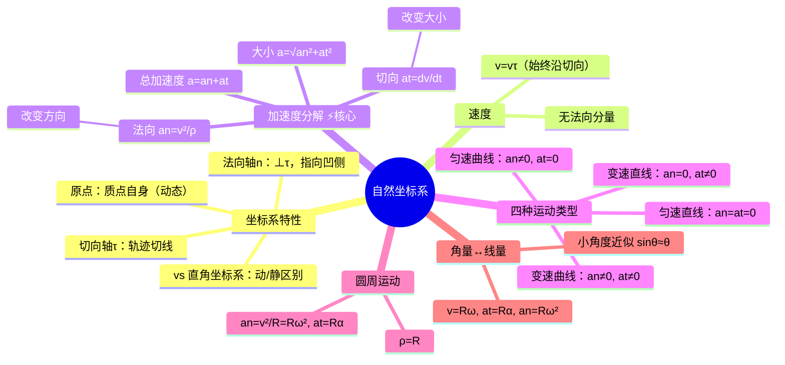

# 大物：自然坐标系与加速度分解

> 📌 重构说明：本笔记聚焦于[[自然坐标系]]下[[加速度]]的切向/法向分解——这是大学物理区别于高中物理的关键升级。已按「自然坐标系建立→速度描述→加速度分解原理→四种运动类型判断→圆周运动特例→角量与线量关系」的逻辑链重排，补充了抛体运动中切向/法向加速度的动态变化分析。

## 🧠 思维导图

---

## 一、自然坐标系的建立

==[[自然坐标系]]是「跟着质点跑」的坐标系==。原点始终取在质点上，切向轴 $\tau$ 沿轨迹切线指向前进方向，法向轴 $n$ 垂直于切向轴指向运动轨迹的凹侧。

| 自然坐标系 | 直角坐标系 |
|-----------|-----------|
| 原点动态（随质点移动） | 原点固定 |
| 轴向 $\tau, n$（由运动决定） | 轴向 $\vec{i}, \vec{j}, \vec{k}$（固定） |
| 适合曲线运动 | 适合直线运动 |

---

## 二、速度在自然坐标系中

$$\vec{v} = \frac{ds}{dt}\vec{\tau} = v\vec{\tau}$$

==速度始终沿切向，不存在法向分量。== 这就是[[自然坐标系]]的优雅之处——用一个标量 $v = ds/dt$ 和一个单位矢量 $\vec{\tau}$ 就完整描述了速度。

---

## 三、加速度的切向/法向分解 ⚡️ 核心

$$\boxed{\vec{a} = \vec{a}_n + \vec{a}_t = \frac{v^2}{\rho}\vec{n} + \frac{dv}{dt}\vec{\tau}}$$

| 分量 | 公式 | 方向 | 物理意义 |
|------|------|------|----------|
| ==[[法向加速度]]== | $a_n = \dfrac{v^2}{\rho}$ | 指向凹侧（圆心） | **只改变速度方向**，不改变大小 |
| ==[[切向加速度]]== | $a_t = \dfrac{dv}{dt}$ | 沿切线方向 | **只改变速度大小**，不改变方向 |

总加速度大小：$a = \sqrt{a_n^2 + a_t^2}$

> [!warning] 考点
> ⚠️ $a_n = v^2/\rho$ 改变方向，$a_t = dv/dt$ 改变大小——这是切向/法向分解的核心思想，也是区分线/角运动的桥梁。

> 📖 补充推导思路：$a_n$ 的推导来自速度方向的旋转——$\Delta\vec{v}_1$ 是两时刻速度方向差异导致的增量，取极限后其大小为 $v\Delta\theta/\Delta t \to v\omega = v^2/\rho$。

---

## 四、四种运动类型判定表

| $a_n$ | $a_t$ | 运动类型 | 典型实例 |
|-------|-------|----------|----------|
| 0 | 0 | ==匀速直线运动== | 光滑平面上的滑块 |
| 0 | ≠ 0 | ==变速直线运动== | 匀加速下落的自由落体 |
| ≠ 0 | 0 | ==匀速曲线运动== | 匀速圆周运动 |
| ≠ 0 | ≠ 0 | ==变速曲线运动== | 抛体运动（除最高点外） |

> 📖 补充：抛体运动中，$a_t = g\sin\theta$ 随轨迹角度 $\theta$ 变化——上升段 $\theta$ 减小 → $a_t$ 减小，最高点 $\theta=0$ → $a_t=0$、$a_n=g$；下降段 $\theta$ 增大 → $a_t$ 增大。全程 $a_n + a_t$ 始终满足 $\vec{a} = \vec{g}$。

---

## 五、圆周运动中的角量与线量

| 角量 | 线量 | 关系式 |
|------|------|--------|
| 角位移 $\theta$ | 弧长 $s$ | $s = R\theta$ |
| [[角速度]] $\omega = d\theta/dt$ | 线速度 $v$ | ==$v = R\omega$== |
| [[角加速度]] $\alpha = d\omega/dt$ | 切向加速度 $a_t$ | ==$a_t = R\alpha$== |
| — | 法向加速度 $a_n$ | ==$a_n = R\omega^2 = v^2/R$== |

> [!warning] 考点
> ⚠️ $v = R\omega$、$a_t = R\alpha$、$a_n = R\omega^2 = v^2/R$ 是刚体转动的基础——这些公式在刚体定轴转动中会不断出现。

**小角度近似公式**：$\theta \to 0$ 时 $\sin\theta \approx \theta$、$\tan\theta \approx \theta$（泰勒展开的一阶近似，在单摆和简谐振动中大量使用）。

---

> 📂 所属分类：[[大物-力学|力学]]

## 📚 核心词条索引

| 知识点链接 | 类别 | 关键词 |
|------|------|--------|
| [[自然坐标系]] | 坐标系 | 沿轨迹建立的切向$\vec{e}_t$+法向$\vec{e}_n$坐标系 |
| [[加速度]] | 运动学量 | $\vec{a}=a_n\vec{e}_n+a_t\vec{e}_t$ |
| [[法向加速度]] | 加速度分量 | $a_n=v^2/\rho$，指向曲率中心 |
| [[切向加速度]] | 加速度分量 | $a_t=dv/dt$，沿切线方向 |
| [[角速度]] | 角量 | $\omega=d\theta/dt$，rad/s |
| [[角加速度]] | 角量 | $\alpha=d\omega/dt$，rad/s² |

