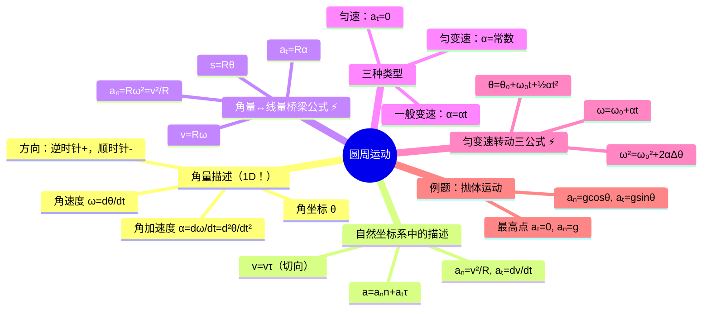

# 大物：圆周运动的角量与线量

> 📌 重构说明：本笔记聚焦圆周运动的完整描述体系——用单一角量 $\theta$ 取代 $x,y$ 两个直角坐标，极大地简化了旋转问题。已按「角量体系→自然坐标系复习→角量/线量桥梁公式→三种圆周运动类型→[[匀变速转动]]三公式→例题分析」的逻辑链重排，补充了抛体运动中法向/切向加速度的动态分析。

## 🧠 思维导图

---

## 一、角量描述——用一维坐标描述二维运动

==圆周运动最大的简化：只需要一个[[角坐标]] $\theta$ 就能完全描述质点的位置。==

| 角量 | 定义 | 含义 |
|------|------|------|
| [[角坐标]] $\theta$ | — | 质点绕圆心转过的角度 |
| [[角速度]] $\omega$ | $\omega = d\theta/dt$ | 角位置的变化率 |
| [[角加速度]] $\alpha$ | $\alpha = d\omega/dt = d^2\theta/dt^2$ | 角速度的变化率 |

方向约定：逆时针为正（+），顺时针为负（-）。

---

## 二、自然坐标系中的圆周运动

[[自然坐标系]]原点取在质点自身（动态），$R$ 就是固定不变的曲率半径（$\rho \equiv R$）：

| 物理量 | 公式 | 说明 |
|--------|------|------|
| 速度 | $\vec{v} = v\vec{\tau} = \dfrac{ds}{dt}\vec{\tau}$ | 始终沿切向 |
| [[切向加速度]] $a_t$ | $a_t = \dfrac{dv}{dt}$ | 改变速度大小 |
| [[法向加速度]] $a_n$ | $a_n = \dfrac{v^2}{R}$ | 改变速度方向 |
| 总加速度 | $a = \sqrt{a_t^2 + a_n^2}$ | 勾股合成 |

---

## 三、角量与线量的联系 ⚡️ 核心桥梁

$$\boxed{s = R\theta}$$

对时间求一次导数 → $\boxed{v = R\omega}$

对时间再求一次导数 → $\boxed{a_t = R\alpha}$

法向加速度用角量：$\boxed{a_n = R\omega^2 = v^2/R}$

> [!warning] 考点
> ⚠️ $v = R\omega$、$a_t = R\alpha$、$a_n = R\omega^2$ — 这三对关系贯串整个刚体转动体系，必须烂熟于心。

---

## 四、三种圆周运动类型

| 类型 | 判别特征 | 运动方程 |
|------|----------|----------|
| **匀速**圆周运动 | $a_t = 0$，$\alpha = 0$ | $\theta = \omega t$ |
| **匀变速**圆周运动 | $\alpha = \text{常数}$ | 见下文三公式 |
| **一般变速**圆周运动 | $\alpha = \alpha(t)$ | 积分求解 |

---

## 五、匀变速转动的三公式 ⚡️

==与[[匀变速转动]]直线运动公式形式完全一致，符号替换：$x \to \theta$、$v \to \omega$、$a \to \alpha$。==

| 直线运动 | 圆周运动 |
|----------|----------|
| $v = v_0 + at$ | $\boxed{\omega = \omega_0 + \alpha t}$ |
| $x = x_0 + v_0t + \frac{1}{2}at^2$ | $\boxed{\theta = \theta_0 + \omega_0t + \frac{1}{2}\alpha t^2}$ |
| $v^2 = v_0^2 + 2a\Delta x$ | $\boxed{\omega^2 = \omega_0^2 + 2\alpha\Delta\theta}$ |

> [!warning] 考点
> ⚠️ 三个[[匀变速转动]]公式与匀变速直线运动公式只差一个符号替换——物理形式完全一样。考场中可直接默写。

---

## 六、例题·抛体运动中 $a_n$ 和 $a_t$ 的动态变化

**核心**：抛体运动的加速度是恒定的重力加速度 $\vec{g}$，但分解到[[自然坐标系]]后，$a_n$ 和 $a_t$ 会随轨迹角度不断变化。

- 上升段：$\theta$ 减小 → $a_t = g\sin\theta$ 减小（减速逐渐变慢）
- ==最高点==：$\theta = 0$ → $a_t = 0$，$a_n = g$（速率不变的方向改变）
- 下降段：$\theta$ 增大 → $a_t = g\sin\theta$ 增大（加速越来越快）

> [!warning] 考点
> ⚠️ 最高点的[[切向加速度]]为 0（$a_t = 0$），[[法向加速度]] = g（$a_n = g$），这是一个高频设问点。

---

## 七、例题·已知 $s(t)$ 求各加速度

**通解步骤**：
1. 速率：$v = ds/dt$
2. [[切向加速度]]：$a_t = dv/dt = d^2s/dt^2$
3. [[法向加速度]]：$a_n = v^2/R$
4. 总加速度：$a = \sqrt{a_t^2 + a_n^2}$
5. 方向：$\tan\varphi = a_n/a_t$（$\varphi$ 为 $\vec{a}$ 与切线方向的夹角）

---

> 📂 所属分类：[[大物-力学|力学]]

## 📚 核心词条索引

| 知识点链接 | 类别 | 关键词 |
|------|------|--------|
| [[匀变速转动]] | 运动类型 | 角加速度恒定的转动，有类似匀变速直线运动的三个公式 |
| [[角坐标]] | 核心概念 | 描述转过的角度θ |
| [[角速度]] | 核心概念 | 角位移随时间的变化率，$\omega=d\theta/dt$ |
| [[角加速度]] | 核心概念 | 角速度随时间的变化率，$\alpha=d\omega/dt$ |
| [[自然坐标系]] | 坐标系 | 原点取在质点自身，切向和法向为基矢量 |
| [[切向加速度]] | 核心概念 | $a_t=dv/dt$，改变速度大小 |
| [[法向加速度]] | 核心概念 | $a_n=v^2/R$，改变速度方向 |

