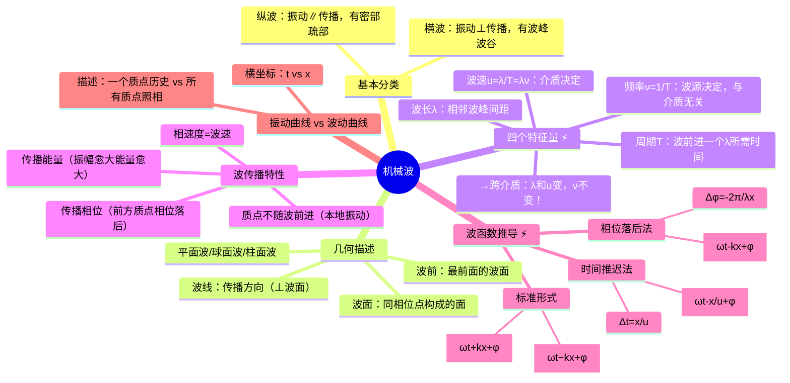

# 大物：机械波与波函数概述

> 📌 重构说明：本笔记是波动力学的开篇——从[[简谐振动]]扩展到一维连续介质中的波动。已按「[[横波]]/[[纵波]]区分→[[波面]]/[[波线]]/[[波前]]的几何描述→四个特征物理量（$\lambda, T, \nu, u$）及其决定因素→波传播的三大特性→[[波函数]]的两种推导法（时间推迟+相位落后）→振动曲线 vs 波动曲线」的逻辑链重排。完整保留了波函数的标准形式、两种推导的细节，以及跨介质时 $\nu$ 不变而 $\lambda$ 和 $u$ 变化的系列判断。

## 🧠 思维导图

---

## 一、横波与纵波——振动方向决定分类

| | [[横波]] | [[纵波]] |
|------|------|------|
| 振动方向与传播方向 | ==垂直== | ==平行== |
| 特征形状 | 波峰 + 波谷 | 密部 + 疏部 |
| 实例 | 绳波、电磁波 | 声波 |
| 能否在气体中传播 | 不能（无切变弹性） | 可以 |

---

## 二、波的几何描述

| 术语 | 定义 |
|------|------|
| **[[波线]]** | 沿波传播方向的有向线段 |
| **[[波面]]** | 振动相位相同的点连成的面 |
| **[[波前]]** | 传播到最前面的波面（特殊波面） |

==[[波线]] ⊥ [[波面]]。== 命名依据波面的形状：平面波、球面波、柱面波。球面波在远处局部可近似为平面波。

---

## 三、四个特征物理量 ⚡️

### 3.1 定义

| 量 | 符号 | 定义 |
|------|------|------|
| [[波长]] | $\lambda$ | 相邻两波峰间距离 = 相邻两相位差 $2\pi$ 质点间距离 = 波源完成一次全振动波前进的距离 |
| [[周期]] | $T$ | 波前进一个波长所需时间 = 波源完成一次全振动的时间 |
| [[频率]] | $\nu$ | $\nu = 1/T$ |
| [[波速]] | $u$ | $u = \lambda/T = \lambda\nu$ |

### 3.2 谁决定谁？——跨介质传播的核心判断 ⚡️

==[[频率]] $\nu$ 只由波源决定，与介质无关。==

==[[波速]] $u$ 由介质决定。==

==[[波长]] $\lambda$ 由介质决定（$\lambda = u/\nu$）。==

> [!warning] 考点
> ⚠️ 波从一种介质到另一种：$\nu$ 不变（波源决定），$u$ 变（介质决定），$\lambda$ 变（$\lambda = u/\nu$）。选择题极高频出现，三个量的决定因素必须分清楚。

---

## 四、波传播的三大特性

1. **传播能量**——波源振动有能量，能量沿波传播，能量与振幅有关
2. **传播相位**——振动形式由相位决定，前方质点相位落后于后方质点
3. **质点不随波前进**——质点只在平衡位置附近振动（本地振动），传播的是振动形式，不是物质本身

**[[相速度]]**：相位传播的速度 = 波速 $u$，由介质决定，与频率无关。

---

## 五、波函数——两种推导法 ⚡️

**问题设定**：波源 O（$x=0$）的振动方程为 $y_O = A\cos(\omega t + \varphi)$，波以速度 $u$ 沿 $+x$ 方向传播。求 $x$ 处质点 P 的振动方程。

### 5.1 时间推迟法

O 的振动形式传到 P 需要时间 $\Delta t = x/u$。

P 在 $t$ 时刻的振动 = O 在 $t - x/u$ 时刻的振动：

$$y = A\cos\left[\omega\left(t - \frac{x}{u}\right) + \varphi\right]$$

### 5.2 相位落后法

P 点相位落后于 O 点的量：$\Delta\varphi = -\dfrac{2\pi}{\lambda}x = -\dfrac{\omega}{u}x$

$$y = A\cos\left(\omega t - \frac{2\pi}{\lambda}x + \varphi\right)$$

令[[波数]] $k = \dfrac{2\pi}{\lambda}$：

$$y = A\cos\left(\omega t - kx + \varphi\right)$$

### 5.3 标准波函数（必背）

| 传播方向 | [[波函数]] |
|----------|--------|
| 沿 $+x$ 方向 | $\boxed{y = A\cos\left(\omega t - kx + \varphi\right)}$ |
| 沿 $-x$ 方向 | $\boxed{y = A\cos\left(\omega t + kx + \varphi\right)}$ |

> [!warning] 考点
> ⚠️ [[波函数]] $y=A\cos(\omega t \pm kx + \varphi)$——正负号决定传播方向：$-$ 号是沿 $+x$，$+$ 号是沿 $-x$。这是波函数的第一道判断题。

---

## 六、振动曲线 vs 波动曲线 ⚡️

==从图上看一模一样，区别只在横坐标！==

| 维度 | [[振动曲线]] | [[波动曲线]] |
|------|----------|----------|
| 横坐标 | 时间 $t$ | 位置 $x$ |
| 对象 | 一个质点 | 所有质点 |
| 含义 | 一个质点在不同时刻的位移（历史） | 所有质点在同一时刻的位移（照相） |

---

> 📂 所属分类：[[大物-波动|波动]]

## 📚 核心词条索引

| 知识点链接 | 类别 | 关键词 |
|------|------|--------|
| [[简谐振动]] | 核心概念 | 位移按余弦规律随时间变化的振动 |
| [[横波]] | 波动类型 | 振动方向与传播方向垂直的波，如绳波、电磁波 |
| [[纵波]] | 波动类型 | 振动方向与传播方向平行的波，如声波 |
| [[波面]] | 几何概念 | 振动相位相同的点连成的面 |
| [[波线]] | 几何概念 | 沿波传播方向的有向线段，垂直于波面 |
| [[波前]] | 几何概念 | 传播到最前面的波面 |
| [[波函数]] | 核心概念 | 描述波传播的数学表达式，y=Acos(ωt±kx+φ) |
| [[波长]] | 核心概念 | 相邻两波峰间距离，λ=uT |
| [[周期]] | 核心概念 | 波前进一个波长所需时间 |
| [[频率]] | 核心概念 | 单位时间内完成全振动次数，由波源决定 |
| [[波速]] | 核心概念 | 波传播的速度，u=λν，由介质决定 |
| [[相速度]] | 核心概念 | 相位传播的速度，等于波速 |
| [[波数]] | 核心概念 | k=2π/λ，表示单位长度内的相位变化 |
| [[振动曲线]] | 图像类型 | 横坐标为时间t，描述一个质点的振动历史 |
| [[波动曲线]] | 图像类型 | 横坐标为位置x，描述所有质点在某时刻的位移 |

