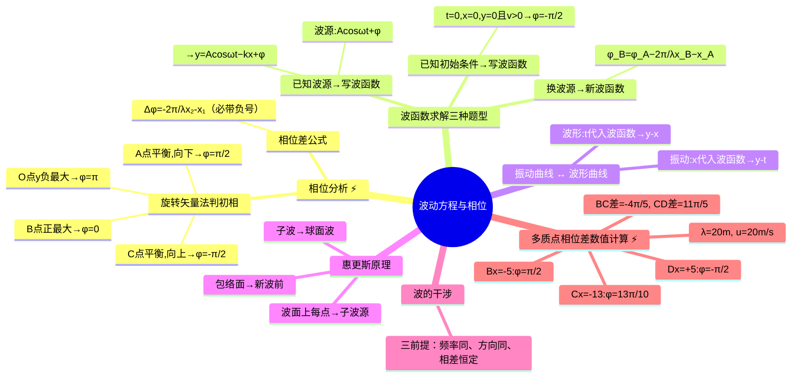

# 大物：波动方程与相位分析

> 📌 重构说明：本笔记是从「定性理解[[波函数]]」到「定量操作[[波函数]]」的实操篇。已按「[[初相位]]判定（[[旋转矢量法]]）→[[相位差]]公式（带负号的正确写法）→[[波函数]]求解（已知波源+已知初始条件+换波源）→波形曲线/振动曲线的互转化→[[惠更斯原理]]→[[波的干涉]]（相干条件）→多质点相位差数值计算」的逻辑链重排。完整保留了原文档中的所有数值例题（$B$ 点 $\varphi$、$C$ 点 $\varphi$、$D$ 点 $\varphi$、$BC$ 两点相位差、$CD$ 两点相位差），以及波形曲线和振动曲线的作图方法和区别。

## 🧠 思维导图

---

## 一、初相位的判定——旋转矢量法实操

> 已知 $t=0$ 时的波形图 → 判定各点[[初相位]]。下面以 $x=0$ 处波源质点的判定为例。

**通用步骤**：
1. 画振动方向标准坐标（$y$ 轴）
2. 由 $t=0$ 时质点的 $y$ 位置→确定矢量在 $y$ 轴上的投影→两个可能矢量（左右对称）
3. 由 **运动方向**（向上/向下）→筛选唯一矢量
4. 矢量与 $y$ 轴正方向的夹角 = [[初相位]]

**典型位置判定对照**：

| 质点位置 ($y$ 坐标) | 运动方向 | 旋转矢量 | 初相位 $\varphi$ |
|:--------------------:|:--------:|:--------:|:----------------:|
| 负最大位移 $(y = -A)$ | 向上 | 左下 | $\pi$ |
| 平衡位置 $(y = 0)$ | 向下 | 右上 | $\pi/2$ |
| 正最大位移 $(y = +A)$ | — | 正上 | $0$ |
| 平衡位置 $(y = 0)$ | 向上 | 右下 | $-\pi/2$ |

> [!warning] 考点
> ⚠️ 波形图中 $t=0$ 时刻各质点的[[初相位]]判定——[[旋转矢量法]]是最直观可靠的工具。公式容易搞错象限，画图验证永远不会错。

---

## 二、相位差公式——必须带负号 ⚡️

$$\boxed{\Delta\varphi = \varphi_2 - \varphi_1 = -\frac{2\pi}{\lambda}(x_2 - x_1)}$$

**重点关注**：
- ==**必须有负号**——波前方质点的[[相位]]小于波后方质点（[[相位]]落后）==
- $x_2 - x_1$ 的正负 → $\Delta\varphi$ 的正负 → 判断 $\varphi_2$ 超前还是落后于 $\varphi_1$

---

## 三、波函数求解的三种题型

### 3.1 已知波源振动方程 → 波函数

**步骤**：
1. 读振幅 $A$、角频率 $\omega$、[[初相位]] $\varphi$
2. 算周期 $T = 2\pi/\omega$
3. 算波长 $\lambda = uT$
4. 写入标准形式：$y = A\cos\left(\omega t - \frac{2\pi}{\lambda}x + \varphi\right)$（沿 $+x$）

### 3.2 已知初始条件 → 波函数 ⚡️

**条件**：$t=0$ 时，坐标原点 $O$ 处于**平衡位置**且向 $y$ 轴**正方向**运动。

- $y_O = A\cos\varphi = 0$ → $\cos\varphi = 0$ → $\varphi = \pm\pi/2$
- $v$ 向 $y$ 轴正方向 → $v$ 为正 → $\sin\varphi$ 应为负 → $\sin(-\pi/2) = -1$ ✓ → $\varphi = -\pi/2$
- 最终[[波函数]]：$y = A\cos\left(\omega t - \dfrac{2\pi}{\lambda}x - \dfrac{\pi}{2}\right)$

### 3.3 改变波源参考点

已知 A 点振动方程，求以 B 点为参考的[[波函数]]时——**振幅、角频率、波长都相同**，只有[[初相位]]改变。

$$\varphi_B = \varphi_A - \frac{2\pi}{\lambda}(x_B - x_A)$$

---

## 四、波形曲线与振动曲线的互转

### 4.1 波形曲线（$y$-$x$，瞬时拍照）

将 $t$ = 具体值代入[[波函数]] → $y = f(x)$ → 该时刻所有质点的位置分布。

### 4.2 振动曲线（$y$-$t$，历史记录）

将 $x$ = 具体值代入[[波函数]] → $y = g(t)$ → 该质点的振动历史。

| | [[波形曲线]] | [[振动曲线]] |
|------|----------|----------|
| 横坐标 | 空间位置 $x$ | 时间 $t$ |
| 求法 | 代入具体 $t$ | 代入具体 $x$ |
| 读什么 | 各质点此刻的位移 | 一个质点各时刻的位移 |

---

## 五、惠更斯原理与波的干涉

### 5.1 惠更斯原理

波面上的任意一点都看作**子波源**，向外发射球面次波。所有子波球面波的**包络面** = 新的波前（平面波→平面包络面，球面波→球面包络面）。

### 5.2 波的干涉——三个相干条件

两列波相遇 → 不是所有波都能产生干涉。必须满足：
1. ==频率相同==
2. ==振动方向相同==
3. ==[[相位差]]恒定==

钱塘江大潮的水波干涉是自然界的宏观干涉现象。

---

## 六、多质点相位差数值计算 ⚡️（原文档完整保留）

**已知**：A 点振动方程，$u=20\,\mathrm{m/s}$，$\lambda=20\,\mathrm{m}$。求 B、C、D 各点振动方程，及 BC、CD 间的[[相位差]]。

**B 点**（A 左侧 5 m，$x_B - x_A = -5$）：
$$\varphi_B = \varphi_A - \frac{2\pi}{\lambda}(-5) = \varphi_A + \frac{\pi}{2} = \frac{\pi}{2}$$

**C 点**（A 左侧 13 m，$x_C - x_A = -13$）：
$$\varphi_C = \varphi_A + \frac{13\pi}{10}$$

**D 点**（A 右侧 5 m，$x_D - x_A = +5$）：
$$\varphi_D = \varphi_A - \frac{2\pi}{\lambda}(5) = \varphi_A - \frac{\pi}{2} = -\frac{\pi}{2}$$

**BC 两点相位差**（$x_B-x_C = 8$）：
$$\varphi_B - \varphi_C = -\frac{2\pi}{20}\times 8 = -\frac{4\pi}{5}$$

**CD 两点相位差**（$x_C-x_D = -22$）：
$$\varphi_C - \varphi_D = -\frac{2\pi}{20}\times(-22) = \frac{11\pi}{5}$$

> [!warning] 考点
> ⚠️ $\Delta\varphi$ 公式中 $x_2-x_1$ 的正负直接影响结果——取值为 **$x$ 坐标的代数差**，转换时务必写入正确的正负号。

---

> 📂 所属分类：[[大物-波动|波动]]

## 📚 核心词条索引

| 知识点链接 | 类别 | 关键词 |
|------|------|--------|
| [[波函数]] | 核心概念 | $y=A\cos(\omega t-kx+\varphi)$，描述波传播的数学表达式 |
| [[初相位]] | 核心概念 | t=0时刻的相位，由初始条件决定 |
| [[旋转矢量法]] | 核心方法 | 用旋转矢量投影直观判断初相位 |
| [[相位差]] | 核心概念 | $\Delta\varphi=-\frac{2\pi}{\lambda}(x_2-x_1)$，两质点相位的差值 |
| [[惠更斯原理]] | 几何原理 | 波面上每点作为子波源，包络面为新波前 |
| [[波的干涉]] | 核心现象 | 两列相干波叠加，需频率相同、振动方向相同、相位差恒定 |
| [[相位]] | 核心概念 | $\omega t-kx+\varphi$，决定振动状态 |
| [[波形曲线]] | 图像类型 | y-x图，某时刻所有质点的位移分布 |
| [[振动曲线]] | 图像类型 | y-t图，某质点的振动历史 |

