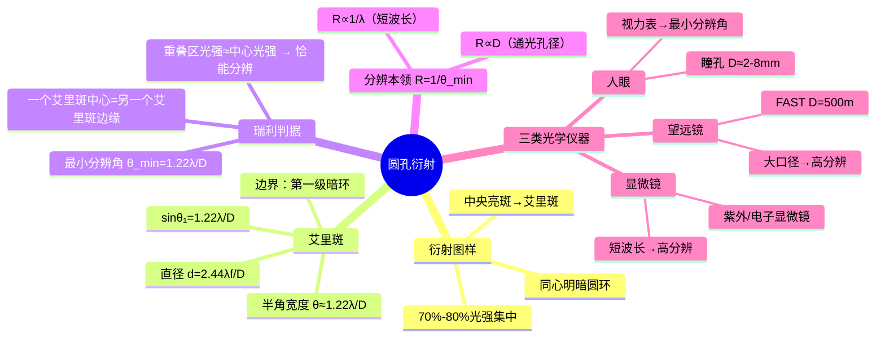

# 大物：圆孔衍射与光学仪器分辨本领

> 📌 重构说明：本笔记以「[[圆孔衍射]]图样→[[艾里斑]]→[[半角宽度]]公式→[[瑞利判据]]→[[分辨本领]]→三类光学仪器」为主线。补充了[[艾里斑]]光强集中的物理根源（与[[单缝衍射]]中央明纹对比），以及[[分辨本领]]在实际仪器中的工程体现（天眼 FAST、电子显微镜）。

## 🧠 思维导图

---

## 一、圆孔衍射图样

### 1.1 现象描述

光通过圆形小孔后，在屏幕上不再是一个亮点，而是==同心明暗相间的圆环==：
- **中央亮斑**（[[艾里斑]]）：光强最大，集中 70%-80% 的总光能
- **第一级暗环**：包围[[艾里斑]]，定义其边界
- **外围**：依次为第一级亮环、第二级暗环……光强迅速衰减

> 📖 对比[[单缝衍射]]：单缝衍射中央明纹比两侧明纹宽 2 倍，亮度最高；[[圆孔衍射]]在二维空间的对应即为圆形[[艾里斑]] + 同心环。

---

## 二、艾里斑的半角宽度

### 2.1 第一级暗环的衍射角

[[夫琅禾费衍射]]圆孔衍射中，第一级暗环满足：

$$\boxed{\sin\theta_1 = 1.22\frac{\lambda}{D}}$$

| 符号 | 含义 |
|------|------|
| $\lambda$ | 入射光波长 |
| $D$ | 圆孔直径（==[[通光孔径]]==） |
| $\theta_1$ | 第一级暗环对应的衍射角 |

### 2.2 半角宽度

$\theta_1$ 通常很小 → $\sin\theta_1 \approx \theta_1$：

$$\boxed{\theta \approx 1.22\frac{\lambda}{D}}$$

这就是**[[艾里斑]]的[[半角宽度]]**——[[艾里斑]]半径对透镜中心所张的角度。

### 2.3 艾里斑的直径

已知透镜焦距 $f$，则[[艾里斑]]在焦平面上的直径：

$$d = 2f\theta = \boxed{2.44\frac{\lambda f}{D}}$$

> [!warning] 考点
> ⚠️ $\theta = 1.22\lambda/D$ 是[[圆孔衍射]]的必背公式。对比[[单缝衍射]]暗纹条件 $b\sin\theta = k\lambda$（系数是 1），圆孔是 1.22——二面的区别源于圆孔衍射积分中包含贝塞尔函数。

---

## 三、瑞利判据（Rayleigh Criterion）

### 3.1 两个物点的成像问题

每个点物通过光学仪器（有圆形孔径）后在像面上都形成一个[[艾里斑]]。两物点靠得很近时，两个[[艾里斑]]会重叠：

| 情况 | 条件 | 结果 |
|------|------|------|
| 能分辨 | 两[[艾里斑]]中心距离 > [[艾里斑]]半径 | 明显两个峰 |
| ==恰能分辨== | 两[[艾里斑]]中心距离 = [[艾里斑]]半径 | 重叠区光强 ≈ 各自主峰光强 |
| 不能分辨 | 两[[艾里斑]]中心距离 < [[艾里斑]]半径 | 合并成一个峰 |

> [!warning] 考点
> ⚠️ [[瑞利判据]]：「一个物点的[[艾里斑]]中心恰好落在另一个物点的[[艾里斑]]边缘（第一暗环）上时，为恰能分辨的极限。」高频率出现于选择题和简答题。

### 3.2 最小分辨角

$$\boxed{\theta_{\min} = 1.22\frac{\lambda}{D}}$$

当两个物点对透镜的**张角** $\ge \theta_{\min}$ 时才能分辨。$\theta_{\min}$ 越小，仪器分辨能力越强。

---

## 四、分辨本领

### 4.1 定义与公式

[[分辨本领]] $R$ = [[最小分辨角]]的倒数：

$$\boxed{R = \frac{1}{\theta_{\min}} = \frac{D}{1.22\lambda}}$$

**提高分辨率的两条途径**：

| 途径 | 具体做法 | 工程实例 |
|------|----------|----------|
| ==增大[[通光孔径]] D== | 造更大的透镜/反射镜 | FAST 天眼（$D = 500\,\text{m}$）、大型天文望远镜 |
| ==减小波长 λ== | 用短波长光源 | 紫外显微镜、电子显微镜（电子波长 $\ll$ 可见光） |

> 📖 工程智慧：牛郎星与织女星在夜空中只差一个很小的角度，人眼能否直接分辨取决于瞳孔直径。大口径望远镜通过增大 $D$ 使 $\theta_{\min}$ 缩小，从而分辨出更近的恒星。

---

## 五、三类光学仪器中的圆孔衍射

### 5.1 人眼

瞳孔是人眼的「圆孔」：
- $D \approx 2\,\text{mm}$（亮光下）到 $8\,\text{mm}$（暗光下）
- 视网膜上每个点物对应一个[[艾里斑]]
- 视力好坏 = [[最小分辨角]]大小 → 视力表就是测试你能分辨多小的 $\theta_{\min}$

### 5.2 望远镜

- **中国天眼 FAST**：500m 口径球面射电望远镜 → $D$ 极大 → $\theta_{\min}$ 极小 → 分辨极远的天体
- 哈勃太空望远镜：$D = 2.4\,\text{m}$，但位于太空无大气扰动 → 接近理论衍射极限

### 5.3 显微镜

- 光学显微镜的极限：可见光 $\lambda \approx 550\,\text{nm}$ → 最大可分辨约 $0.2\,\mu\text{m}$
- **电子显微镜**：电子波长 $\lambda \approx 0.004\,\text{nm}$（100kV 加速）→ $\theta_{\min}$ 比光学显微镜小约 $10^5$ 倍 → 可看到原子结构

---

## 六、单缝衍射与圆孔衍射的对比总结

| 维度 | [[单缝衍射]] | [[圆孔衍射]] |
|------|----------|----------|
| 障碍物 | 狭缝（一维限制） | 圆孔（二维限制） |
| 图样 | 条形明暗条纹 | 同心圆环 |
| 暗纹条件 | $b\sin\theta = k\lambda$（系数 1） | $\sin\theta_1 = 1.22\lambda/D$（系数 1.22） |
| 中央明纹 | 2 倍于其他明纹宽 | [[艾里斑]]占 70%-80% 总光强 |
| 应用 | [[光栅衍射]]的基础 | 光学仪器[[分辨本领]]的物理根源 |

> [!warning] 考点
> ⚠️ [[单缝衍射]]暗纹 $b\sin\theta = k\lambda$（无 1.22 系数）与[[圆孔衍射]]第一暗环 $\sin\theta = 1.22\lambda/D$（有 1.22 系数）的区分是选择题/判断题高频雷区。

---

> 📂 所属分类：[[大物-光学|光学]]

## 📚 核心词条索引

| 知识点链接 | 类别 | 关键词 |
|------|------|--------|
| [[圆孔衍射]] | 核心现象 | 光通过圆孔形成同心圆环衍射图样 |
| [[艾里斑]] | 核心概念 | 圆孔衍射中央亮斑，集中70%-80%光强 |
| [[半角宽度]] | 核心公式 | $\theta \approx 1.22\lambda/D$，艾里斑张角 |
| [[瑞利判据]] | 分辨标准 | 一艾里斑中心落在另一艾里斑边缘为恰能分辨 |
| [[分辨本领]] | 核心概念 | $R = D/(1.22\lambda)$，分辨能力量度 |
| [[单缝衍射]] | 对比概念 | 光通过狭缝形成条形明暗条纹 |
| [[夫琅禾费衍射]] | 衍射类型 | 远场衍射，光源和屏都在无穷远 |
| [[通光孔径]] | 仪器参数 | 光学仪器有效孔径直径$D$ |
| [[最小分辨角]] | 核心公式 | $\theta_{min} = 1.22\lambda/D$ |
| [[光栅衍射]] | 应用概念 | 多缝衍射，产生锐细明纹 |

