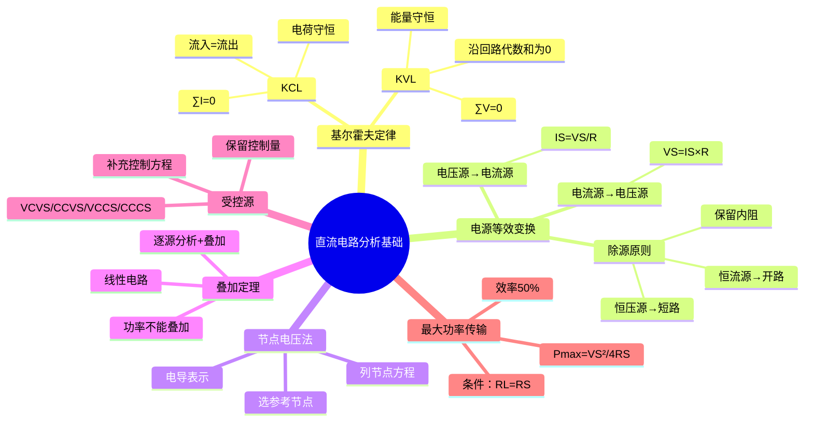

# 电子技术：直流电路分析基础

> 📌 重构说明：本笔记将基尔霍夫定律、电源等效变换、节点电压法、叠加定理、受控源和最大功率传输等直流电路分析的核心工具整合为统一的分析方法体系。

## 🧠 思维导图

---

## 一、基尔霍夫定律——所有电路分析的基石

### 1.1 [[KCL]]

**表述**：在任一节点，==流入节点的电流之和 = 流出节点的电流之和==。

$$\sum I_{\text{in}} = \sum I_{\text{out}} \quad \text{或} \quad \sum I = 0$$

**物理本质**：==电荷守恒定律==在电路中的体现——节点不能积累电荷（稳态下）。

**应用要点**：
- 必须先为每条支路规定==参考方向==（可以任意设，结果的正负反映实际方向）
- 流入为正则流出为负，或反之——只要统一即可
- 适用于任何节点，也适用于"广义节点"（闭合曲面包围的节点群）

**三极管中的KCL示例**：

$$I_E = I_B + I_C$$

不管三极管是NPN还是PNP（电流方向不同），此数值关系恒成立——因为KCL关心的是==数值代数和==，值的大小关系由PN结偏置条件决定。

### 1.2 [[KVL]]

**表述**：在任一闭合回路，==沿绕行方向各段电压的代数和等于零==。

$$\sum V = 0$$

**物理本质**：==能量守恒定律==——沿闭合回路一圈，电位变化之和为零（回到起点）。

**应用要点**：
- 必须规定绕行方向（顺时针或逆时针）
- 电压参考方向与绕行方向一致时取正，相反取负
- 结果的正负反映实际极性与参考方向的关系

**三极管输出回路的KVL示例**：

$$V_{CC} = I_C R_C + V_{CE}$$

这是计算静态工作点 $V_{CEQ}$ 的基础方程。

> [!warning] 考点
> ⚠️ KCL和KVL是大量解题的基础，必须熟练掌握列写方程的方法。常见错误：忘记规定参考方向和绕行方向就直接写方程——符号混乱是丢分重灾区。

---

## 二、电源等效变换

### 2.1 两种电源模型的转换

实际电源有两种等效模型：

| 模型 | 结构 | 理想特性 | 内阻处理 |
|------|------|------|------|
| 电压源模型 | 理想电压源 $V_S$ ==串联==内阻 $R_S$ | 空载时 $V_{oc}=V_S$ | 短路时 $I_{sc}=V_S/R_S$ |
| 电流源模型 | 理想电流源 $I_S$ ==并联==内阻 $R_S$ | 短路时 $I_{sc}=I_S$ | 开路时 $V_{oc}=I_S R_S$ |

**等效变换条件**（两模型对外电路等效）：

$$I_S = \frac{V_S}{R_S}, \quad V_S = I_S \cdot R_S, \quad \text{内阻 } R_S \text{ 不变}$$

### 2.2 除源原则——叠加定理和等效变换的基础 ⚡️

在应用叠加定理、求等效电阻等操作中需要"除源"（将电源置零）：

| 电源类型 | 除源操作 | 内阻处理 |
|------|------|------|
| ==恒压源==（独立电压源） | ==短路==代替 | 保留 $R_S$（如有） |
| ==恒流源==（独立电流源） | ==开路==代替 | 保留 $R_S$（如有） |

> [!warning] 考点
> ⚠️ 最高频错误：恒压源除源时忘记保留内阻（直接把内阻也短了）；恒流源除源时也忘了保留内阻。口诀："除源不除阻"。

---

## 三、节点电压法

### 3.1 核心思想

以==节点电压（节点对参考点的电位）==为未知量列方程，解出节点电压后再求各支路电流。相比支路电流法，节点电压法==未知量更少==（n个节点只需 n-1 个方程）。

### 3.2 方程构建

选一个节点为参考点（电位=0），对每个非参考节点列方程：

$$U_a \cdot \sum G - \sum (U_{\text{相邻}} \cdot G) = \sum I_S + \sum \frac{V_S}{R}$$

其中 $G = 1/R$ 为电导。

**特殊形式**（适用于每个支路的电源都转化为电流源的等效）：

$$U_a = \frac{\sum I_S + \sum V_S \cdot G}{\sum G}$$

分子 = 流入该节点的==电流源电流 + 电压源转化的电流==之和，分母 = 连接到该节点的==所有支路电导==之和。

### 3.3 解题流程

1. 选择参考节点（通常选连接支路最多的节点）
2. 标注各节点电压
3. 按公式列写方程
4. 解出节点电压
5. 用欧姆定律求各支路电流

---

## 四、叠加定理 ⚡️

### 4.1 定理内容

在==线性电路==中，多个独立源共同作用产生的响应（电压或电流）= 各独立源==单独作用==产生的响应之==代数和==。

### 4.2 操作步骤

1. 分别考虑每个独立源单独作用——其余独立源按除源原则处理（恒压源短路、恒流源开路）
2. 分别求解每个"分电路"中待求的电流/电压
3. ==代数和叠加==——与参考方向相同取正，相反取负

### 4.3 功率不能叠加——高频易错点 ⚡️

功率 $P = I^2 R$ 中 $I$ 是平方项：

$$P_{\text{总}} = (I_1 + I_2)^2 R = I_1^2 R + I_2^2 R + \boxed{2I_1 I_2 R}$$

而叠加定理直接叠加功率只能得到 $P_1 + P_2 = I_1^2 R + I_2^2 R$，==缺少耦合项 $2I_1 I_2 R$==。

**正确做法**：先用叠加定理求总电压/总电流，==再==用总电压/总电流计算功率。

> [!warning] 考点
> ⚠️ "功率不能叠加"是考试的高频判断题和简答题。记住：叠加定理只适用于线性关系（电流、电压），功率是二次关系，不属于线性关系。

### 4.4 在放大电路中的应用

叠加定理是放大电路分析的逻辑基础：
- ==直流分析==：交流信号源置零（短路），只考虑直流偏置电源 → 求静态工作点Q
- ==交流分析==：直流电源置零（短路），只考虑交流信号源 → 求动态参数
- ==总响应 = 直流分量 + 交流分量==

---

## 五、受控源

### 5.1 四种类型

受控源（非独立源）的输出由电路中其它支路的电压或电流控制：

| 类型 | 缩写 | 关系式 | 控制量 | 输出量 | 典型应用 |
|------|:---:|------|------|------|------|
| 电压控制电压源 | VCVS | $V_2 = \mu V_1$ | 电压 | 电压 | 运放模型 |
| 电流控制电压源 | CCVS | $V_2 = r I_1$ | 电流 | 电压 | 互感模型 |
| 电压控制电流源 | VCCS | $I_2 = g V_1$ | 电压 | 电流 | FET模型 |
| 电流控制电流源 | CCCS | $I_2 = \beta I_1$ | 电流 | 电流 | ==BJT模型== |

三极管的小信号模型中，集电极输出等效为受控电流源 $\beta i_b$（CCCS型）——基极电流 $i_b$ 控制集电极电流。

### 5.2 分析原则

1. 将受控源视为独立源，正常列方程
2. ==补充控制量与被控量的关系方程==
3. 联立求解

注意：叠加定理中==受控源不能单独作用==（它不是独立源），在所有分电路中都要保留。

> [!warning] 考点
> ⚠️ 受控源在叠加定理中的处理：不能像独立源那样单独作用，也不能被除源。所有分电路都必须保留受控源。

---

## 六、最大功率传输定理

### 6.1 定理内容

对于给定的有源一端口网络（等效为 $V_S$ 串联 $R_S$），当==负载电阻 $R_L = R_S$== 时，负载获得==最大功率==：

$$P_{\max} = \frac{V_S^2}{4R_S}$$

### 6.2 注意

此时传输效率只有 50%（负载功率 = 内阻消耗功率）。在高频/射频电路中追求最大功率传输（阻抗匹配），在电力系统中追求高效率传输（$R_L \gg R_S$）。

---

> 📂 所属分类：[[电子技术-电路分析|电路分析]]

## 📚 核心词条索引

| 词条 | 类别 | 关键词 |
|------|:---:|------|
| 基尔霍夫电流定律 | 基本定律 | KCL、电荷守恒、节点 |
| 基尔霍夫电压定律 | 基本定律 | KVL、能量守恒、回路 |
| 节点电压法 | 分析方法 | 电导、参考节点 |
| 叠加定理 | 分析定理 | 线性电路、功率不能叠加 |
| 电源等效变换 | 分析技术 | 电压源↔电流源、除源原则 |
| 受控源 | 电路元件 | CCCS/VCVS、BJT模型 |
| 最大功率传输 | 工程应用 | $R_L=R_S$、阻抗匹配 |

