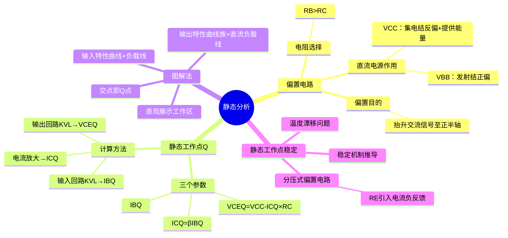

# 电子技术：三极管放大电路——静态分析

> 📌 重构说明：本笔记聚焦于放大电路的直流分析——偏置电路设计、静态工作点计算、图解法和静态工作点稳定技术，是通往动态分析的前置基础。

## 🧠 思维导图

---

## 一、直流偏置电路的设计逻辑

### 1.1 为什么需要偏置

交流信号（如正弦波）有正有负。如果直接把交流信号加在基极-发射极之间，信号负半周时 $v_{BE} < 0$，发射结反偏，三极管进入==截止区==——输出波形被"削底"，产生严重的==截止失真==。

**解决方法**：在基极叠加一个足够大的直流电压 $V_{BB}$，将信号整体==抬升==，使得任何时刻 $v_{BE}$ 都保持正偏。这就是"偏置"——给交流信号提供直流的"工作基础"。

### 1.2 两个直流电源的职责分工

| 电源 | 连接位置 | 职责 |
|------|------|------|
| ==$V_{BB}$==（基极偏置电源） | 基极回路 | 确保发射结==始终正偏==，将交流信号抬升到正半轴 |
| ==$V_{CC}$==（集电极电源） | 集电极回路 | ①确保集电结反偏 ②为整个放大电路提供能量 |

### 1.3 电阻选择的原理

**$R_B > R_C$** 是保证三极管工作在放大区的关键条件。

推导：放大条件为 $V_C > V_B > V_E$（NPN）。由输出回路 KVL：

$$V_{CC} = I_C R_C + V_{CE}$$

要使 $V_{CE} > V_{BE}$（即集电结反偏），需要 $I_C R_C$ 不能太大 → $R_C$ 不能太大（典型值几十~几千欧）。

而 $R_B$ 调节基极电流 $I_{BQ} = (V_{BB} - V_{BE})/R_B$，$R_B$ 太小会导致 $I_{BQ}$ 过大，三极管进入饱和区。因此 $R_B$ 通常比 $R_C$ 大一个数量级以上。

> [!warning] 考点
> ⚠️ $R_B > R_C$ 不是任意放大的必要条件，而是共射极偏置电路的设计经验法则。理解其背后的物理原因（保证 $V_C > V_B$）比记住不等式本身更重要。

---

## 二、[[静态工作点]]的计算——三步法 ⚡️

### 2.1 [[静态工作点]]Q的定义

输入信号 $v_s = 0$ 时，电路中只有直流电源作用，三极管的电压/电流值称为==[[静态工作点]]Q==（Quiescent Point）。

### 2.2 三个核心参数的计算

对基本共射极固定偏置电路：

**第一步——求 $I_{BQ}$**（输入回路 KVL）：

$$V_{BB} = I_{BQ} R_B + V_{BEQ}$$

$$\boxed{I_{BQ} = \frac{V_{BB} - V_{BEQ}}{R_B}}$$

其中 $V_{BEQ}$：硅管取 0.7V，锗管取 0.3V（这是==恒压降模型==在BJT中的直接应用）。

**第二步——求 $I_{CQ}$**（电流放大关系）：

$$\boxed{I_{CQ} = \beta \cdot I_{BQ}}$$

$\beta$ 为共射极直流电流放大系数——这是三极管工作在放大区的线性关系。

**第三步——求 $V_{CEQ}$**（输出回路 KVL）：

$$V_{CC} = I_{CQ} R_C + V_{CEQ}$$

$$\boxed{V_{CEQ} = V_{CC} - I_{CQ} R_C}$$

### 2.3 计算示例

已知 $V_{CC} = 12\text{V}$，$V_{BB} = 3\text{V}$，$R_B = 100\text{k}\Omega$，$R_C = 2\text{k}\Omega$，$\beta = 100$。

1. $I_{BQ} = (3 - 0.7) / 100\text{k} = 23\mu\text{A}$
2. $I_{CQ} = 100 \times 23\mu\text{A} = 2.3\text{mA}$
3. $V_{CEQ} = 12 - 2.3\text{mA} \times 2\text{k}\Omega = 7.4\text{V}$

验证：$V_C = V_{CC} = 12\text{V}$，$V_B = 3\text{V}$，$V_E = 0\text{V}$（未接 $R_E$），$V_C > V_B > V_E$ → 放大区 ✓。

> [!warning] 考点
> ⚠️ 三步法是考试中最高频的计算题类型。常见丢分点：①忘记将 $V_{BEQ}$ 减去 ②单位换算出错（$\mu A$ / mA / k$\Omega$）③算完 $V_{CEQ}$ 后没有验证是否确实在放大区。

---

## 三、图解法——直观理解Q点 ⚡️

### 3.1 输出回路的图解法

**输出特性曲线族**：以 $V_{CE}$ 为横轴、$I_C$ 为纵轴，不同 $I_B$ 对应不同曲线。

**直流负载线**：由输出回路 KVL 方程 $V_{CE} = V_{CC} - I_C R_C$ 在坐标平面上确定的直线。

- 与横轴交点（$I_C = 0$）：$V_{CE} = V_{CC}$
- 与纵轴交点（$V_{CE} = 0$）：$I_C = V_{CC} / R_C$
- 斜率：$-1/R_C$

**Q点 = 直流负载线与 $I_B = I_{BQ}$ 那条输出特性曲线的交点**。

### 3.2 图解法的价值

1. ==直观展示Q点位置==——一眼看出是在放大区、饱和区还是截止区
2. ==分析信号摆动范围==——Q点选在负载线中央附近，正负半周摆动空间对称
3. ==预判失真类型==——Q点偏高（$I_{CQ}$ 偏大、$V_{CEQ}$ 偏小、靠近饱和区）→饱和失真：$V_{CE}$ 波形==底部削平==（$V_{CE}$ 降到 $V_{CE(sat)}\approx 0.2V$ 时无法更低）；Q点偏低（$I_{CQ}$ 偏小、$V_{CEQ}$ 偏大、靠近截止区）→截止失真：$V_{CE}$ 波形==顶部削平==（$V_{CE}$ 升到 $V_{CC}$ 时无法更高）

---

## 四、静态工作点稳定——分压式偏置电路 ⚡️

### 4.1 温度漂移问题

三极管的 $\beta$ 和 $I_{CBO}$ 对温度高度敏感：温度升高 → $\beta$ 增大 → $I_C = \beta I_B$ 增大 → Q点漂移。如果漂移超出放大区，电路失效。

### 4.2 分压式偏置——最经典的稳定方案

在固定偏置的基础上增加发射极电阻 $R_E$，并将基极通过 $R_{B1}$ 和 $R_{B2}$ 分压得到稳定的基极电位：

$$V_B = \frac{R_{B2}}{R_{B1} + R_{B2}} \cdot V_{CC}$$

### 4.3 稳定机制的完整推导

温度 $T \uparrow$ → $\beta \uparrow$ → $I_C \uparrow$ → $I_E \uparrow$ → $V_{RE} = I_E R_E \uparrow$

而 $V_B$ 由分压电阻固定不变 → $V_{BE} = V_B - V_{RE} \downarrow$

$V_{BE} \downarrow$ → $I_B \downarrow$ → $I_C \downarrow$（回落到接近原来的值）

==负反馈自动调节过程完成，Q点保持稳定。==

### 4.4 分压式偏置的Q点计算

$$I_E = \frac{V_B - V_{BEQ}}{R_E} \approx I_C$$

$$V_{CEQ} = V_{CC} - I_C R_C - I_E R_E \approx V_{CC} - I_C(R_C + R_E)$$

> [!warning] 考点
> ⚠️ 分压式偏置的温度稳定原理是考试必考的分析题。记住三个关键词：①$V_B$由分压固定 ②温度变化→$I_E$变化→$V_{RE}$变化 ③$V_{BE}$随之反向调整→负反馈稳定Q点。完整推导过程必须会默写。

---

> 📂 所属分类：[[电子技术-电路分析|电路分析]]

## 📚 核心词条索引

| 词条 | 类别 | 关键词 |
|------|:---:|------|
| 静态工作点 | 核心概念 | Q点、$I_{BQ}/I_{CQ}/V_{CEQ}$ |
| 直流偏置电路 | 电路设计 | $V_{BB}$、$V_{CC}$、抬升信号 |
| 输入回路方程 | 分析方法 | KVL、$V_{BB}=I_{BQ}R_B+V_{BEQ}$ |
| 输出回路方程 | 分析方法 | KVL、$V_{CC}=I_{CQ}R_C+V_{CEQ}$ |
| 直流负载线 | 图解工具 | 斜率$-1/R_C$、截距$V_{CC}$ |
| 图解法 | 分析方法 | 负载线与特性曲线交点 |
| 分压式偏置 | 电路设计 | $R_{B1}/R_{B2}$分压、$R_E$负反馈 |
| Q点稳定 | 工程问题 | 温度漂移、负反馈调节 |

