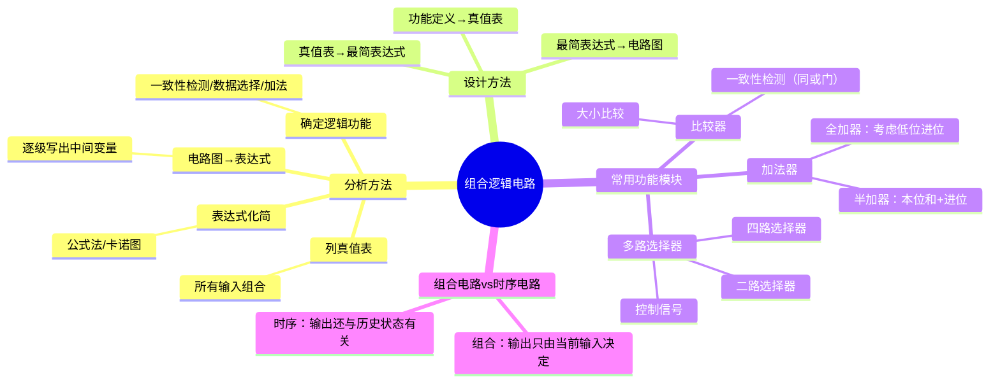

# 电子技术：组合逻辑电路分析与设计

> 📌 重构说明：本笔记将组合逻辑电路的分析方法（从电路图到真值表再到功能识别）、设计方法（从功能定义到门级实现）以及常用组合逻辑模块（选择器、加法器、比较器）整合为完整的数字电路设计方法论。

## 🧠 思维导图

---

## 一、[[组合逻辑电路]]的定义

==[[组合逻辑电路]]==：任一时刻的==输出仅由该时刻的输入决定==，与电路过去的状态无关。

- 无存储元件（无触发器、无锁存器）
- 无反馈回路（信号只能前向传播）
- 包含：门电路、编码器、译码器、选择器、加法器……

与 时序逻辑电路 的区别：后者含有存储元件（如触发器），输出取决于==当前输入 + 历史状态==。

---

## 二、组合逻辑电路的分析方法——四步法 ⚡️

### 2.1 步骤一：由电路图逐级写逻辑表达式

从输入级开始，逐级向输出端推进，用中间变量标记每一级门的输出。

**示例电路**：输入 A、B → 第一级与非门 → 中间变量 Y1；A 经过非门 → 中间变量 Y2；Y1 和 Y2 经过或门 → 最终输出 Y。

$$Y_1 = \overline{AB},\quad Y_2 = \overline{A}$$

$$Y = Y_1 + Y_2 = \overline{AB} + \overline{A}$$

### 2.2 步骤二：化简表达式

用公式法或卡诺图将输出表达式化为最简：

$$\overline{AB} + \overline{A} = \overline{A} + \overline{B}$$（由德摩根定律 + 吸收律）

### 2.3 步骤三：列真值表

枚举所有 $2^n$ 种输入组合，代入最简表达式计算输出：

| A | B | $Y = \overline{A} + \overline{B}$ |
|---|---|---|
| 0 | 0 | 1 |
| 0 | 1 | 1 |
| 1 | 0 | 1 |
| 1 | 1 | 0 |

### 2.4 步骤四：确定逻辑功能

根据真值表判断功能——此例中 $Y=0$ 仅当 A=1 且 B=1，$Y=1$ 其余情况。这就是一个==与非门==（$Y = \overline{AB}$）。

### 2.5 典型功能识别

| 真值表特征 | 逻辑功能 |
|------|------|
| 全1出1，其余0 | [[与运算|与门]] |
| 全0出0，其余1 | [[或运算|或门]] |
| 相同出1，不同出0 | ==同或门（一致性检测）== |
| 相同出0，不同出1 | ==异或门（不等价检测）== |
| C=0时Y=B，C=1时Y=A | ==二路选择器== |

---

## 三、多路选择器（MUX）⚡️

### 3.1 二路选择器

**功能**：控制信号 $S$ 选择 $A$ 或 $B$ 作为输出。

**真值表的前两行（$S=0$）→ $Y=B$，后两行（$S=1$）→ $Y=A$**：

| S | A | B | Y |
|---|---|---|---|
| 0 | — | 0 | 0 |
| 0 | — | 1 | 1 |
| 1 | 0 | — | 0 |
| 1 | 1 | — | 1 |

**最简表达式**：

$$\boxed{Y = \overline{S}B + SA}$$

其中 $\overline{S}B$ 是"B路通道"（$S=0$ 时开通），$SA$ 是"A路通道"（$S=1$ 时开通）。

### 3.2 工作原理——门控机制

**门电路实现**：
- 两个与门分别负责A路和B路
- 其中一个与门的控制信号取反（$\overline{S}$），另一个直接接 $S$
- 两个与门的输出接入一个或门

$S=1$ → A路与门开通（$S \cdot A = A$），B路与门关闭（$\overline{S} \cdot B = 0$）→ $Y=A$

$S=0$ → B路与门开通，A路关闭 → $Y=B$

### 3.3 多路选择器的扩展

| 选择器 | 输入路数 | 控制信号位数 | 控制信号与路数关系 |
|:---:|:---:|:---:|------|
| 二路 | 2 | 1 | $\lceil \log_2 2 \rceil = 1$ |
| 四路 | 4 | 2 | $\lceil \log_2 4 \rceil = 2$ |
| 八路 | 8 | 3 | $\lceil \log_2 8 \rceil = 3$ |
| n路 | n | $k$ | $\lceil \log_2 n \rceil = k$ |

> 📖 直观类比：多路选择器就像一个"电子旋转开关"——控制信号决定"旋钮"拧到哪个位置，从而选中对应的输入信号。日常生活中，电视遥控器的"信源选择"（HDMI1/HDMI2/AV/TV）就是一个多路选择器。

> [!warning] 考点
> ⚠️ 二路选择器的表达式 $Y = \overline{S}B + SA$ 是组合电路设计中的基础模板。理解其门控原理（控制信号的1/0分别开通一路、关闭另一路）比死记公式重要得多。

---

## 四、加法器设计

### 4.1 半加器（Half Adder）

**功能**：两个 1 位二进制数相加，不考虑低位进位。

| A | B | 本位和 $S$ | 进位 $C$ |
|---|---|---|---|
| 0 | 0 | 0 | 0 |
| 0 | 1 | 1 | 0 |
| 1 | 0 | 1 | 0 |
| 1 | 1 | 0 | 1 |

**观察关键**：$S$ 的真值表 = 异或门：$S = A \oplus B$；$C$ 的真值表 = 与门：$C = AB$。

**电路实现**：一个异或门（算本位和）+ 一个与门（算进位）。

### 4.2 全加器（Full Adder）

**功能**：考虑来自低位的进位 $C_{in}$。

| A | B | $C_{in}$ | 本位和 $S$ | 进位 $C_{out}$ |
|---|---|---|---|---|
| 0 | 0 | 0 | 0 | 0 |
| 0 | 0 | 1 | 1 | 0 |
| 0 | 1 | 0 | 1 | 0 |
| 0 | 1 | 1 | 0 | 1 |
| 1 | 0 | 0 | 1 | 0 |
| 1 | 0 | 1 | 0 | 1 |
| 1 | 1 | 0 | 0 | 1 |
| 1 | 1 | 1 | 1 | 1 |

**逻辑表达式**：

$$S = A \oplus B \oplus C_{in}$$

$$C_{out} = AB + BC_{in} + AC_{in} = AB + (A \oplus B)C_{in}$$

进位 $C_{out}=1$ 的条件：「A 和 B 都是 1」或「A 和 B 中有且仅有一个是 1 且 $C_{in}=1$」。

**多位加法器**：n 个全加器级联（低位 $C_{out}$ → 高位 $C_{in}$），实现 n 位二进制加法。

---

## 五、一致性检测电路

**功能**：判断多个输入是否一致（全0 或全1）。

**二输入一致性检测** → 用同或门（XNOR）：$Y = \overline{A \oplus B} = AB + \overline{A}\overline{B}$

输出 1 表示 A 和 B 一致（同为 0 或同为 1）。

**多输入一致性检测**：用多输入与门 + 多输入或非门（或用多级同或门级联）。

---

> 📂 所属分类：[[电子技术-数字电路|数字电路]]

## 📚 核心词条索引

| 词条 | 类别 | 关键词 |
|------|:---:|------|
| 组合逻辑电路 | 电路类型 | 无记忆、输出仅由当前输入决定 |
| 多路选择器 | 功能模块 | MUX、$Y=\overline{S}B+SA$、门控 |
| 半加器 | 功能模块 | $S=A\oplus B$、$C=AB$ |
| 全加器 | 功能模块 | $S=A\oplus B\oplus C_{in}$、级联进位 |
| 一致性检测 | 功能模块 | XNOR、相同出1 |
| 分析方法 | 方法论 | 电路→表达式→真值表→功能 |
| 设计方法 | 方法论 | 功能→真值表→表达式→电路 |

