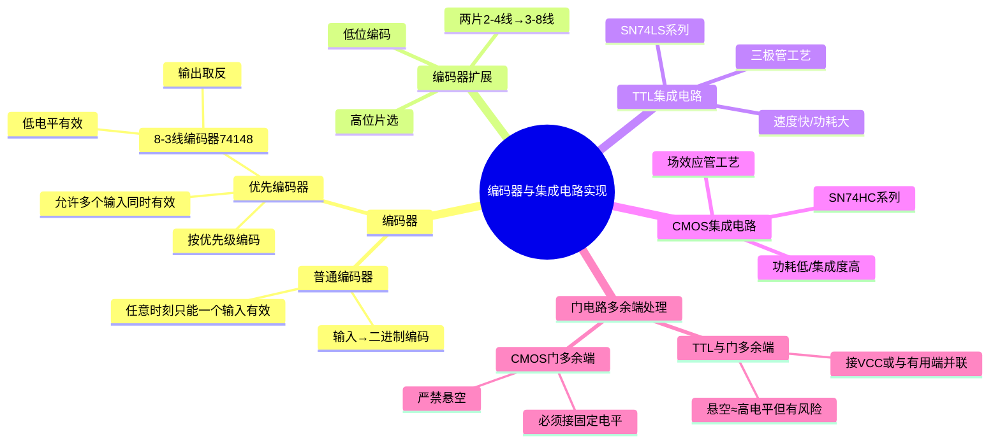

# 电子技术：编码器与集成电路实现

> 📌 重构说明：本笔记将优先编码器原理与扩展、TTL/CMOS集成电路特性、逻辑门多余端处理等工程实用内容整合，从设计原理→芯片实现→应用规范递进组织。

## 🧠 思维导图

---

## 一、[[编码器]]——将信息转换为二进制码

### 1.1 [[编码器]]与译码器的关系

|     方向     | 器件      | 功能               |
| :--------: | ------- | ---------------- |
| 2ⁿ 线 → n 线 | [[编码器]] | 多路输入信号 → 二进制编码输出 |
| n 线 → 2ⁿ 线 | [[编码器]] | 二进制编码 → 选通对应的输出线 |

[[编码器]]和译码器互为逆过程。

### 1.2 8-3 线[[优先编码器]]（74148）⚡️

**功能**：将 8 个输入信号（$I_0 \sim I_7$）编码为 3 位二进制输出（$Y_2 Y_1 Y_0$）。

**关键特性**：

| 特性        | 说明                                                       |
| --------- | -------------------------------------------------------- |
| ==低电平有效== | 输入 0 表示"有效"，1 表示"无效"                                     |
| ==优先级==   | $I_7 > I_6 > I_5 > I_4 > I_3 > I_2 > I_1 > I_0$（7最高，0最低） |
| ==输出取反==  | 输出的是编码的==反码==                                            |

**工作示例**：

输入 $I_5 = 0$（有效），其余为 1（无效）：
- 5 的二进制编码 = 101
- 输出取反 → $\overline{101} = 010$

**优先级体现**：如果 $I_7$ 和 $I_5$ 同时有效，按优先级 $I_7$ 被编码 → 输出 $\overline{111} = 000$（而不是 $\overline{101}$）。

> 📖 直观理解：优先编码器就像一个"优先接待"的排队系统：多个窗口同时有人排队时，VIP窗口（$I_7$）优先处理，普通窗口（$I_0$）最后处理。数字电路中的实际应用：中断控制器中多个设备同时请求中断时，CPU按优先级响应。

> [!warning] 考点
> ⚠️ 74148 的三个特性（低电平有效、优先级、输出取反）是考试重点。注意：编码"5"对应的二进制是 101，但74148的输出是 $\overline{101}=010$——这是因为芯片内部电路设计成"与或非"结构。

---

## 二、编码器扩展

### 2.1 扩展原理——用两片小型编码器拼出大型编码器

**场景**：只有 2-4 线编码器（4 输入→2 位输出），需要实现 8-3 线编码功能。

**方案**：用两片 2-4 线编码器 + 高位片选逻辑。

### 2.2 连接方法

1. 输入 $I_0 \sim I_3$ → 第一片编码器（"低四位"）
2. 输入 $I_4 \sim I_7$ → 第二片编码器（"高四位"）
3. 高位输入 $I_4 \sim I_7$ 中任一有效时 → 通过或门产生"片选"信号选中第二片
4. 输出由片选信号 + 两片的编码输出组合而成

**输出位映射**：
- 最高位（$Y_2$）由片选信号决定：高四位有效 → $Y_2=1$，低四位有效 → $Y_2=0$
- 低两位（$Y_1 Y_0$）由被选中那片的编码输出提供

---

## 三、TTL 与 CMOS——两类主流集成电路工艺

### 3.1 TTL（三极管-三极管逻辑）

**基本结构**：输入级用多发射极三极管，输出级用推挽电路。

| 特性 | 说明 |
|------|------|
| 工艺 | 双极型三极管 |
| 速度 | ==较快==（传输延迟 ns 级） |
| 功耗 | 较大（每门 mW 级） |
| 供电 | 严格 5V±5% |
| 输入特性 | 输入端悬空 ≈ 高电平（但有噪声风险） |
| 典型系列 | 74LS00（四2输入与非门）、74LS04（六非门） |

### 3.2 CMOS（互补金属氧化物半导体）

**基本结构**：NMOS + PMOS 互补配对。

| 特性 | 说明 |
|------|------|
| 工艺 | MOS 场效应管 |
| 速度 | 较慢但不断改进（先进工艺已达 GHz） |
| 功耗 | ==极低==（静态几乎为零，动态与频率成正比） |
| 供电 | 范围宽（3V~15V，不同系列不同） |
| 输入特性 | ==输入端严禁悬空==（MOS 管栅极高阻抗，悬空会积累电荷导致损坏） |
| 典型系列 | 74HC00（高速CMOS四2输入与非门） |

### 3.3 TTL vs CMOS 选择对比

| 考虑因素 | 推荐 |
|------|------|
| 低功耗 → | ==CMOS== |
| 高速 → | TTL（传统）/ 先进 CMOS（现代） |
| 高集成度 → | ==CMOS== |
| 抗干扰 → | TTL（噪声容限大） |
| 电池供电 → | ==CMOS== |
| 现代主流 → | ==CMOS 占绝对主导== |

---

## 四、逻辑门多余输入端的处理 ⚡️

### 4.1 多余端的种类和问题

| 门类型 | 多余端如何处理 | 原因 |
|------|------|------|
| ==与门/与非门== | 接高电平（VCC） | 与门输入端接1不影响其他输入（$A \cdot 1 = A$） |
| ==或门/或非门== | 接低电平（GND） | 或门输入端接0不影响其他输入（$A + 0 = A$） |

### 4.2 TTL 与 CMOS 不同处理策略

| 工艺 | 多余与门输入端 | 多余或门输入端 | 关键禁忌 |
|------|------|------|------|
| ==TTL== | 可悬空（≈高但不可靠）最好接 VCC 或与有用端并联 | 必须接地 | 悬空虽然≈高但易引入噪声 |
| ==CMOS== | ==**严禁悬空！**==必须接 VCC | ==**严禁悬空！**==必须接 GND | ==悬空会烧毁== |

**为什么 CMOS 输入不能悬空？**
MOS 管的栅极是==纯电容性负载==（输入阻抗极高），悬空后栅极电容会逐渐积累电荷，使栅极电压不确定——可能同时导通 NMOS 和 PMOS，导致==大电流流过电源到地==，烧毁芯片。

> [!warning] 考点
> ⚠️ "CMOS门电路输入端不能悬空"是高频判断题。一句话理由：MOS管输入阻抗极高，悬空时栅极电荷积累导致电平不确定，可能使NMOS和PMOS同时导通，烧毁器件。

---

> 📂 所属分类：[[电子技术-数字电路|数字电路]]

## 📚 核心词条索引

| 知识点链接 | 类别 | 关键词 |
|------|------|--------|
| [[编码器]] | 组合逻辑 | 将输入信号编码为二进制输出 |
| [[编码器扩展]] | 扩展方法 | 用小规模编码器拼出大规模编码器 |
| [[优先编码器]] | 特殊编码器 | 多输入同时有效时只编码优先级最高者 |

