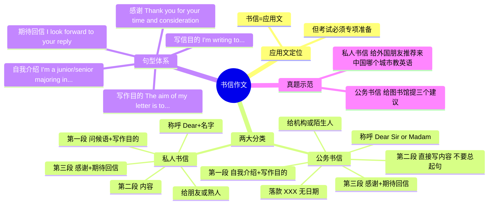

# CET-4：书信作文——公务书信与私人书信双套模板

> 📌 重构说明：源文件讲书信作文的两类模板（公务书信=给机构/陌生人，私人书信=给朋友/熟人），每类配套一篇真题示范。按「应用文定位→公务书信五段法→私人书信五段法→句型模板→两篇真题示范」的知识树重构。

---

## 🧠 思维导图



---

## 第一部分：书信作文的定位

### 一、不是「写作」那么简单

> 书信作文属于**应用文**——它有固定的格式和套路，不同于议论文的自由发挥。

| 维度 | 说明 |
|------|------|
| 文体 | 应用文 |
| 两大分类 | **公务书信**（给机构/陌生人）+ **私人书信**（给朋友/熟人） |
| 判断标准 | 不是看写给「一个人」还是「一群人」——**看关系熟不熟** |

> 「给校长写封信——他依然是公务书信。给你的好朋友写才是私人书信。」

---

## 第二部分：公务书信

### 二、公务书信五段法

```
称呼
  ↓
第一段：自我介绍 + 写作目的（两句话）
  ↓
第二段：直接写内容（首先、其次、最后）
  ↓
第三段：感谢 + 期待回信
  ↓
落款
```

### 三、称呼

| 题目情况 | 称呼写法 | 示例 |
|------|------|------|
| 给出了具体人名 | Dear + 给出的人名 | Dear Professor Smith |
| 没给出具体人名 | Dear Sir or Madam | Dear Sir or Madam |

> ⚠️ 大小写注意：Dear Sir or Madam，逗号不要忘。

### 四、第一段：自我介绍 + 写作目的

| 部分 | 说明 | 句型 |
|------|------|------|
| 自我介绍 | 永远写一句，根据情况编 | I'm a junior/senior majoring in... |
| 写作目的 | 永远写一句 | The aim of my letter is to... / I'm writing to... |

**总模板**：

> I'm a [大几] student from [专业] at [学校]. I'm writing this letter to [写作目的].

> ⚠️ 第一段**不要问候**！不要说「你最近过得好吗」——那是私人书信的写法。公务书信上来就是自我介绍+写作目的。

### 五、第二段：写内容

| 规则 | 说明 |
|------|------|
| **不要写总起句** | 不要说「我的建议有很多，下面三条是最重要的」 |
| 直接上来就写 | 首先、其次、最后 |
| 用学过的句型 | 简单句+连接词即可 |

### 六、第三段：感谢 + 期待回信

| 部分 | 常用表达 |
|------|------|
| 感谢 | Thank you for your time and consideration. |
| 期待回信 | I look forward to your reply at your earliest convenience. |

### 七、落款

| 规则 | 示例 |
|------|------|
| 只写名字 | Yours sincerely, Li Ming |
| **不写日期** | ❌ 不需要日期 |

---

## 第三部分：私人书信

### 八、私人书信五段法

```
称呼
  ↓
第一段：问候语 + 写作目的
  ↓
第二段：写内容
  ↓
第三段：感谢 + 期待回信
  ↓
落款
```

### 九、关键变化：第一段从「自我介绍」变成「问候语」

| 书信类型 | 第一段第一句 | 原因 |
|------|------|------|
| 公务书信 | **自我介绍** | 陌生人不认识你 |
| 私人书信 | **问候语** | 熟人不需要再自我介绍 |

**私人书信第一段模板**：

> Dear [朋友名字],
>
> How are you doing recently? I'm writing to [写作目的].
>
> 或：
>
> I'm glad to hear that you are [对方近况]. As for [主题], I think [推荐/建议] is the best choice.

> 「给你二舅写信——亲爱的二舅，我是一个大学体育专业大三的学生？神经病啊！是熟人就不需要自我介绍了。」

### 十、语句风格

| 公务书信 | 私人书信 |
|------|------|
| 正式、规范 | 随意、口语化 |
| The aim of my letter is to... | I'm writing to tell you... |
| I look forward to your reply | Hope to hear from you soon! |
| 不要关心对方最近怎样 | 可以先聊聊近况再进入主题 |

---

## 第四部分：句型模板速查

### 十一、通用句型库

| 功能 | 公务书信 | 私人书信 |
|------|------|------|
| 自我介绍 | I'm a junior/senior majoring in... at... | 不需要 |
| 问候 | 不需要（直接进入目的） | How are you doing recently? |
| 写作目的 | The aim of my letter is to... | I'm writing to... |
| 首先 | To begin with, / First of all, | First of all, |
| 其次 | In addition, / Moreover, | In addition, |
| 最后 | Last but not least, | Last but not least, |
| 感谢 | Thank you for your time and consideration. | Thanks for reading this. |
| 期待回信 | I look forward to your reply at your earliest convenience. | Hope to hear from you soon! |
| 落款 | Yours sincerely, [Name] | Yours, [Name] |

---

## 第五部分：两篇真题全程示范

### 十二、公务书信真题：给图书馆提建议

> 「Dear Sir or Madam, I'm a junior student majoring in Physical Education at this university. The aim of my letter is to provide some suggestions to improve your services.」

**称呼**：Dear Sir or Madam（没给具体人名，用通用称呼）

**第一段**：我是这个大学体育专业大一/大三的学生 + 写这封信是为了给你们提建议

**第二段**——直接提三个建议：

| 建议 | 内容 | 理由 |
|:---:|------|------|
| 1 | 增加英语书 | 英语在交流中扮演重要角色，学好英语能帮学生在事业和生活中更好地提升自己 |
| 2 | 改进图书管理员态度（尤其是某位） | 目前的态度让很多学生不愿意再来图书馆 |
| 3 | 图书馆早上七点开门 | 很多学生到得早，却要等很长时间 |

**连接词**：To begin with → In addition → Last but not least

**第三段**：感谢你花时间考虑我的建议，期待回复

**落款**：Yours sincerely, Li Ming（无日期）

### 十三、私人书信真题：给外国朋友推荐城市教英语

> 「一个外国朋友想来中国教英语，给他推荐一个城市。」

**称呼**：Dear Bob（熟人，直接名字）

**第一段**：最近过得怎么样？听说你要来中国教英语啦，说到去哪儿——我认为重庆是最好的选择！

**第二段**——三个推荐原因：

| 原因 | 内容 |
|:---:|------|
| 1 | 重庆是一座大的、发展中的城市，对英语老师有越来越多的需求 |
| 2 | （原因二） |
| 3 | （原因三） |

**第三段**：谢谢，有空回信哦

**落款**：Yours, Li Ming

---


> 📂 所属分类：[[英语四级-写作|写作]]

## 🔗 相关知识点

| 知识点 | 类型 | 说明 |
|--------|------|------|
| [[三段式框架]] | 结构模板 | 书信采用三段式结构：引入+内容+结尾 |
| [[分类论证]] | 论证方法 | 第二段内容可用分类论证展开 |


