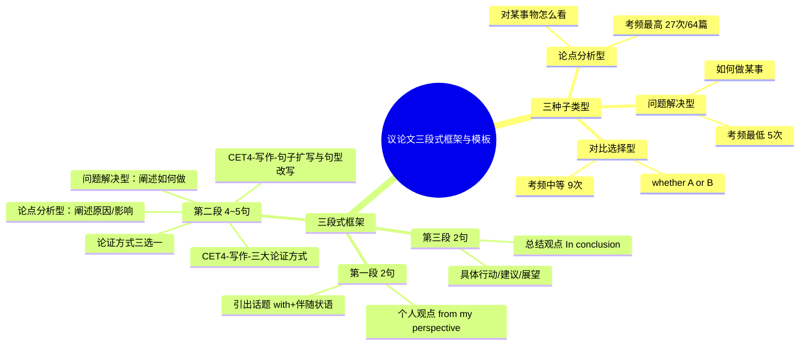

# CET-4：议论文三段式框架与模板

> 📌 重构说明：本笔记将课堂讲解的论点分析型、问题解决型议论文的完整框架和两个范例整合，含审题方法、每段具体句型和替代表达。议论文占比最高（60%+），是本课程的核心模块。

## 🧠 思维导图

---

## 一、通用三段式框架总览

### 核心原则

> ==不叫"模板"叫"框架"：因为纯模板已经不给分了。框架意味着结构和句型由你选择，每个人写出来的都不一样。==

### 三段式总表

| 段落 | 句数 | 内容 | 常用句型 |
|---|---|---|---|
| **第一段** | 2句 | ①引出话题 + ②个人观点 | With the rapid development of... / From my perspective... |
| **第二段** | 4-5句 | 论证（原因分析/影响分析/如何做） | First... Secondly... Lastly... / If... Conversely... / For example... |
| **第三段** | 2句 | ①总结观点 + ②具体行动/建议 | In conclusion... / It is necessary that... (should) do... |

> [!warning] ⚠️ 第一段永远只有2句话，多一句都废。第二段不要加总起句（如"There are three reasons"）——直接123开始论证。

---

## 二、论点分析型议论文——完整范例

### 审题示例

> 题目：Suppose the business school of your university is conducting a survey to collect students' opinions on the express delivery service industry in China. You are to write a response about its recent development and its impact on people's lives.

**审题步骤**：
1. 看关键词：essay/response → 论说文 ✓
2. 确定类型：看"opinions on..." → 论点分析型 ✓
3. 划出必须写的内容：recent development + impact on people's lives

### 第一段：引出话题 + 个人观点

#### 引出话题（第1句）

| 模式 | 例句 |
|---|---|
| with + 伴随状语 | **With the unprecedentedly rapid development of China's express delivery service industry**, this phenomenon has been **brought into the limelight**. |
| 简化版 | Recently, the express delivery service industry in China has **developed unprecedentedly rapidly**, which has **become a focus of public attention**. |

**备选引出话题句型**：
- Recently, ... has become a hot topic among the public.
- There is a growing concern over ...
- The issue of ... has aroused wide public concern.

#### 个人观点（第2句）

| 模式 | 例句 |
|---|---|
| 标准版 | **From my perspective**, China's express delivery industry **has exerted a profound impact on people's lives**. |
| 替代版 | **As far as I'm concerned**, the express delivery industry **has profoundly influenced people's daily lives**. |
| 主语从句版 | **It is my belief that** the express delivery industry **has had a significant influence on people's lives**. |

**个人观点常用表达（背一个即可）**：

| 表达式 | 推荐度 |
|---|---|
| From my perspective, ... | ⭐⭐⭐ 推荐 |
| As far as I'm concerned, ... | ⭐⭐⭐ 推荐 |
| It is my perspective that ... | ⭐⭐ 替代 |
| In my opinion, ... | ⭐ 可用但稍简单 |
| ❌ I think that ... | ❌ 太土，不用 |

### 第二段：分类论证（课堂标准范例）

> ==总起句 + 分类论证（个人→社区→社会）==

**总起句**：
> Superficially, it seems to be a simple phenomenon, but when **analyzing it carefully, it has profound reasons**.

**分类论证三层**：

| 层次 | 逻辑词 | 关键词 | 内容 |
|---|---|---|---|
| 对消费者 | **First**, | driven by scientific and technological innovation | 消费者点击鼠标就能跟踪全程服务 → 根本改变了消费习惯 |
| 对社区 | **Secondly**, | employment opportunities | 快递业创造了大量就业 → 分销店如雨后春笋 → 方便购物 + 增收 |
| 对社会 | **Lastly**, | upgrading and recycling of packaging materials → sustainable development | 快递包装环保升级 → 重视可持续发展 |

> 完整第二段英语（课堂范例）：
> Superficially, it seems to be a simple phenomenon, but when analyzing it carefully, it has profound reasons. **First**, driven by scientific and technological innovation, consumers can now **enjoy the full tracking service from ordering to receiving goods** just by clicking the mouse, which has **fundamentally changed people's consumption habits**. **Secondly**, the development of express delivery has also **created a large number of employment opportunities** for the community, whose outlets have **sprung up like mushrooms**, providing local residents with **convenient shopping channels and ways to increase income**. **Lastly**, the **upgrading and recycling of express packaging materials** also reflects the industry's **emphasis on sustainable development**.

### 第三段：总结 + 行动建议

| 句序 | 内容 | 例句 |
|---|---|---|
| 第1句 | 总结观点 | **In conclusion**, the recent development of China's express delivery industry **has indeed had a profound impact on people's lives**. |
| 第2句 | 具体行动/建议（h3+虚拟语气） | **It is necessary that** consumers **should avoid excessive consumption** and learn to save. |

> [!warning] ⚠️ 第三段第2句建议用 `it is necessary/important/essential that + (should) do` 结构，这是六级也用的高端虚拟句式，但四级完全可以用。

**备选总结句型**：
- To sum up, ...
- In a word, ...
- All in all, ...
- Taking all these factors into account, we may safely draw the conclusion that...

**备选行动建议句型**：
- It is high time that we (should) do...
- Only in this way can we...
- We are supposed to...

---

## 三、问题解决型议论文——完整范例

### 审题示例

> 题目：Suppose your university newspaper is inviting submissions from students for its coming issue on **how to enrich students' knowledge of traditional Chinese culture**. You are to write an essay.

**审题**：how to... → 问题解决型 ✓

### 第一段框架（与论点分析型相同）

> ①引出话题（中国传统文化受关注） + ②个人观点（我们应该加深了解）

| 句序 | 例句 |
|---|---|
| 引出话题 | **With the enhancement of China's global influence**, traditional Chinese culture **has attracted international interest**. |
| 个人观点 | **From my perspective**, college students **should deepen their understanding of** traditional Chinese culture and **effectively share Chinese stories** with the world. |

### 第二段：如何做（三种途径）

| 层次 | 逻辑词 | 内容 | 例句 |
|---|---|---|---|
| 途径一 | **First**, | 参与校园文化活动 | Students can **participate in campus cultural activities**, such as **attending lectures delivered by renowned scholars**. |
| 途径二 | **Secondly**, | 阅读中国历史和经典 | We should **read more books about Chinese history**. For example, my teacher often **recites ancient Chinese poems**. |
| 途径三 | **Lastly**, | 结合举例论证 | By **exchanging ideas with international students**, we can **spread Chinese culture** effectively. |

> 第二段正反论证备选：
> **If** college students read more about Chinese history, they **will better understand** the development of Chinese history. **Conversely**, if they are addicted to video games every day, they **may know nothing about** Chinese history.

### 第三段框架（相同）

> In conclusion, it is essential for college students to deepen their understanding of traditional Chinese culture. **Only by taking these measures can we** better inherit and promote our precious cultural heritage.

---

## 四、对比选择型议论文（框架概述）

### 识别关键词
> 题目中看到 **whether** → 对比选择型

### 框架要点

| 段落 | 内容 |
|---|---|
| 第一段 | 引出话题（两种观点）+ 明确表明自己的立场 |
| 第二段 | 论证你选择的理由（选一边站，不要模棱两可） |
| 第三段 | 总结 + 重申立场 |

---

## 五、议论文写作检查清单

> ==写完花3分钟逐项检查==

- [ ] 字数：是否120-180词？（150词最合适，约10行）
- [ ] 审题：是否跑题？题目要求的内容都写了吗？
- [ ] 第一段：是否2句话？（引出话题+个人观点）
- [ ] 第二段：是否用了逻辑关系词？是否有3-4个长句子？
- [ ] 第三段：是否2句话？（总结+行动建议）
- [ ] 语法：可数名词是否加了s？主谓是否一致？不可数名词（information等）是否被加了s？
- [ ] 句型：是否有至少3种不同句型？（不能全部主谓宾）

---

## 六、议论文高分短语集合

### 引出话题
| 英文 | 用法 |
|---|---|
| With the unprecedentedly rapid development of... | with + 伴随状语万能开头 |
| Recently, ... has become a focus of public attention. | 简单版引出话题 |
| There is a growing concern over... | 引出担忧类话题 |
| This phenomenon has been brought into the limelight. | 带入聚光灯/焦点 |

### 表达观点
| 英文 | 用法 |
|---|---|
| From my perspective, | 个人观点（推荐） |
| As far as I'm concerned, | 个人观点（推荐） |
| It is my firm belief that... | 个人观点（主语从句版） |
| have/has exerted a profound impact on... | 产生了深远影响 |

### 总结
| 英文 | 用法 |
|---|---|
| In conclusion, | 总结（推荐） |
| To sum up, | 总结（推荐） |
| It is necessary/essential that... (should) do... | 建议行动（虚拟句式） |
| Only in this way can we... | 倒装句式收尾 |

---

> 📂 所属分类：[[英语四级-写作|写作]]

## 🔗 相关知识点

| 知识点 | 类型 | 说明 |
|--------|------|------|
| [[三段式框架]] | 结构模板 | 议论文标准结构：引出话题→论证→总结 |
| [[正反论证]] | 论证方法 | 通过对比正反两方面论证观点 |
| [[分类论证]] | 论证方法 | 从不同层次分类论述 |
| [[举例论证]] | 论证方法 | 通过具体例子支撑论点 |

