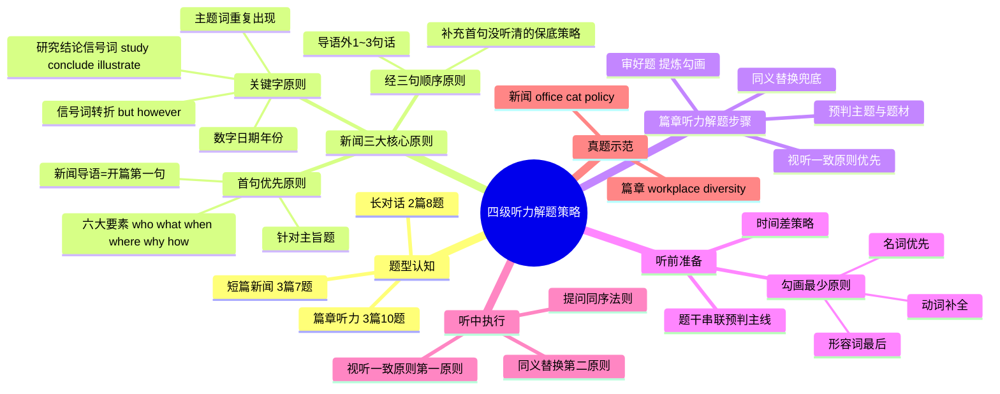

# CET-4：听力解题策略——新闻与篇章

> 📌 重构说明：本笔记合并了两次听力课程录音，打破「先讲方法论再讲例题」的线性流，按「题型认知→解题原则→听前准备→听中技巧→真题示范→避坑口诀」的知识树深度重构。

---

## 🧠 思维导图

---

## 第一部分：题型认知——听力板块全貌

### 一、题量与题型分布

| 板块 | 篇数 | 题数 | 特点 |
|------|:---:|:---:|------|
| 短篇新闻 | 3篇 | 7题 | 导语即主题，信息密度高 |
| 长对话 | 2篇 | 8题 | 正式/非正式两类，前三句出主题 |
| 篇章听力 | 3篇 | 10题 | 独白为主，逻辑链清晰 |

> 三大板块的解题策略**高度相通**：审题→预判→视听一致→同义替换，差别仅在题型特征的微调。

---

## 第二部分：新闻听力——三大核心解题原则

### 二、[[首句优先原则]]

新闻导语（开篇第一句）交代整个新闻的核心要素——**六大要素**：

> who（谁）、what（什么事）、when（何时）、where（何地）、why（为什么）、how（怎样）

适用题型：**主旨题**。问「这篇新闻主要讲什么」时，答案大概率在首句。

### 三、[[经三句顺序原则]]

当首句没听清、或首句只是引子而非主旨时，启用本原则：

> 在导语之外的**第1~3句话**范围内，仍然可以捕捉到新闻主题。

这是[[首句优先原则]]的**保底补充**——「首句没抓住，往后再听三句」。

### 四、关键字原则（针对细节题）

细节题的破解不靠泛听，靠**对特定信息的警觉**。四类关键信号：

| 信号类型 | 具体词/模式 | 为什么要警惕 |
|----------|------------|-------------|
| **转折[[信号词]]** | but, however, yet, although, nevertheless | 转折后=出题人最爱设考点的地方 |
| **数字/日期** | 年份、百分比、金额、序号 | 多数字同时出现必须记录，不能当甩手掌柜 |
| **主题词重复** | 新闻核心词在全文反复出现 | 说明这就是新闻的轴心话题 |
| **研究结论信号** | study finds..., research shows..., it is reported that..., sb. concluded that... | 2021年新增高频考点，结论句=主旨句 |

> ⚠️ 考点：听到转折词（but/however），**必须立刻收心**。前文走神没关系，转折后的句子就是答案所在。

---

## 第三部分：篇章听力——解题步骤

### 五、三步走流程

**第一步：审好题，提炼勾画**

不是「审准题」，而是「审好题」——利用已知题干信息进行提炼、总结、并做好规划。

**第二步：预判主题与题材**

根据所勾画的信息，判断文章大致讲什么方向。

**第三步：视听一致优先 + 同义替换兜底**

---

## 第四部分：通用解题技巧

### 六、听前准备——审题勾画

#### 6.1 为什么要勾画？（不是多此一举）

> 你从第3题倒回第1题时，如果只看了一遍没做任何标记，等回到第1题时你**完全不记得它讲了什么**——因为短时记忆的容量极其有限。

勾画的核心作用：用最少的关键词帮你**快速回忆起题干重点**，从而以最短时间进入「听题状态」。

#### 6.2 [[勾画最少原则]]（宁少勿多）

| 优先级 | 词性 | 说明 |
|:---:|------|------|
| 1 | **名词** | 最先勾，优先级最高 |
| 2 | **动词** | 光看名词还不懂题干意思时补勾 |
| 3 | **形容词** | 最后考虑，通常不需勾 |

> 如果题干本身只有两三个单词，全部勾上就是「最少」——原则不是死板的。

#### 6.3 题干串联预判主线

同一篇新闻/篇章的题目之间存在**隐藏的脉络**。边读题边在心里串起主线：

> 例：Q1 谈宠物猫捐款 → Q2 允许员工带猫上班 → Q3 给养猫员工发奖金 → 「这应该是讲公司对员工养猫的福利政策」

有了预判，听材料时就不再是「脑子发空发懵」的茫然状态。

### 七、听中执行——两大原则一铁律

#### 7.1 [[视听一致原则]]（第一原则）

> 听到的原文与题干选项**贴合度越高**，越倾向于正确答案。

注意：正确答案通常不是100%原词重现，而是一部分==视听一致== + 一部分==同义改写==搭配出现。

#### 7.2 [[同义替换]]（第二原则）

当[[视听一致原则]]找不到匹配时，马上切换思路：
- 「不是原词→是不是换了说法？」
- 回忆之前讲过的[[同义替换]]模式

#### 7.3 [[提问同序法则]]（铁律）

> 答案在原文中出现的顺序 = 题目发放的顺序。

| 第5题答案 | 在开头 |
|:---:|------|
| 第6题答案 | 在中间 |
| 第7题答案 | 在末尾 |

不可能第7题的答案出现在开头，第5题出现在中间——**永远不会这样考**。

### 八、听力能力全景——它不是单维度的

> 听力考察的不只是「听音辨词」，而是**综合能力**：听音辨音 + 短时记忆 + 反应速度 + 逻辑推理。

这也是听力成为四级四个板块中**最难**的原因。

---

## 第五部分：真题示范——新闻篇（Office Cat Policy）

### 九、审题示范

**Q5 选项：**

| 选项 | 勾画关键词 | 理解 |
|------|-----------|------|
| A | donate money, animal shelters | 给动物避难所捐钱 |
| B | employees bring cats, office | 允许员工带猫上班 |
| C | $5,000, employees, pets | 给养宠员工5000元 |
| D | workers do, hearts desire | 允许员工做内心想做的事 |

**Q6 选项：**

| 选项 | 勾画关键词 | 理解 |
|------|-----------|------|
| A | cats, keep off street | 让猫远离街道 |
| B | rescue homeless cats | 救助流浪猫 |
| C | volunteer, animal shelters | 志愿帮助动物避难所 |
| D | establish animal protection, fund | 成立动物保护机构并提供资金 |

**Q7 选项：**

| 选项 | 勾画关键词 | 理解 |
|------|-----------|------|
| A | contribute to, firm's fame | 有助于公司名誉 |
| B | help improve, animals' well-being | 改善动物福祉 |
| C | lead other companies, follow suit | 带动其他公司效仿 |
| D | led to damage, office equipment | 导致办公设备损坏 |

#### 题干串联预判

Q5-Q7 的共同关键词：cat, animal, office, company, employee → **这是一篇关于公司推行猫咪友好政策的新闻**。

### 十、听材料做题

> 真题材料播放一遍——平时练习可以多听，但要清楚考试只放一遍。

**原文摘要**：
> A Japanese IT firm has officially introduced an "office cat" policy to combat the stressful environment of the workplace. A total of nine furry friends freely wander around the office and do whatever their little hearts desire. Hidenobu Fukawa, who heads the firm, introduced the pet policy upon request from one of his employees, allowing staff to bring their own cats to work.

| 题号 | 答案 | 依据 |
|:---:|------|------|
| Q5 | D（允许员工做内心想做的事） | 视听一致：do whatever their little hearts desire |
| Q6 | B（救助流浪猫） | 原文提到rescue homeless cats |
| Q7 | B（改善动物福祉） | 原文提到improve animals' well-being / C也有提及但B匹配度更高 |

---

## 第六部分：避坑与口诀

### 十一、常见误区

| 误区 | 真相 |
|------|------|
| 「题目不用看就能选对」 | **天方夜谭**。四级听力必须有针对性审题。 |
| 「勾画越多越好」 | 勾得跟原文一样多=没勾。必须遵循最少原则。 |
| 「边看选项边听材料」 | 注意力会**被大大分散**。必须是先看完→再听。 |
| 「听到原词就是答案」 | 大部分答案=试听一致+同义替换混合，不是纯原词。 |

### 十二、考场口诀

| 口诀 | 含义 |
|------|------|
| **名词优先，能少则少** | 勾画原则：名词→动词→形容词，宁少勿多 |
| **信号词一响，魂必须归位** | 听到but/however等，立刻警觉 |
| **首句不抓往后三句** | 新闻主旨题的保底策略 |
| **顺序做题，永不回头** | 提问同序：答案位置=题目序号 |
| **试听一致优先，改替换兜底** | 先找原词匹配，找不到再想同义替换 |

---

> 📂 所属分类：[[英语四级-听力|听力]]

## 🔗 相关知识点

| 知识点 | 类型 | 说明 |
|--------|------|------|
| [[首句优先原则]] | 新闻解题 | 导语=开篇第一句，涵盖六大要素 |
| [[经三句顺序原则]] | 新闻解题 | 导语外1~3句内仍可抓到主题 |
| [[信号词]] | 新闻解题 | 信号词、数字、主题词、研究结论 |
| [[勾画最少原则]] | 审题技巧 | 名词→动词→形容词，宁少勿多 |
| [[视听一致原则]] | 听中技巧 | 听到的与选项贴合度越高越优先 |
| [[同义替换]] | 听中技巧 | 找不到原词匹配时的第二策略 |
| [[提问同序法则]] | 铁律 | 答案顺序=题目发放顺序 |

