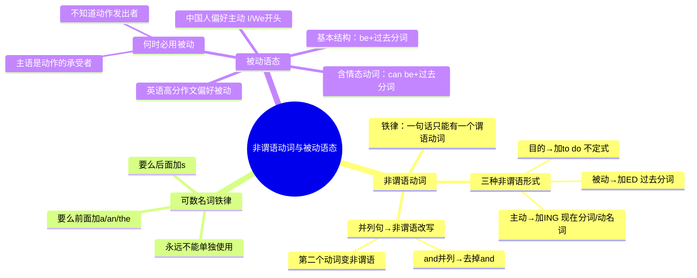

# CET-4：非谓语动词与被动语态（语法核心）

> 📌 重构说明：本笔记将课堂讲解的10个语法例句重组为「非谓语动词三大规则」「可数名词铁律」「被动语态写作策略」「翻译实战」四大知识模块，是写作翻译语法不出错的基石。

## 🧠 思维导图



---

## 一、非谓语动词核心规则

### 1.1 铁律：一句话只能有一个谓语动词

> ==英语中一句话只能有一个动词做谓语，多余的动词全部要变成「不是动词」——即非谓语动词。==

```
一句话 = 1个谓语动词 + (n个非谓语动词)
```

### 1.2 三种非谓语形式速查表

| 关系 | 形式 | 关键词 | 示例 |
|---|---|---|---|
| 主动 | **V-ing** | 主动做 | spending, playing, lying, symbolizing |
| 被动 | **V-ed** | 被做 | described, picked, known |
| 目的 | **to do** | 为了做 | to improve, to express |

### 1.3 课堂10个例句逐一分析

> 以下10个例句涵盖非谓语动词的所有典型场景。

#### 例句1：并列谓语 → 非谓语改写

| 原并列句 | 非谓语版 |
|---|---|
| My husband **surfs** the Internet every day, and **spends** a lot of time playing games, and **watches** short videos. | My husband **surfs** the Internet every day, **spending** a lot of time **playing** games and **watching** short videos. |

> **分析**：surfs 保留做谓语 → 后面主动动作全变 V-ing

> [!warning] ⚡️ **考点**: spend time/money (in) doing something 是固定搭配，花时间/金钱做某事。

#### 例句2：and 连接 → 非谓语改写

| 并列句（两句） | 非谓语版（一句） |
|---|---|
| The party **was** over, and Dayan **went** home disappointedly. | The party **being** over, Dayan **went** home disappointedly. |

> **分析**：went 保留做谓语（句子决定说"回家"更重要） → was 变 being（主动）

#### 例句3：乌镇——主谓关系判断

| 并列句 | 非谓语版 |
|---|---|
| Wuzhen **is** a water town in Zhejiang Province, and it **lies** near the Beijing-Hangzhou Grand Canal. | Wuzhen **is** a water town in Zhejiang Province, **lying** near a river from Beijing to Hangzhou. |

> **分析**：is 保留做谓语 → lies 变 lying（乌镇自己"位于"，是主动）

#### 例句4：灯笼——翻译真题

```
唐代，灯笼在很多地方流行起来，它象征着生活美满、生意兴隆。
```

| 成分 | 英文 | 分析 |
|---|---|---|
| 谓语 | **became popular** | became 保留做谓语（过去时） |
| 非谓语 | **symbolizing** a happy life and prosperous business | symbolizing（主动→V-ing） |

> 完整句：Lanterns **became popular** in many places in the Tang Dynasty, **symbolizing** a happy life and prosperous business.

> [!warning] ⚠️ 可数名词不能单独使用！Lantern 必须写成 Lanterns（复数），或者 A lantern。

#### 例句5：明朝——翻译真题

```
明朝统治中国276年，被人们描述为人类历史上最伟大的时代之一。
```

| 成分 | 英文 | 分析 |
|---|---|---|
| 谓语 | **had ruled** China for 276 years | had ruled 保留做谓语（过去完成时） |
| 非谓语 | **described** as one of the greatest eras... | described（被动→V-ed） |

> 完整句：The Ming Dynasty **had ruled** China for 276 years, **described** as one of the greatest eras in human history for its stable society.

> [!warning] ⚡️ **考点**: "被人们描述为"中的"被人们"是虚词（没说是具体谁），不需要翻译成 by people——直接用过去分词 described。

---

## 二、可数名词铁律

> ==可数名词永远不能单独使用。==

### 规则

| 用法 | 示例 |
|---|---|
| 前面加 a/an | **a** book |
| 前面加 the | **the** book |
| 后面加 s | book**s** |

### 经典错误对照

| 错误 ❌ | 正确 ✅ | 原因 |
|---|---|---|
| Bicycle is very important. | **Bicycles are** very important. 或 **The bicycle is** very important. | bicycle 可数，不能光杆 |
| Lantern became popular. | **Lanterns** became popular. | lantern 可数，不能光杆 |

> [!warning] ⚠️ 这是四级写作中最高频的语法错误之一！写完作文必须检查所有名词前是否有 a/an/the 或后面是否有 s。

---

## 三、被动语态——写作翻译满分句型

### 3.1 为什么要用被动？

> ==中国学生写英语作文，90%的句子以 I/We/You 开头。但英语阅读理解中几乎见不到人打头的句子。== 被动语态是写作和翻译的满分句型。

### 3.2 被动语态基本结构

| 时态 | 结构 | 示例 |
|---|---|---|
| 一般现在时被动 | **am/is/are + V-ed** | English **is spoken** worldwide. |
| 一般过去时被动 | **was/were + V-ed** | The letter **was written** yesterday. |
| 含情态动词被动 | **can/must/should be + V-ed** | Tieguanyin **can be picked** all year round. |

### 3.3 翻译真题实战

#### 铁观音一年四季均可采摘

> 拿到句子先找主谓宾 → 铁观音（主） 可采摘（谓） 一年四季（状语）

| 成分 | 分析 | 英文 |
|---|---|---|
| 主语 | 铁观音 | Tieguanyin |
| 谓语 | 可采摘（被动！茶是被人采摘的） | **can be picked** |
| 状语 | 一年四季 | all year round / at any time in a year |

> 完整句：Tieguanyin **can be picked** all year round.

> [!warning] ⚡️ **考点**: "一年四季"不会写 → 替换为 all year round 或 at any time in a year，不要纠结"四季"一定要翻译出 four seasons。

#### 由于春秋两季采摘的茶叶品质最高（状语处理）

> 这句话是前面句子的伴随状语，可以处理为：

```
..., with the tea picked in spring and autumn being of the highest quality.
```

> 或者拆成两句话：
> Tieguanyin can be picked all year round. **And** the tea picked in spring and autumn **is** of the highest quality.

> [!warning] ⚠️ 翻译中不会写的单词，不要死磕。京杭大运河不会写 → a river from Beijing to Hangzhou。"季节"不会写 → 用 time/year 替代。阅卷老师不会逐字对照中文检查。

---

## 四、翻译技巧补充

### 4.1 翻译基本流程

```
拿到句子 → 先确定主谓宾 → 主谓宾之外的全是定语/状语/同位语
```

### 4.2 不会写的单词处理三策略

| 策略 | 示例 |
|---|---|
| 近义词替换 | "描述"不会写 → said / thought / considered |
| 解释法 | "京杭大运河" → a river from Beijing to Hangzhou |
| 略过法 | 三个并列词中一个不会 → 只写两个（阅卷不逐字对照） |

### 4.3 翻译顺序

> **由于春秋两季采摘的茶叶品质最高** → 分析：这不是定语（不在名词前出现"的"+"名词"），那就是状语。
>
> 只要不是定语，99% 都是状语。

---

## 五、语法检查清单（写完必查）

> ==花3分钟逐项检查==

| 检查项 | 具体内容 |
|---|---|
| 1. 一句话是否只有一个谓语？ | 多出来的动词是否已变非谓语（V-ing / V-ed / to do）？ |
| 2. 可数名词是否光杆？ | 每个可数名词前有 a/an/the 或后有 s 吗？ |
| 3. 主谓一致？ | 主语是单数，动词加 s 了吗？主语是复数，动词用原形了吗？ |
| 4. 不可数名词被加 s？ | information, news, advice, furniture 等不可数名词是否被加了 s？ |
| 5. 被动语态结构正确？ | be + 过去分词，不能漏 be |
| 6. 虚拟语气完整？ | if 从句过去式 / were + 主句 would + 动词原形 |

---


> 📂 所属分类：[[英语四级-语法|语法]]

## 🔗 相关知识点

| 知识点 | 类型 | 说明 |
|--------|------|------|
| [[三段式框架]] | 结构模板 | 语法知识支撑三段式写作 |
| [[正反论证]] | 论证方法 | 需要正确的语法结构 |
| [[分类论证]] | 论证方法 | 需要正确的语法结构 |
| [[举例论证]] | 论证方法 | 需要正确的语法结构 |


