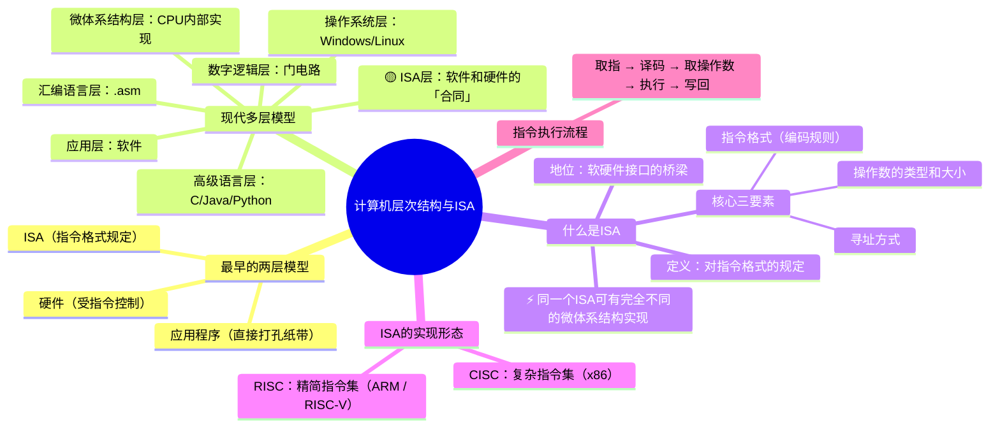
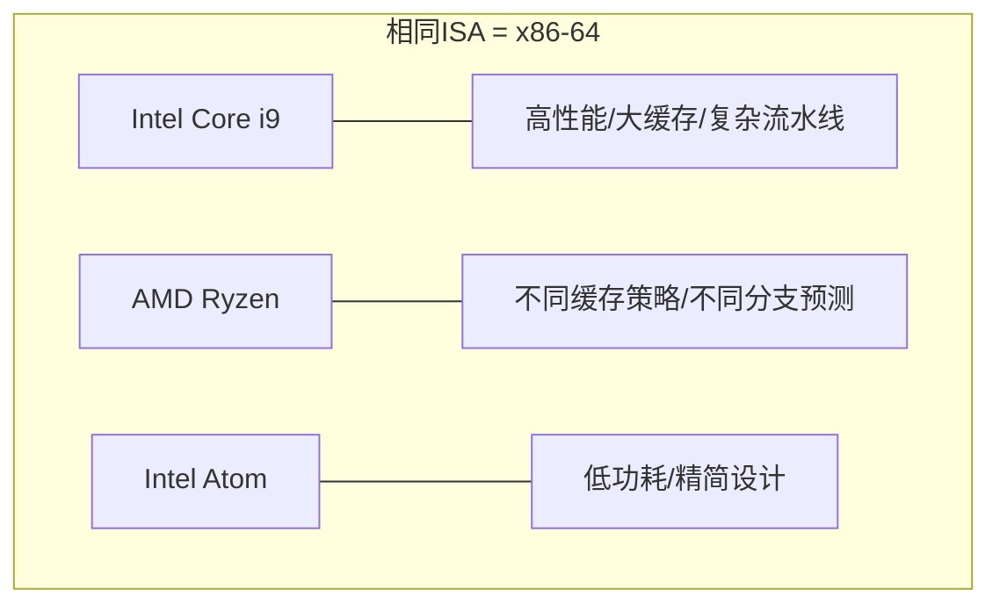

# 计算机层次结构与指令集体系结构

> 📌 重构说明：本笔记从最早机器语言时代的简单两层模型讲起，逐步演化至现代计算机的完整层次结构，以 ISA（指令集体系结构）为桥梁，串联软件层与硬件层的全部抽象。

---

## 🧠 思维导图



---

## 第一部分：从简单到复杂——层次结构的演化

### 一、最早的两层模型

老师首先回顾了计算机早期的简单结构：

```
应用程序（纸带打孔的程序）
    ↕ 必须满足特定[[指令格式]]
[[ISA]]
    ↕ 控制硬件开关
硬件电路
```

> 老师原话：「最早用 0 和 1 用[[机器语言]]去编程的时候，[[计算机系统]]的层次结构就很简单——应用程序，然后让我们的应用程序的[[指令]]满足控制计算机的一种格式规定，然后硬件就受控制了。」

### 二、现代分层模型

计算机发展到今天，层次结构已经演变为非常复杂的多级抽象：

```
┌─────────────────────────────────────┐
│  应用层（软件、用户程序）            │  ← 你在用的 App
├─────────────────────────────────────┤
│  高级语言层（C / Java / Python）     │  ← 你的源代码
├─────────────────────────────────────┤
│  汇编语言层（.asm / .s）            │  ← 编译的中间结果
├─────────────────────────────────────┤
│  操作系统层（Win / Linux / macOS）   │  ← 管理资源
├═════════════════════════════════════┤
│  🟡 指令集体系结构层（ISA）          │  ← 软硬件分界线
├═════════════════════════════════════┤
│  微体系结构层（CPU 内部组织）        │  ← 硬件实现
├─────────────────────────────────────┤
│  功能部件层（ALU / 寄存器 / 总线）   │  ← 组件
├─────────────────────────────────────┤
│  电路层（逻辑门）                   │  ← 门电路
├─────────────────────────────────────┤
│  器件层（晶体管）                    │  ← 物理实体
└─────────────────────────────────────┘
```

---

## 第二部分：ISA——软件与硬件的「合同」

### 三、ISA 的直观理解

> 老师原话：「ISA 你可以先简单把它理解为我怎么样的格式能控制开关。0 和 1 像某一种格式，刚好能代表把某一个器件打开——它满足某一种格式。所以 ISA 可以看成是**对指令格式的一种规定**。」

ISA 的地位是独一无二的：它是软件层和硬件层之间唯一的**桥梁**。

#### 3.1 ISA 的三个核心维度

| 维度 | 内容 | 例子 |
|------|------|------|
| **指令格式** | 指令的二进制编码规则 | 操作码长度、操作数字段位置 |
| **寻址方式** | 如何定位操作数 | 寄存器寻址、直接寻址、间接寻址 |
| **操作数类型** | 支持的数据类型和大小 | 8 位 byte、16 位 word、32 位 dword |

#### 3.2 软件编写视角的重要理解

> [!warning] 考点
> ⚠️ ISA 是软件开发者能看到的「计算机的抽象界面」——我们编程时无需知道 CPU 内部的晶体管怎么接，只需要知道指令格式、寄存器名字和操作规则。这一层提供的**抽象屏蔽**是现代软件工程得以存在的基础。

### 四、同一个 ISA，千差万别的实现

老师用了一个非常深刻的概念来解释 ISA 的关键特性：

> 老师原话浓缩：「相同的 ISA 可以有不同的**微体系结构**实现。」



**例证**：Intel 和 AMD 都实现了 x86-64 ISA，但它们的 CPU 内部设计完全不同：
- 不同的流水线深度
- 不同的缓存大小和策略
- 不同的分支预测算法
- 不同的晶体管布局

但对程序员来说，它们**看起来一模一样**——同样的寄存器名、同样的指令助记符、同样的寻址方式。

---

## 第三部分：ISA 的两种哲学——CISC 与 RISC

### 五、CISC：复杂指令集

| 属性 | 说明 |
|------|------|
| **代表** | x86 / x86-64 |
| **设计哲学** | 一条指令做很多事 |
| **指令长度** | 可变（1~15 字节） |
| **指令数量** | 数百条 |
| **寻址方式** | 丰富多彩 |
| **优势** | 编译器优化空间大、代码密度高 |
| **劣势** | 硬件实现复杂、解码器难做 |
| **应用场景** | PC 和服务器（Intel / AMD） |

### 六、RISC：精简指令集

| 属性 | 说明 |
|------|------|
| **代表** | ARM / RISC-V / MIPS |
| **设计哲学** | 每条指令只做一件简单的事 |
| **指令长度** | 固定（通常 4 字节） |
| **指令数量** | 数十条精选指令 |
| **寻址方式** | 简单统一 |
| **优势** | 硬件简单、功耗低、易流水线 |
| **劣势** | 代码密度可能较低 |
| **应用场景** | 移动设备（ARM）、嵌入式、新兴生态（RISC-V） |

> [!info] 补充定义
> **RISC-V** 是加州大学伯克利分校开发的**开放标准**指令集，不像 ARM/x86 那样受制于商业授权，近年来在 IoT、AI 加速器等新兴领域发展迅猛。

---

## 第四部分：指令的「一生」——取指 → 执行

### 七、一条指令的完整旅行

老师用流程图的方式描述了计算机如何执行每一条指令：


#### 7.1 逐阶段详解

| 阶段 | 做什么 | 涉及部件 |
|------|--------|---------|
| **取指 (Fetch)** | 从内存读取下一条指令 | 程序计数器 PC → 地址总线 → 内存 → 指令寄存器 IR |
| **译码 (Decode)** | 解析操作码和操作数 | 译码器电路 |
| **取操作数** | 从寄存器或内存读取数据 | 寄存器文件 / 数据总线 |
| **执行 (Execute)** | ALU 完成运算 | 算术逻辑单元 ALU |
| **写回 (Write Back)** | 把结果写入寄存器或内存 | 数据总线 |

#### 7.2 程序计数器（PC）的关键作用

> 老师原话提炼：「取完一条指令后，PC 自动增加。如果是跳转指令，PC 被修改为新地址。然后下一轮又从新的 PC 开始取指令。」

这就是计算机执行程序的**最基本的循环**——取一条、执行一条、PC+1、再取下一条……

### 八、具体指令追踪实例

假设我们要执行这条汇编指令：

```asm
ADD EAX, 5    ; EAX = EAX + 5
```

**追踪每一步：**

| 步骤 | PC 值 | 操作 | 状态变化 |
|------|-------|------|----------|
| ① 取指 | 0x1000 | 从 0x1000 读出 `83 C0 05` | IR = `83 C0 05`；PC → 0x1003 |
| ② 译码 | — | 解析：操作码=ADD, 目标=EAX, 立即数=5 | — |
| ③ 取操作数 | — | 读 EAX 寄存器值（假设=10） | ALU 输入端 A=10 |
| ④ 执行 | — | ALU：10 + 5 = 15 | ALU 输出=15 |
| ⑤ 写回 | — | 结果 15 写入 EAX | EAX = 15 |

> [!warning] 考点
> ⚠️ 填空题/简答题高频：计算机执行程序的循环是 **取指令 → 译码 → 执行（含取操作数）→ 写回**，其中 PC 寄存器始终指向下一条指令的地址。

---

## 第五部分：从概念到应用——为什么层次结构重要

### 九、抽象层的价值

每一层抽象都**对上一层隐藏复杂性**：

| 层次 | 隐藏了什么 | 提供什么 |
|------|-----------|---------|
| 高级语言层 | 寄存器分配、函数调用约定 | 直观的变量、循环、函数 |
| 汇编语言层 | 机器码编码细节 | 助记符和标签 |
| ISA 层 | 微体系结构实现细节 | 统一的指令模型 |
| 微体系结构层 | 晶体管开关时序 | 功能模块的组织 |

### 十、一个具体的多层次追踪

我们从 C 代码逐层向下追踪到底层硬件，展示层次结构如何运转：

**C 语言源码：**
```c
int c = a + b;
```

↓ **编译器翻译到汇编**
```asm
MOV  EAX, [a]    ; 读变量 a 的值
ADD  EAX, [b]    ; 加上变量 b 的值
MOV  [c], EAX    ; 存到变量 c
```

↓ **汇编器翻译到机器码**
```
A1 00 10 40 00    ; MOV EAX, [a]
03 05 04 10 40 00 ; ADD EAX, [b]
A3 08 10 40 00    ; MOV [c], EAX
```

↓ **CPU 执行每条机器码**
```
取指 → 译码 → ALU执行加法 → 写回寄存器
      ↓
  控制器发出控制信号
      ↓
  门电路开关 → 晶体管导通/截止
```

> 📌 完整追踪的价值：理解这一完整的转换链条，才能真正理解「计算机系统」的运作。这也是老师反复强调「从系统上认识计算机」的含义所在。

---


> 📂 所属分类：[[计算机-系统与硬件|系统与硬件]]


