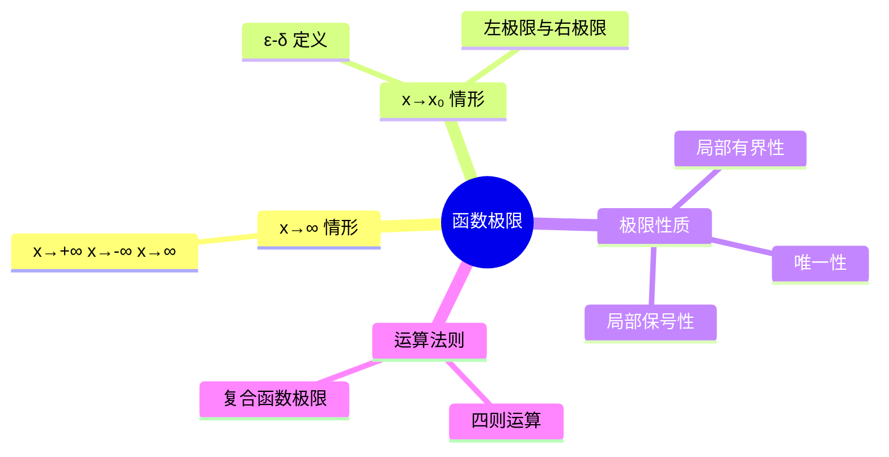

# 高数：函数的极限与运算法则

> 📌 重构说明：本笔记按「函数极限定义（x→∞与x→x₀）→ 左右极限 → 极限运算法则 → 复合函数极限」重构。

## 🧠 思维导图

---

## 一、函数极限的定义

### 1.1 $x \to \infty$ 的情形

$$\boxed{\lim_{x \to \infty} f(x) = A \iff \forall \varepsilon>0, \exists X>0,\ \text{s.t. } |x|>X \Rightarrow |f(x)-A|<\varepsilon}$$

### 1.2 $x \to x_0$ 的情形

> 📖 补充定义：$\lim_{x \to x_0} f(x) = A \iff \forall \varepsilon>0, \exists \delta>0$，当 $0<|x-x_0|<\delta$ 时，恒有 $|f(x)-A|<\varepsilon$。

注意：$x \to x_0$ 时，$x$ 不能等于 $x_0$，因此极限与 $f(x_0)$ 的值无关。

---

## 二、左右极限

### 2.1 定义

| 类型 | 记号 | 条件 |
|:----:|:----:|:----:|
| 左极限 | $\lim_{x \to x_0^-} f(x)$ | $x$ 从左侧趋近 $x_0$ |
| 右极限 | $\lim_{x \to x_0^+} f(x)$ | $x$ 从右侧趋近 $x_0$ |

### 2.2 极限存在定理

$$\boxed{\lim_{x \to x_0} f(x) \text{ 存在 } \iff \text{ 左右极限均存在且相等}}$$

> [!warning] 考点
> ⚠️ 分段函数的分段点、绝对值函数的分界点处，极限是否存在必须分别考虑左右极限。

---

## 三、极限运算法则

### 3.1 四则运算

若 $\lim f(x) = A$，$\lim g(x) = B$，则：

| 运算 | 公式 |
|:----:|:----:|
| 加法 | $\lim [f(x) \pm g(x)] = A \pm B$ |
| 乘法 | $\lim [f(x) \cdot g(x)] = A \cdot B$ |
| 除法 | $\lim \frac{f(x)}{g(x)} = \frac{A}{B}\ (B \neq 0)$ |

### 3.2 复合函数极限

若 $\lim_{x \to x_0} g(x) = u_0$，且在 $x_0$ 附近 $g(x) \neq u_0$，则：

$$\lim_{x \to x_0} f(g(x)) = \lim_{u \to u_0} f(u)$$

---

## 🔗 知识网络

### 前置依赖
- [[01-02_数列的极限]] — 海涅定理连接数列与函数极限
- [[01-01_函数的概念与基本要素]] — 函数的三要素

### 后续应用
- [[01-04_极限存在准则与重要极限]] — 两个重要极限的证明
- [[01-05_无穷小与无穷大]] — 无穷小的比较

---

## 📚 核心词条索引

| 知识点链接 | 类别 | 关键词 |
|------|------|--------|
| [[函数极限]] | 核心概念 | $x \to x_0$ 或 $x \to \infty$ 时 $f(x)$ 的趋近值 |
| [[ε-δ 定义]] | 定义 | $\forall\varepsilon>0,\exists\delta>0,\ |x-x_0|<\delta \Rightarrow |f(x)-A|<\varepsilon$ |
| [[左极限]] | 概念 | $x$ 从左侧趋近 $x_0$ |
| [[右极限]] | 概念 | $x$ 从右侧趋近 $x_0$ |
| [[极限四则运算]] | 法则 | 加减乘除的极限等于极限的加减乘除 |