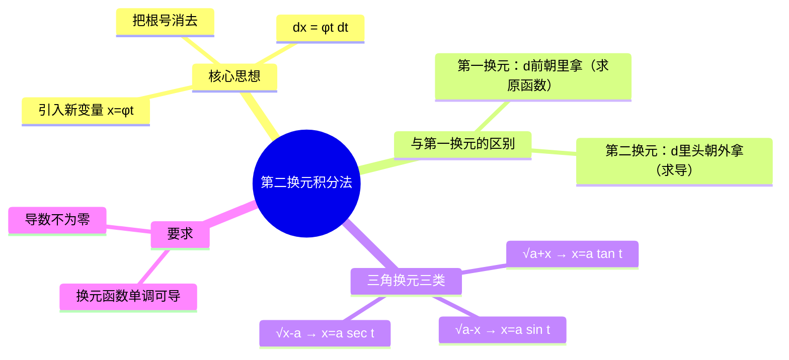

# 高数：第二换元积分法

> 📌 重构说明：本笔记按「第一换元与第二换元的区别 → 第二换元的条件 → 三角换元（三类）→ 例题」重构，来源于语音片段中关于第二换元积分法和三角换元的详细讲解。

## 🧠 思维导图

---

## 一、核心思想

### 1.1 基本思路

第二换元积分法引入新变量 $t$，令 $x = \varphi(t)$，则：

$$\boxed{\int f(x)\,dx = \int f(\varphi(t)) \cdot \varphi'(t)\,dt}$$

计算完成后，利用 $\varphi(t)$ 的反函数 $t = \varphi^{-1}(x)$ 代回。

### 1.2 与第一换元法的区别

| 特征 | 第一换元法 | 第二换元法 |
|:----:|:----------:|:----------:|
| 操作方向 | 把 $d$ 前的函数**拿进** $d$ 里 | 把 $d$ 里的 $x$ **拿出**来 |
| 对应运算 | 求原函数（逆过程） | 求导（正过程） |
| 适用场景 | 积分较规整，凑微分即可 | 含根号、复杂表达式 |

---

## 二、对换元函数的要求

令 $x = \varphi(t)$ 需要满足：

1. **单调** — 保证存在反函数，可以代回
2. **可导** — 需要计算 $\varphi'(t)$
3. **$\varphi'(t) \neq 0$** — 保证变换是良定的

---

## 三、三角换元（三类）

三角换元解决根号下含 $x^2$ 的积分，核心是利用三角恒等式消去根号。

### 3.1 类型一：$\sqrt{a^2 - x^2}$

$$\boxed{x = a\sin t,\quad t \in \left(-\frac{\pi}{2}, \frac{\pi}{2}\right)}$$

则 $\sqrt{a^2 - x^2} = \sqrt{a^2 - a^2\sin^2 t} = a|\cos t| = a\cos t$（在区间内 $\cos t > 0$）

### 3.2 类型二：$\sqrt{a^2 + x^2}$

$$\boxed{x = a\tan t,\quad t \in \left(-\frac{\pi}{2}, \frac{\pi}{2}\right)}$$

### 3.3 类型三：$\sqrt{x^2 - a^2}$

$$\boxed{x = a\sec t}$$

> [!example] 例题：求 $\int \sqrt{a^2 - x^2}\,dx$
> **题目**：求 $\int \sqrt{a^2 - x^2}\,dx$。
> **关键步骤**：
> ① 令 $x = a\sin t$，$dx = a\cos t\,dt$
> ② $\sqrt{a^2 - x^2} = a\cos t$（$t\in(-\pi/2,\pi/2)$）
> ③ 原式 $= \int a\cos t \cdot a\cos t\,dt = a^2\int \cos^2 t\,dt$
> ④ $\cos^2 t = \frac{1+\cos 2t}{2}$，积分得 $\frac{a^2}{2}(t + \frac{1}{2}\sin 2t) + C$
> ⑤ 用 $t = \arcsin\frac{x}{a}$ 代回
> **答案**：$\frac{a^2}{2}\arcsin\frac{x}{a} + \frac{x}{2}\sqrt{a^2-x^2} + C$

---

## 🔗 知识网络

### 前置依赖
- [[04-01_不定积分的概念与性质]] — 不定积分的基本概念
- [[02-01_求导法则与基本公式]] — 链式法则是换元的理论基础

### 后续应用
- 定积分的换元法
- 反常积分的计算

### 对比辨析
- 第一换元 vs 第二换元：第一换元把 $d$ 前函数拿进去（凑微分），第二换元把 $x$ 拿出来（引入新变量）

---

## 📚 核心词条索引

| 知识点链接 | 类别 | 关键词 |
|------|------|--------|
| [[第二换元积分法]] | 方法 | 令 $x=\varphi(t)$ 换元积分 |
| [[三角换元]] | 方法 | 用三角函数替换消去根号 |
| [[第一换元积分法]] | 方法 | 凑微分法，把函数拿到 $d$ 里 |