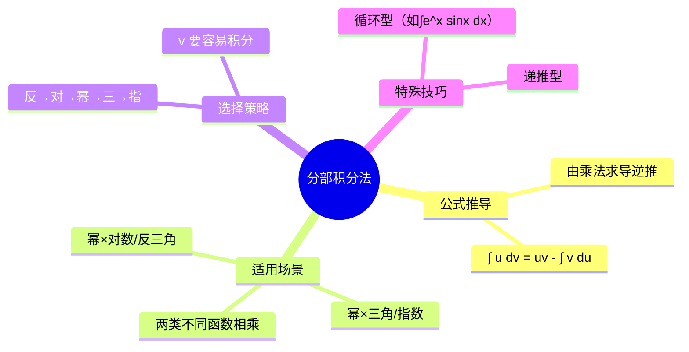

# 高数：分部积分法

> 📌 重构说明：本笔记按「分部积分公式推导 → 适用场景 → 选择策略 → 典型例题」重构，来源于语音片段中关于分部积分法的讲解。

## 🧠 思维导图

---

## 一、分部积分公式

### 1.1 公式推导

由乘法求导法则 $(uv)' = u'v + uv'$ 移项得：

$$uv' = (uv)' - u'v$$

两边积分得分部积分公式：

$$\boxed{\int u\,dv = uv - \int v\,du}$$

其中 $u = u(x)$，$v = v(x)$，$du = u'(x)dx$，$dv = v'(x)dx$。

### 1.2 核心思想

将不易直接积分的 $\int u\,dv$ 转化为易积分的 $\int v\,du$。关键是**选对 $u$ 和 $dv$**。

---

## 二、选择策略

### 2.1 优先顺序

在选择 $u$ 时，按反着顺序优先：

$$\boxed{\text{反三角函数} \to \text{对数函数} \to \text{幂函数} \to \text{三角函数} \to \text{指数函数}}$$

即：$u$ 选排在前面的，$dv$ 选排在后面的。

| 类型 | $u$ 的选择 | $dv$ 的选择 | 说明 |
|:----:|:----------:|:----------:|:----:|
| $\int x^n e^x\,dx$ | $x^n$ | $e^x$ | 降幂 |
| $\int x^n \sin x\,dx$ | $x^n$ | $\sin x$ | 降幂 |
| $\int x^n \ln x\,dx$ | $\ln x$ | $x^n$ | 消去对数 |
| $\int e^x \sin x\,dx$ | 任选一个 | 另一个 | 循环型 |

---

## 三、典型例题

> [!example] 例题1：简单型
> **题目**：求 $\int x e^x\,dx$。
> **关键步骤**：
> ① 令 $u = x$，$dv = e^x\,dx$ ⇒ $du = dx$，$v = e^x$
> ② $\int x e^x\,dx = x e^x - \int e^x\,dx = x e^x - e^x + C$
> **答案**：$(x-1)e^x + C$

> [!example] 例题2：循环型
> **题目**：求 $\int e^x \sin x\,dx$。
> **关键步骤**：
> ① 令 $u = e^x$，$dv = \sin x\,dx$ ⇒ 分部得 $I = -e^x\cos x + \int e^x\cos x\,dx$
> ② 对 $\int e^x\cos x\,dx$ 再次分部 ⇒ $I = -e^x\cos x + e^x\sin x - I$
> ③ 移项：$2I = e^x(\sin x - \cos x)$
> **答案**：$\frac{1}{2}e^x(\sin x - \cos x) + C$

---

## 🔗 知识网络

### 前置依赖
- [[02-01_求导法则与基本公式]] — 乘法法则的逆用
- [[04-01_不定积分的概念与性质]] — 积分基本公式

### 后续应用
- 定积分的分部积分法
- 微分方程求解（特解形式）

### 对比辨析
- 分部积分 vs 换元积分：分部解决乘积形式，换元解决复合形式

---

## 📚 核心词条索引

| 知识点链接 | 类别 | 关键词 |
|------|------|--------|
| [[分部积分法]] | 方法 | $\int u\,dv = uv - \int v\,du$ |
| [[反对幂三指]] | 口诀 | $u$ 的选择优先顺序 |
| [[循环积分]] | 技巧 | 分部后出现相同积分，移项求解 |