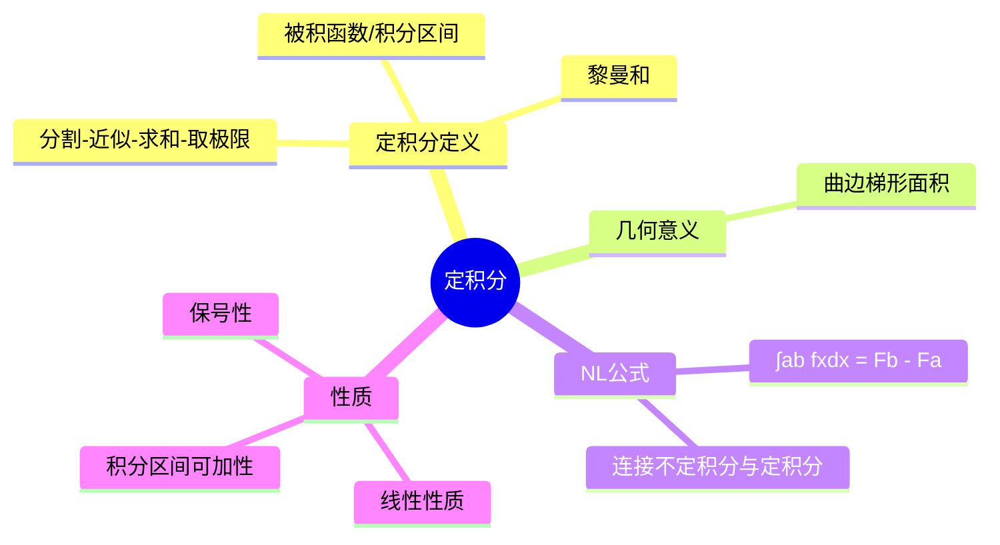

# 高数：定积分的概念与牛顿-莱布尼兹公式

> 📌 重构说明：本笔记按「定积分定义（黎曼和）→ 几何意义 → 定积分性质 → 牛顿-莱布尼兹公式」重构。

## 🧠 思维导图

---

## 一、定积分的定义

### 1.1 黎曼和定义

> 📖 补充定义：设 $f(x)$ 在 $[a,b]$ 上有定义，将 $[a,b]$ 分成 $n$ 小区间 $[x_{i-1}, x_i]$，任取 $\xi_i \in [x_{i-1}, x_i]$，若极限 $\lim_{n\to\infty} \sum_{i=1}^n f(\xi_i)\Delta x_i$ 存在且与分割和 $\xi_i$ 取法无关，则称该极限为 $f(x)$ 在 $[a,b]$ 上的**定积分**，记作 $\int_a^b f(x)\,dx$。

可概括为四个步骤：**分割 → 近似 → 求和 → 取极限**。

### 1.2 几何意义

- $f(x) \ge 0$ 时：$\int_a^b f(x)\,dx$ 表示曲边梯形的**面积**
- $f(x) \le 0$ 时：定积分为负值，表示面积的相反数
- $f(x)$ 变号时：定积分表示 **X轴上方面积减去下方面积**

---

## 二、定积分的性质

| 性质 | 公式 |
|:----:|:----:|
| 线性 | $\int (af+bg) = a\int f + b\int g$ |
| 区间可加 | $\int_a^b = \int_a^c + \int_c^b$ |
| 保号性 | $f(x) \ge 0 \Rightarrow \int_a^b f(x)\,dx \ge 0$ |
| 估值 | $m(b-a) \le \int_a^b f(x)\,dx \le M(b-a)$ |

---

## 三、牛顿-莱布尼兹公式

### 3.1 公式陈述

$$\boxed{\int_a^b f(x)\,dx = F(b) - F(a)}$$

其中 $F(x)$ 是 $f(x)$ 的任意一个原函数。

> [!warning] 考点
> ⚠️ 使用 NL 公式的前提是：$f(x)$ 在 $[a,b]$ 上**连续**，$F(x)$ 是 $f(x)$ 的**原函数**。不满足条件时需使用 [[05-01_反常积分|反常积分]]。

### 3.2 意义

NL 公式将定积分（和的极限）与不定积分（原函数）联系起来，是微积分中最重要的公式之一。
从不定积分的角度看：
- 求 $\int f(x)\,dx$ 得到原函数族 $F(x)+C$
- 定积分 $\int_a^b f(x)\,dx$ 就是原函数在区间端点的差值

---

## 🔗 知识网络

### 前置依赖
- [[04-01_不定积分的概念与性质]] — NL 公式需要先求原函数
- [[01-02_数列的极限]] — 定积分定义为和的极限

### 后续应用
- [[05-01_反常积分]] — 突破连续条件的限制
- 定积分求面积、体积
- 24_二重积分的计算方法

---

## 📚 核心词条索引

| 知识点链接 | 类别 | 关键词 |
|------|------|--------|
| [[定积分]] | 核心概念 | 分割求和取极限，$\int_a^b f(x)dx$ |
| [[黎曼和]] | 定义 | $\sum f(\xi_i)\Delta x_i$ 的极限 |
| [[牛顿-莱布尼兹公式]] | 公式 | $\int_a^b f = F(b)-F(a)$ |
| [[积分区间可加性]] | 性质 | $\int_a^b = \int_a^c + \int_c^b$ |