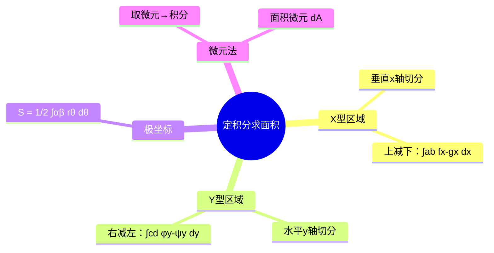

# 高数：定积分的应用——面积计算

> 📌 重构说明：本笔记按「X型区域面积 → Y型区域面积 → 极坐标面积 → 微元法思想」重构，来源于语音片段中关于定积分求面积和X型/Y型区域的详细讲解。

## 🧠 思维导图

---

## 一、X型区域

### 1.1 定义

用垂直于 $x$ 轴的直线切分区域，每个切片为竖直条。如果区域边界在 $x$ 的每一个取值处都有明确的上下函数，则用 X 型。

### 1.2 公式

$$\boxed{S = \int_a^b [f_{\text{上}}(x) - f_{\text{下}}(x)]\,dx}$$

即**上面的函数减下面的函数**，然后在 $x$ 方向积分。

> [!warning] 考点
> ⚠️ 不管曲线在 $x$ 轴的上方还是下方，都是**上减下**。若曲线上方是 $y=0$（$x$ 轴），则 $S = \int |f(x)|\,dx$。

---

## 二、Y型区域

### 2.1 定义

用垂直于 $y$ 轴的水平线切分区域，每个切片为水平条。如果区域边界在 $y$ 的每一个取值处都有明确的左右函数，则用 Y 型。

### 2.2 公式

$$\boxed{S = \int_c^d [\varphi_{\text{右}}(y) - \psi_{\text{左}}(y)]\,dy}$$

即**右边的函数减左边的函数**，然后在 $y$ 方向积分。

### 2.3 X型与Y型的选择

| 特征 | X型 | Y型 |
|:----:|:---:|:---:|
| 切分方向 | 垂直（竖切） | 水平（横切） |
| 积分变量 | $x$ | $y$ |
| 适用场景 | 每个 $x$ 对应唯一上/下边界 | 每个 $y$ 对应唯一左/右边界 |

> [!info] 补充说明
> 如果一个区域同时可以用 X 型和 Y 型计算，结果相同。选择计算更简便的方式即可。

---

## 三、极坐标下的面积

### 3.1 公式

若曲线由极坐标 $r = r(\theta)$ 给出，则从 $\alpha$ 到 $\beta$ 围成的扇形区域面积为：

$$\boxed{S = \frac12 \int_\alpha^\beta [r(\theta)]^2\,d\theta}$$

---

## 四、微元法思想

定积分应用的**微元法**是核心思想：

1. **取微元**：在区间 $[x, x+dx]$ 上取典型微元
2. **求微元**：近似写出微元的表达式 $dA$
3. **积分**：对所有微元求和取极限得整体

> [!example] 例题：求两曲线围成的面积
> **题目**：求 $y=x^2$ 与 $y=x$ 围成的面积。
> **关键步骤**：
> ① 联立得交点 $(0,0)$ 和 $(1,1)$
> ② X型：$S = \int_0^1 (x - x^2)\,dx$
> ③ $= [\frac{x^2}{2} - \frac{x^3}{3}]_0^1 = \frac12 - \frac13 = \frac16$
> **答案**：$\frac16$

---

## 🔗 知识网络

### 前置依赖
- [[05-02_定积分的概念与牛顿-莱布尼兹公式]] — 定积分的计算
- [[01-01_函数的概念与基本要素]] — 函数图像的解读

### 后续应用
- [[08-02_二重积分的计算方法]] — 二重积分化累次积分（X型/Y型推广）
- 旋转体体积

### 对比辨析
- X型 vs Y型：X型竖切（对 $x$ 积分），Y型横切（对 $y$ 积分）

---

## 📚 核心词条索引

| 知识点链接 | 类别 | 关键词 |
|------|------|--------|
| [[X型区域]] | 方法 | 竖切，上减下对 $x$ 积分 |
| [[Y型区域]] | 方法 | 横切，右减左对 $y$ 积分 |
| [[微元法]] | 思想 | 取微元→积分，定积分应用的核心方法 |
| [[极坐标面积]] | 公式 | $S = \frac12 \int r^2 d\theta$ |