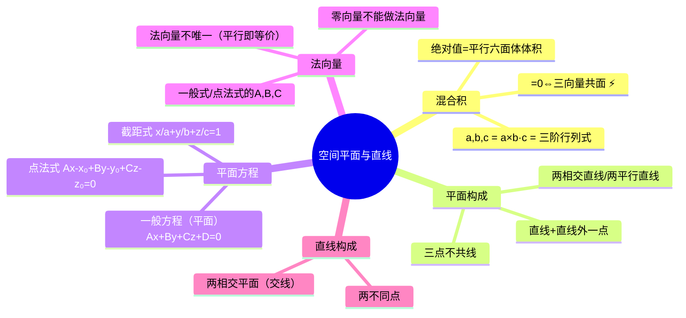

# 高数：空间平面与直线方程

> 📌 重构说明：本笔记是高数下册空间解析几何篇的核心——平面与直线的方程体系的完整建立。已按「[[混合积]]（定义+行列式计算+[[三向量共面]]条件充要判据）→平面的构成（四种方式）→平面的方程（[[点法式]]→[[一般方程（平面）]]→[[截距式]]→特殊情形速查）→直线的构成→五种求平面方程的策略」重排。完整保留了混合积为零⇔三向量共面的充要条件推导、13 种平面方程特殊情形的速查表及法向量不唯一性的反复强调。

## 🧠 思维导图

---

## 一、混合积——三元向量的标量运算

### 定义

$$[\vec{a}, \vec{b}, \vec{c}] = (\vec{a} \times \vec{b}) \cdot \vec{c}$$

运算顺序：先叉积（得向量）→ 再点乘（得标量）。==结果是数，不是向量。==

**行列式计算**（最快的计算方式）：

$$[\vec{a},\vec{b},\vec{c}] = \begin{vmatrix} a_x & a_y & a_z \\ b_x & b_y & b_z \\ c_x & c_y & c_z \end{vmatrix}$$

按第一行展开即可。这是真正的三阶行列式（9 个数），与向量积的行列式（第一行是 $\vec{i},\vec{j},\vec{k}$）不同。

### 核心结论：共面条件 ⚡️

$$\boxed{\vec{a},\vec{b},\vec{c} \text{ 共面} \;\Leftrightarrow\; [\vec{a},\vec{b},\vec{c}] = 0}$$

> 📖 几何解释：[[混合积]]绝对值 = 以三向量为棱的平行六面体体积。体积为零 → 退化到平面 → [[三向量共面]]。

---

## 二、平面的构成——四种确定方式

| 方式 | 说明 |
|------|------|
| 两条相交直线 | 交点在平面上 |
| 两条平行直线 | 两平行线所在唯一平面 |
| 一直线 + 线外一点 | 过一点作平行线 → 两平行线 |
| 三点不共线 | ==三点必须不共线，否则无穷多平面== |

---

## 三、平面方程

### 3.1 点法式

已知点 $M_0(x_0,y_0,z_0)$ + 法向量 $\vec{n}=(A,B,C)$：

$$\boxed{A(x-x_0) + B(y-y_0) + C(z-z_0) = 0}$$

==推导核心==：$\vec{n} \perp \overrightarrow{M_0M}$ → [[数量积]]为零。

### 3.2 法向量

从方程中直接读取：[[一般方程（平面）]] $Ax+By+Cz+D=0$ → ==法向量 = $(A,B,C)$。==

> [!warning] 注意
> 法向量不唯一—— $(A,B,C)$ 和 $(2A,2B,2C)$ 都垂直于平面，只差一个比例常数。考试中可取最简形式（坐标无公因子）。

### 3.3 一般方程

$$Ax + By + Cz + D = 0 \quad (A,B,C \text{ 不全为零})$$

==三元一次方程的几何意义 = 平面。== 这是由[[点法式]]展开合并得到的。

### 3.4 特殊情形速查表

| 条件 | 几何意义 | 法向量 |
|------|----------|--------|
| $D=0$ | ==过原点== | $(A,B,C)$ |
| $A=0$ | 平行于 $x$ 轴 | $(0,B,C)$ |
| $B=0$ | 平行于 $y$ 轴 | $(A,0,C)$ |
| $C=0$ | 平行于 $z$ 轴 | $(A,B,0)$ |
| $A=0,B=0$ | ==平行于 $xOy$ 面== | $(0,0,C)$ |
| $x=0$ | $yOz$ 坐标面 | $(1,0,0)$ |

### 3.5 截距式

$$\frac{x}{a} + \frac{y}{b} + \frac{z}{c} = 1$$

$a,b,c$ = 平面在三个坐标轴上的截距。==平面不过原点才能用[[截距式]]。==

---

## 四、直线的构成

1. **两个不同的点**确定直线
2. **两张相交的平面**确定直线（交线）

---

## 五、求平面方程的策略总结

| 已知条件 | 方法 |
|----------|------|
| 一点 + 法向量 | 直接[[点法式]] |
| 三点 | 两向量叉积得法向量 → [[点法式]] |
| 两相交直线 | 方向向量叉积得法向量 |
| 直线 + 线外一点 | 直线上取点 + 方向向量与连线向量叉积 |

---

> 📂 所属分类：[[高数-空间几何|空间几何]]

## 📚 核心词条索引

| 知识点链接 | 类别 | 关键词 |
|------|------|--------|
| [[点法式]] | 平面方程 | $A(x-x_0)+B(y-y_0)+C(z-z_0)=0$ |
| [[混合积]] | 向量运算 | $[\vec{a},\vec{b},\vec{c}]=(\vec{a}\times\vec{b})\cdot\vec{c}$ |
| [[截距式]] | 平面方程 | $x/a+y/b+z/c=1$，$a,b,c$为截距 |
| [[三向量共面]] | 判定条件 | 混合积为0 |
| [[数量积]] | 向量运算 | $\vec{a}\cdot\vec{b}=|\vec{a}||\vec{b}|\cos\theta$ |
| [[一般方程（平面）]] | 平面方程 | $Ax+By+Cz+D=0$ |

