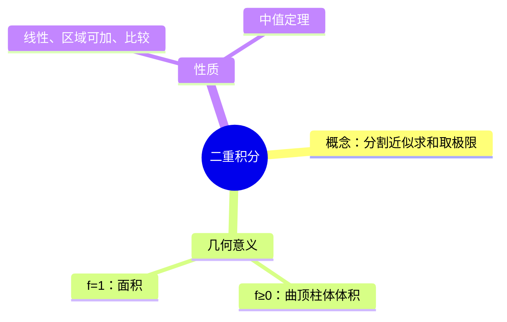

# 高数：二重积分的概念与性质

> 📌 重构说明：本笔记是高数下册处理顶端多项面积领域问题的基石——从一重积分到[[二重积分]]的概念延伸。已按「分割→近似→求和→取极限的定义逻辑」完整呈现[[二重积分]]的构造过程，并扼要记录[[X型与Y型区域]]划分及[[对称性（二重积分）]]等后续核心手段的原型。保留了「不规则体计算」笔记中起始的分割/求和思想。

## 🧠 思维导图

---

## 一、概念——四步构建

1. ==分割==：将区域 $D$ 划分为 $n$ 个小块 $\Delta\sigma_i$
2. ==近似==：每块取点 $(\xi_i,\eta_i)$，作 $f(\xi_i,\eta_i)\Delta\sigma_i$
3. ==求和==：$\sum f(\xi_i,\eta_i)\Delta\sigma_i$
4. ==取极限==：$\lambda\to0$（最大直径趋于 0）

$$\iint_D f(x,y)d\sigma = \lim_{\lambda\to0} \sum_{i=1}^{n} f(\xi_i,\eta_i)\Delta\sigma_i$$

---

## 二、几何意义

| $f$ 条件 | 意义 |
|----------|------|
| ==$f(x,y)\geq 0$== | 以 $D$ 为底、$z=f(x,y)$ 为顶的==[[曲顶柱体体积]]== |
| ==$f(x,y)=1$== | ==区域 $D$ 的面积==（$\iint_D 1\,d\sigma = D$ 的面积） |
| $f(x,y)\leq 0$ | 曲顶柱体体积加负号 |

---

## 三、基本性质

| 性质   | 描述                                                                      |           |              |     |     |
| ---- | ----------------------------------------------------------------------- | --------- | ------------ | --- | --- |
| 线性   | $\iint_D (af+bg) = a\iint_D f + b\iint_D g$                             |           |              |     |     |
| 区域可加 | $D_1\cap D_2$ = 无内点 → $\iint_{D_1\cup D_2} = \iint_{D_1} + \iint_{D_2}$ |           |              |     |     |
| 比较   | $f\leq g$ 在 $D$ 上 → $\iint_D f \leq \iint_D g$                          |           |              |     |     |
| 绝对值  | $                                                                       | \iint_D f | \leq \iint_D | f   | $   |
| 中值定理 | $\iint_D f = f(\xi,\eta)\cdot \text{面积}(D)$                             |           |              |     |     |

---

> 📂 所属分类：[[高数-重积分与曲线积分|重积分与曲线积分]]

## 📚 核心词条索引

| 知识点链接 | 类别 | 关键词 |
|------|------|--------|
| [[X型与Y型区域]] | 积分区域 | X型：$y$上下界为$x$函数；Y型：$x$左右界为$y$函数 |
| [[对称性（二重积分）]] | 计算技巧 | 奇函数在对称区域积分为0，偶函数可减半 |
| [[二重积分]] | 核心概念 | $\iint_D f(x,y)d\sigma$，曲顶柱体体积 |
| [[曲顶柱体体积]] | 几何意义 | $f\geq 0$时二重积分的几何意义 |

