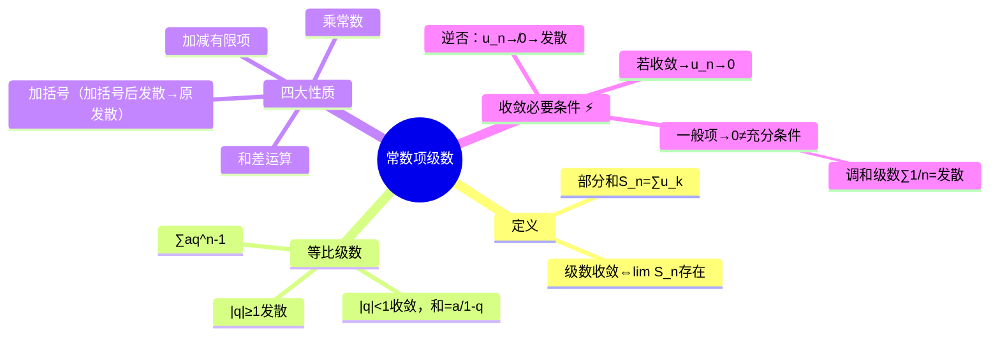

# 高数：常数项级数的概念与性质

> 📌 重构说明：本笔记是无穷级数篇的基石——[[级数]]的定义、性质与收敛判别基础。已按「[[级数]]定义（部分和 $S_n$→[[级数]] = $\lim S_n$）→[[等比级数]]（形式+收敛条件 $|q|<1$+和=首项/(1-公比)）→四大性质（乘常数/和差/删加有限项/加括号——加括号后发散→原发散）→[[收敛必要条件]]（一般项→0→逆否命题：不→0→发散——[[调和级数]]的反例证明）」的逻辑链重排。合并了「数学分析课程学习笔记」和「数学分析课程学习笔记(1)」两篇重复笔记。

## 🧠 思维导图

---

## 一、级数的定义

$$\sum_{n=1}^{\infty} u_n = u_1 + u_2 + u_3 + \cdots$$

**部分和**：$S_n = u_1 + u_2 + \cdots + u_n$

==[[级数]]收敛 ⇔ $\lim_{n\to\infty} S_n$ 存在==（存在 = 有有限极限值）。

---

## 二、等比级数（几何级数）

$$\sum_{n=0}^{\infty} aq^n = a + aq + aq^2 + \cdots$$

|    $    | q      | $                           | 结论  | 和   |
| :-----: | ------ | --------------------------- | --- | --- |
|  $<1$   | ==收敛== | $\dfrac{a}{1-q}$（首项÷(1-公比)） |
| $\ge 1$ | ==发散== | —                           |
> 📖 记忆法：收敛和 = 首项÷(1-公比)。判断收敛性只需看公比 $q$ 的绝对值。

---

## 三、级数的四大性质

| 性质 | 内容 |
|------|------|
| 乘常数 | $\sum (c u_n) = c \sum u_n$（收敛→乘常数仍收敛） |
| 和差 | $\sum(u_n\pm v_n) = \sum u_n \pm \sum v_n$ |
| 删加有限项 | ==收敛性不变==（有限项的和是常数） |
| 加括号 | 收敛级数加括号不变；==加括号后发散 → 原级数发散== |

---

## 四、收敛必要条件 ⚡️

$$\boxed{\sum u_n \text{ 收敛} \;\Rightarrow\; \lim_{n\to\infty} u_n = 0}$$

**逆否命题（更常用）**：

$$\boxed{\lim_{n\to\infty} u_n \neq 0 \;\Rightarrow\; \sum u_n \text{ 发散}}$$

==一般项不趋于零 → 直接判发散==。这是最快的初筛。

> [!warning] 考点
> ⚠️ 一般项→0 是必要条件不是充分条件。[[调和级数]] $\sum\frac{1}{n}$ 一般项→0 但发散——这是经典反例。

### 调和级数发散证明

$\sum_{n=1}^{\infty}\frac{1}{n}$ 发散。

证明思路：假设收敛 → $S_{2n}-S_n \to 0$，但 $S_{2n}-S_n = \frac{1}{n+1}+\cdots+\frac{1}{2n} > n\times\frac{1}{2n} = \frac{1}{2}$ → 矛盾。

---

> 📂 所属分类：[[高数-无穷级数|无穷级数]]

## 📚 核心词条索引

| 知识点链接      | 类别   | 关键词                           |     |                    |
| ---------- | ---- | ----------------------------- | --- | ------------------ |
| [[等比级数]]   | 基本级数 | $\sum aq^n$，$                 | q   | <1$时收敛，和$=a/(1-q)$ |
| [[调和级数]]   | 经典反例 | $\sum 1/n$发散，一般项→0但发散         |     |                    |
| [[级数]]     | 核心概念 | 无穷项之和$\sum_{n=1}^{\infty}u_n$ |     |                    |
| [[收敛必要条件]] | 判别条件 | 若收敛则$u_n \to 0$（逆否命题常用）       |     |                    |

