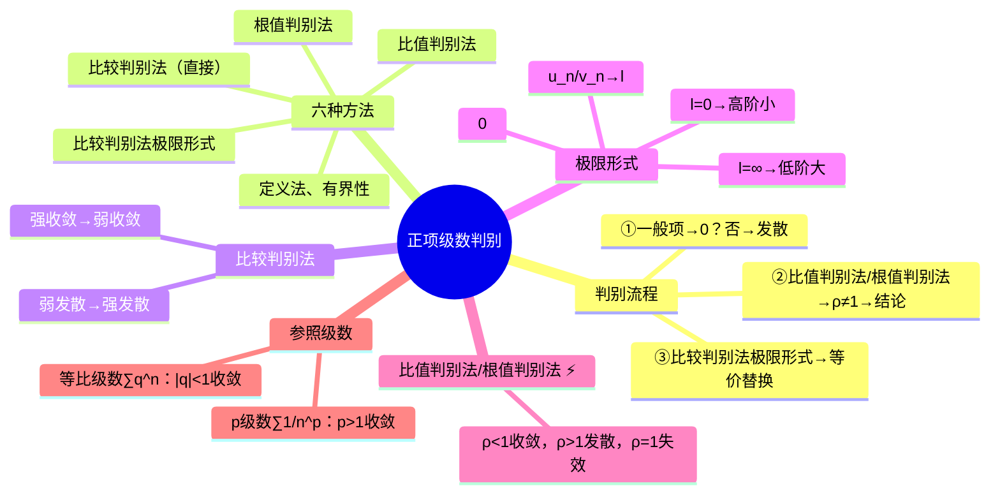

# 高数：正项级数的判别法

> 📌 重构说明：本笔记汇集了判别[[正项级数]]收敛性的全部方法体系。已按「判别流程图（三步：$u_n\to0?$→[[比值判别法]]/[[根值判别法]]→[[比较判别法极限形式]]）→六种方法的属性速查（定义法/有界性/比较/极限形式/比值/根值→优缺点标注）→[[比较判别法]]（强收敛→弱收敛 / 弱发散→强发散 + 使用方向：放大→预判收敛 / 缩小→预判发散）→[[比较判别法极限形式]]（$u_n/v_n\to l$→三结论：同阶($0<l<\infty$)=同收敛性、高阶($l=0$)上收敛→下收敛、低阶($l=\infty$)下发散→上发散）→[[比值判别法]]（$u_{n+1}/u_n\to\rho$→$\rho<1$ 收敛 / $\rho>1$ 发散 / $\rho=1$ 失效）→[[根值判别法]]（$\sqrt[n]{u_n}\to\rho$→同理）→常用参照[[级数]]（[[p级数]] / [[等比级数]]）」的逻辑链重排。合并了「数学级数判别法概述」和「比较判别法极限形式」两篇笔记。

## 🧠 思维导图



---

## 一、判别流程图

```
一般项 u_n → 0？
  ├─ 否 → [[级数]]发散 ✅
  └─ 是 → 尝试[[比值判别法]]/[[根值判别法]]
            ├─ ρ ≠ 1 → 结论
            └─ ρ = 1 → [[比较判别法极限形式]]
                         → 等价替换 + 与 [[p级数]] 比较
```

---

## 二、六种判别法速查

| 方法 | 核心操作 | ρ=1 时 |
|------|----------|:---:|
| 定义法 | 求 $\lim S_n$ | — |
| 有界性 | $S_n$ 有界 | — |
| ==[[比较判别法]]== | 找参照[[级数]]，放大/缩小 | — |
| ==[[比较判别法极限形式]]== | $\lim u_n/v_n = l$ | 看 $l$ |
| ==[[比值判别法]]== | $\lim u_{n+1}/u_n = \rho$ | 失效 |
| ==[[根值判别法]]== | $\lim \sqrt[n]{u_n} = \rho$ | 失效 |

---

## 三、比较判别法 ⚡️

### 直接比较

| 若 $u_n \le k\cdot v_n$（$k>0$） | 结论 |
|------|------|
| $\sum v_n$ 收敛 | ==$\sum u_n$ 收敛==（强收敛 → 弱收敛） |
| $\sum u_n$ 发散 | ==$\sum v_n$ 发散==（弱发散 → 强发散） |

### 使用策略

| 预判 | 操作 | 找 |
|------|------|------|
| ==预判收敛== | ==放大== $u_n$ | 找收敛的强[[级数]] |
| ==预判发散== | ==缩小== $u_n$ | 找发散的弱[[级数]] |

---

## 四、比较判别法极限形式 ⚡️

$$\lim_{n\to\infty} \frac{u_n}{v_n} = l$$

| $l$ | 含义 | 结论 |
|:---:|------|------|
| $0<l<\infty$ | $u_n$ 与 $v_n$ ==同阶== | ==收敛性相同== |
| $l=0$ | $u_n$ 比 $v_n$ ==高阶==（$u_n$ 更小） | 若 $\sum v_n$ 收敛 → $\sum u_n$ 收敛 |
| $l=\infty$ | $u_n$ 比 $v_n$ ==低阶==（$u_n$ 更大） | 若 $\sum v_n$ 发散 → $\sum u_n$ 发散 |

==口诀==：高阶小，低阶大。

---

## 五、比值判别法

$$\lim_{n\to\infty} \frac{u_{n+1}}{u_n} = \rho$$

| $\rho$ | 结论 |
|:---:|------|
| $<1$ | ==收敛== |
| $>1$ | ==发散== |
| $=1$ | ==失效（意义：[[比值判别法]]与[[根值判别法]]需逼到 $\rho=1$ 才判定）== |

优点：不需要找参照[[级数]]。缺点：$\rho=1$ 时失效。

---

## 六、根值判别法

$$\lim_{n\to\infty} \sqrt[n]{u_n} = \rho$$

结论同[[比值判别法]]（$<1$ 收敛 / $>1$ 发散 / $=1$ 失效）。

**常用公式**：$\sqrt[n]{a^m} = a^{m/n}$，$\lim_{n\to\infty}(1+1/n)^n = e$。

---

## 七、参照级数速查

| 参照 | 形式 | 收敛条件 |
|------|------|----------|
| ==[[p级数]]== | $\sum \frac{1}{n^p}$ | ==$p>1$ 收敛，$p\le 1$ 发散== |
| ==[[等比级数]]== | $\sum q^n$ | ==$|q|<1$ 收敛，$|q|\ge 1$ 发散== |

---


> 📂 所属分类：[[高数-无穷级数|无穷级数]]


## 📚 核心词条索引

| 知识点链接 | 类别 | 关键词 |
|------|------|--------|
| [[p级数]] | 参照级数 | $\sum\frac{1}{n^p}$，$p>1$收敛，$p\le1$发散 |
| [[比较判别法]] | 判别方法 | 放大找收敛强级数，缩小找发散弱级数 |
| [[比较判别法极限形式]] | 判别方法 | $\lim u_n/v_n=l$，同阶同收敛，高阶小，低阶大 |
| [[比值判别法]] | 判别方法 | $\lim u_{n+1}/u_n=\rho$，$\rho<1$收敛，$\rho>1$发散 |
| [[等比级数]] | 参照级数 | $\sum q^n$，$|q|<1$收敛 |
| [[根值判别法]] | 判别方法 | $\lim\sqrt[n]{u_n}=\rho$，结论同比值判别法 |
| [[级数]] | 核心概念 | 无穷项求和$\sum u_n$ |
| [[正项级数]] | 核心概念 | 各项$u_n\ge0$的级数 |


