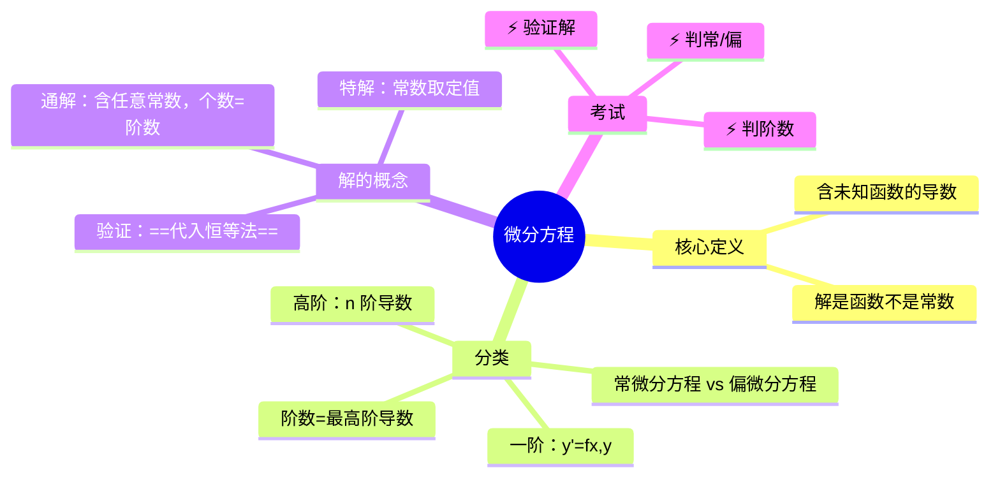

# 高数：微分方程的概念与分类

> 📌 重构说明：本笔记是高数下册的开篇——从「代数方程解=常数」到「[[微分方程]] 解=函数」的概念跃迁。已按「定义→分类（常/偏、一阶/高阶/[[阶数]] 判定）→[[通解]]/[[特解]] 的区分→四个验证步骤」的逻辑链重排，完整保留了原笔记中通解含任意常数的个数=阶数、例题验证法及代数/微分方程对比表。

## 🧠 思维导图

---

## 一、微分方程的核心定义

==[[微分方程]] = 含有未知函数导数或微分的方程。==

与代数方程的本质区别：

| | 代数方程 | [[微分方程]] |
|------|----------|----------|
| 未知量 | 数 | 函数 |
| 解的形式 | 常数 | 函数 |
| 例子 | $x^2-3x+2=0$ | $\frac{dy}{dx}=y$ |

**关键点**：方程中必须出现未知函数的导数或微分，自变量和未知函数本身不一定出现。

> [!info] 补充定义
> $y'=y$ 的解是 $y=Ce^x$（一族函数），不是某个具体的 $x$ 值。这与代数方程的「解是几个数」完全不同。

---

## 二、分类一：常微分方程 vs 偏微分方程

| 分类 | 未知函数 | 导数类型 | 典型形式 |
|------|---------|----------|----------|
| ==[[常微分方程]]== | 一元函数 $y(x)$ | 普通导数 | $\frac{dy}{dx}=f(x,y)$ |
| ==[[偏微分方程]]== | 多元函数 $u(x,t)$ | 偏导数 | $\frac{\partial u}{\partial t}=a^2\frac{\partial^2 u}{\partial x^2}$ |

> [!warning] 考点
> 出现 $\frac{\partial}{\partial}$ = [[偏微分方程]]；出现 $\frac{d}{dx}$ = [[常微分方程]]。判断题送分但易看错符号。

---

## 三、分类二：阶数 ⚡️

**[[阶数]] = 方程中出现的未知函数导数的最高阶数。**

| 例子 | 阶数 |
|------|:---:|
| $y'+2y=e^x$ | 1 |
| $y''+3y'+2y=0$ | 2 |
| $y^{(n)}=f(x)$ | $n$ |

==[[通解]] 中任意常数的个数 = 方程的 [[阶数]]。== 一阶方程通解含 1 个 $C$，二阶含 2 个 $C_1, C_2$。

---

## 四、解的概念：通解与特解

==[[通解]]==：含任意常数且常数个数等于阶数的解。
==[[特解]]==：通解中任意常数取特定值的解。

**例题**：

方程 $\frac{dy}{dx}=1$

- [[通解]]：$y=x+C$（$C$ 为任意常数）
- [[特解]]：$y=x$（$C=0$），$y=x+3$（$C=3$）

---

## 五、如何验证一个函数是否为解？

==代入恒等法==：将函数求导后代入原方程，等式恒成立即为解。

> [!warning] 考点
> ⚠️ 验证解 = 求导 + 代入 + 检查恒等。三步缺一不可。

---

> 📂 所属分类：[[高数-微分方程|微分方程]]

## 📚 核心词条索引

| 知识点链接 | 类别 | 关键词 |
|------|------|--------|
| [[常微分方程]] | 方程类型 | 只含普通导数的微分方程 |
| [[阶数]] | 核心概念 | 方程中出现的未知函数导数的最高阶数 |
| [[偏微分方程]] | 方程类型 | 含有偏导数的微分方程 |
| [[特解]] | 解的类型 | 通解中任意常数取特定值得到的解 |
| [[通解]] | 解的类型 | 含任意常数且常数个数等于阶数的解 |
| [[微分方程]] | 核心概念 | 含有未知函数导数或微分的方程 |

