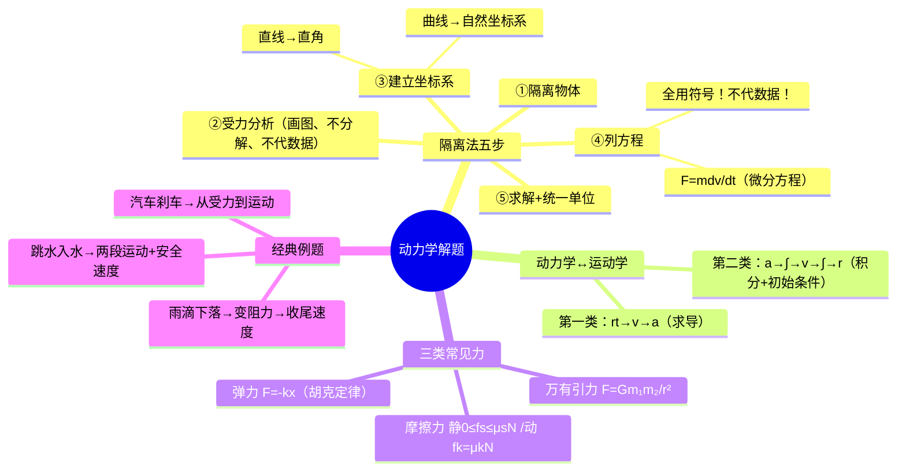

# 大物：动力学解题思路与受力分析

> 📌 重构说明：本笔记是质点动力学的解题方法论。已按「隔离法五步→动力学/运动学双向衔接→三类常见力→三道经典例题」的逻辑链重排，补充了"用符号不代数据"的方法论要点，以及变力问题中积分上下限的确定技巧。

## 🧠 思维导图

---

## 一、隔离法五步解题法

> 老师核心方法论：「中间过程全用文字符号，能不解先不解，最后一步才代入数据。」

| 步骤 | 操作 | 关键点 |
|------|------|--------|
| ① | ==隔离法==——选单个研究对象 | 明确「分析谁」 |
| ② | ==受力分析==——画受力图 | 只标力，不分解，方向要对 |
| ③ | ==建坐标系==——直线用直角，曲线用自然坐标 | 方便分解 |
| ④ | ==列方程==——$F = m\frac{dv}{dt}$ 或分量式 | ==全程用符号，不代任何数据！== |
| ⑤ | ==求解+统一单位== | 最后一步才代入数据、统一单位 |

> [!warning] 考点
> ⚠️ 列方程请用微分形式 $F = m\frac{dv}{dt}$ 而非 $F = ma$——在变力问题中 $a$ 随 $t$ 变化，只有微分形式才能正确处理。

---

## 二、动力学的两个方向

| 方向 | 已知 | 求 | 方法 |
|------|------|----|------|
| ==第一类== | $\vec{r}(t)$ 运动方程 | 力 $F$ | 求导→$v$→$a$→代入 $F=ma$ |
| ==第二类== | 力 $F$ + 初始条件 | $\vec{v}(t)$、$\vec{r}(t)$ | 积分 $a=F/m$→$\int \to \vec{v}$→$\int \to \vec{r}$ |

**积分上下限**：
- 下限 = 初始条件（$t=0$ 时的状态）
- 上限 = 需求状态（求具体值用具体时间，求方程用 $t$）

---

## 三、三类常见力速查

| 力 | 公式 | 说明 |
|----|------|------|
| 万有引力 | $F = G\dfrac{m_1 m_2}{r^2}$ | 引力常量 $G$ |
| 弹力 | $F = -kx$ | 胡克定律，负号 = 恢复力性质 |
| 摩擦力 | $0 \le f_s \le \mu_s N$ | 可变、看作未知数 |
| 摩擦力 | $f_k = \mu_k N$ | 定值，方向与相对运动方向相反 |

---

## 四、例题精讲

### 4.1 汽车刹车

**已知**：初速 $v_0 = 120\mathrm{km/h}$，阻力 $f$

**五步走**：隔离汽车→水平方向只有 $f$→$x$ 轴→$f = m\frac{dv}{dt}$→积分

$$\int_{v_0}^{0} dv = \int_0^t \frac{f}{m}\,dt \quad\Rightarrow\quad t = \frac{mv_0}{f}$$

为求路程，再利用 $v = dx/dt$ 积分一次。

### 4.2 雨滴下落——收尾速度

**物理图像**：雨滴下落时受重力（向下）+ 浮力（向上）+ 阻力 $kv$（向上，随 $v$ 增大而增大）→ 合力逐渐减小 → 加速度递减 → 当 $a=0$ 时达收尾速度 $v_{\max}$。

$$mg - \rho_{\text{空}}gV - kv_{\max} = 0 \quad\Rightarrow\quad v_{\max} = \frac{mg - \rho_{\text{空}}gV}{k}$$

> 📖 生活类比：从高楼丢下的纸片不会无限加速——空气阻力随速度增大直到平衡重力，最终匀速下落。雨滴、跳伞运动员同理。

### 4.3 跳水运动员

**两段运动**：空气中自由落体 $v = \sqrt{2gh}$，入水后受阻力+浮力，最终要求触底速度 $\le 2.0\mathrm{m/s}$。在人体密度≈水密度的简化下，浮力≈重力，水中合力≈阻力 $kv$。

---

---

## 🔗 知识网络

### 前置依赖
- 01_质点运动描述的物理量 — 位移、速度、加速度的基本定义
- 02_质点运动学两类问题与例题 — 运动学的两类问题（求导法/积分法）
- 参照系 — 运动描述的参考基准

### 后续应用
- 06_动量定理与解题步骤 — 力对时间的累积效果（冲量-动量）
- 07_刚体模型与定轴转动运动学 — 从质点模型升级到刚体模型
- 08_刚体定轴转动定律与转动惯量 — 转动中的牛二定律

### 对比辨析
- 牛顿定律 vs 动量定理：前者 $F=ma$ 是瞬时关系，后者 $F\Delta t=\Delta p$ 是时间累积关系；变力问题中动量定理更方便
- 静摩擦力 vs 动摩擦力：静摩擦力是约束力（可调），动摩擦力是定值 $\mu_k N$

## 📚 核心词条索引

| 知识点链接 | 类别 | 关键词 |
|------|------|--------|
| [[隔离法]] | 核心方法 | 将研究对象从环境中隔离，单独进行受力分析 |
| [[受力分析]] | 核心方法 | 分析物体受到的所有外力，画受力图 |
| [[万有引力]] | 常见力 | $F = Gm_1m_2/r^2$，任何两物体间 |
| [[弹力]] | 常见力 | $F = -kx$，胡克定律，恢复力性质 |
| [[摩擦力]] | 常见力 | 静：$0 \le f_s \le \mu_s N$，动：$f_k = \mu_k N$ |
| [[收尾速度]] | 应用概念 | 变力作用下$a\to 0$时的恒定速度 |
