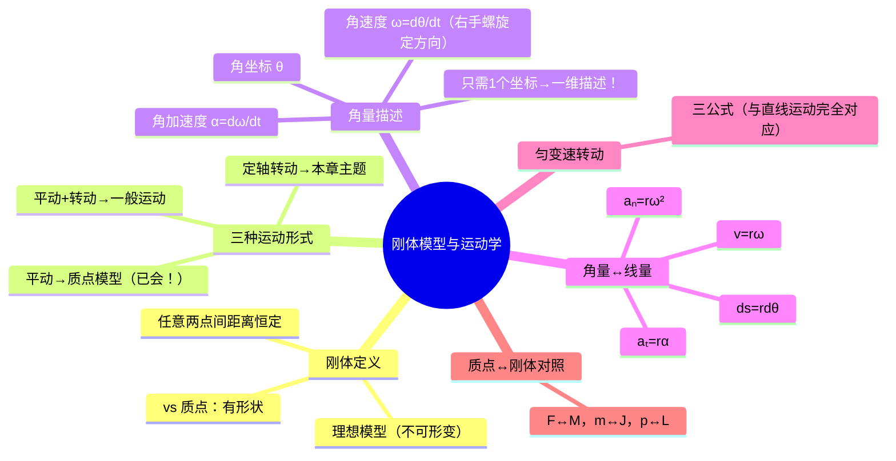

# 大物：刚体模型与定轴转动运动学

> 📌 重构说明：本笔记是质点力学到刚体力学的"概念升维"节点——从一维质点模型过渡到有形状的刚体模型。已按「刚体定义→三种运动形式→定轴转动的角量描述→角量/线量桥梁→匀变速转动→质点/刚体理论体系对照」的逻辑链重排。补充了平动与转动的本质区分，以及注意事项：本章只讨论绕定轴转动。

## 🧠 思维导图

---

## 一、刚体是什么？

==刚体是质点模型的升级版==。组成物体的任意两点间距离始终保持恒定——不能形变、不能伸缩。

| 模型 | 特点 | 适用场景 |
|------|------|----------|
| 质点 | 无形状、无大小，质量集中一点 | 平动、弹道轨迹 |
| ==刚体== | 有形状、有大小，但不可形变 | 旋转、轮子、杠杆 |

---

## 二、刚体的三种运动形式

| 运动 | 特征 | 用什么模型分析 |
|------|------|--------------|
| ==平动== | 内部任意两点连线始终平行 | 质点模型（已学完） |
| ==定轴转动== | 绕一根固定轴旋转 | **本章全部内容** |
| ==平动+转动== | 车轮滚动、手榴弹飞行 | 分拆为平动和转动分别分析 |

> [!warning] 考点
> ⚠️ 本章只讨论刚体绕**定轴**转动——轴是固定不动的。若转轴本身在移动，那属于更复杂的一般刚体运动，不在考试范围内。

---

## 三、角量描述——一维的威力

刚体绕定轴转动虽然是三维空间中发生的事件，但==只需要一个角坐标 $\theta$ 就能完全描述==——这就是刚体定轴转动最精妙的地方。

| 角量 | 定义 | 对比直线运动 |
|------|------|-------------|
| 角坐标 $\theta$ | 相对于参考轴的转角 | $x$ |
| 角速度 $\omega$ | $\omega = d\theta/dt$ | $v = dx/dt$ |
| 角加速度 $\alpha$ | $\alpha = d\omega/dt = d^2\theta/dt^2$ | $a = dv/dt$ |

**方向判断**（右手螺旋）：四指沿转动方向弯曲 → 大拇指方向即为 $\omega$ 方向。与转轴正方向一致为正，反之为负。

---

## 四、角量与线量的桥梁

==组成刚体的所有质点都做圆周运动，但半径不同 → 线量不同，角量相同。==

$$\boxed{ds = r\,d\theta} \quad \boxed{v = r\omega} \quad \boxed{a_t = r\alpha} \quad \boxed{a_n = r\omega^2}$$

> [!warning] 考点
> ⚠️ $v = r\omega$ 是角量→线量的最核心转换，贯串整个刚体力学体系——从运动学到动力学到角动量。

---

## 五、匀变速转动三公式

$\alpha =$ 常数时，三公式与匀变速直线运动完全对应：

| 直线运动 | 匀变速转动 |
|----------|-----------|
| $v = v_0 + at$ | $\omega = \omega_0 + \alpha t$ |
| $x = x_0 + v_0t + \frac{1}{2}at^2$ | $\theta = \theta_0 + \omega_0t + \frac{1}{2}\alpha t^2$ |
| $v^2 = v_0^2 + 2a\Delta x$ | $\omega^2 = \omega_0^2 + 2\alpha\Delta\theta$ |

---

## 六、从质点到刚体——理论体系的对照迁移

| 质点（平动） | 刚体（定轴转动） | 对称关系 |
|-------------|----------------|----------|
| 力 $F$ | 力矩 $M$ | 作用追求 →  |
| 质量 $m$ | 转动惯量 $J$ | 惯性的量度 |
| 动量 $p=mv$ | 角动量 $L=J\omega$ | 运动的量度 →  |
| 动能 $\frac{1}{2}mv^2$ | 转动动能 $\frac{1}{2}J\omega^2$ | 能量的量度 |

> 老师核心方法论：把质点公式中的 $F\to M$、$m\to J$、$a\to\alpha$、$v\to\omega$，一切照搬——这就是刚体力学的全部秘密。

---

---

## 🔗 知识网络

### 前置依赖
- 01_质点运动描述的物理量 — 位移、速度、加速度的基本定义
- 03_自然坐标系与加速度分解 — 圆周运动的切向/法向加速度
- 04_圆周运动的角量与线量 — 角量与线量的转换关系

### 后续应用
- 08_刚体定轴转动定律与转动惯量 — 转动中的牛二定律 M=Jα
- 09_角动量定理与守恒定律 — 角动量定理在刚体转动中的应用
- 11_旋转矢量法与简谐振动描述 — 简谐振动的旋转矢量表示

### 对比辨析
- 平动 vs 转动：平动用质点模型（F=ma），转动用刚体模型（M=Jα）；前者一维直线，后者一维角度
- 角量描述 vs 线量描述：角量（θ,ω,α）对所有质点相同，线量（s,v,aₜ）因半径而异

## 📚 核心词条索引

| 知识点链接 | 类别 | 关键词 |
|------|------|--------|
| [[刚体]] | 核心模型 | 有形状有体积但不可变形的理想物体 |
| [[定轴转动]] | 运动类型 | 刚体绕固定轴旋转，各质点做同角量圆周运动 |
| [[匀变速转动]] | 运动类型 | 角加速度恒定的转动，有类似匀变速直线运动的三个公式 |
| [[平动]] | 运动类型 | 刚体上每一点运动轨迹完全相同的运动 |
| [[角坐标]] | 核心概念 | 描述转过的角度θ |
| [[角速度]] | 核心概念 | 角位移随时间的变化率，$\omega=d\theta/dt$ |
| [[角加速度]] | 核心概念 | 角速度随时间的变化率，$\alpha=d\omega/dt$ |
| [[转动惯量]] | 核心概念 | 刚体转动惯性的量度，$J=\int r^2 dm$ |
| [[动量]] | 核心概念 | $\vec{p}=m\vec{v}$，描述平动状态的物理量 |
| [[角动量]] | 核心概念 | $\vec{L}=J\vec{\omega}$，描述转动状态的物理量 |
