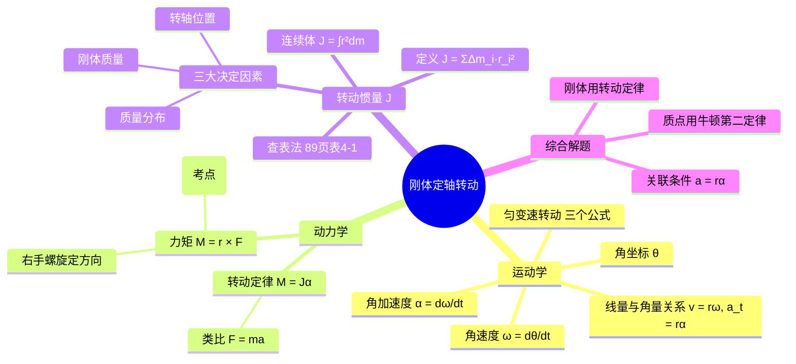

# 大物：刚体定轴转动定律与转动惯量

> 📌 重构说明：本笔记打破原始录音的时间顺序，按「运动学 → 动力学 → 转动惯量 → 转动定律 → 综合解题」的知识树重新组织。重点还原了老师用跳水、体操、飞轮等生活实例解释转动惯量的生动讲解，以及质点+刚体混合问题的完整解题流程。

## 🧠 思维导图



---

## 第一部分：什么是刚体？

### 一、刚体的定义

> 老师原话：「刚体就是不能发生形变的物体。」

刚体是一个理想化模型——无论受多大的力，物体内部各点之间的相对位置永不改变。在刚体模型中，物体不能压缩、不能拉伸、不能弯曲。

> [!info] 补充定义
> 刚体（rigid body）是在任何外力作用下，形状和大小都保持不变的物体。它是质点系的一种特殊情形，其中任意两质点间的距离保持不变。

### 二、刚体的两种基本运动

| 运动类型 | 特征 | 处理方法 | 已学章节 |
|----------|------|----------|----------|
| **平动** | 物体上每一点的运动轨迹完全相同 | 视为质点运动 | 第1~3章 |
| **定轴转动** | 物体绕某一固定轴旋转 | 刚体定轴转动模型 | **本章** |

> 老师强调：「平动实际上就是把刚体看作一个质点系的运动，前面三章的内容已经学过了。以后我们不会再单独讲平动，剩下的就是转动。」

---

## 第二部分：刚体定轴转动的运动学

### 三、为什么说定轴转动是「一维」的？

> 老师原话：「定轴转动为什么简单？因为它是一维的。描述刚体定轴转动，我们实际上只需要一个角坐标来描述它就可以了。」

==原因是：组成刚体的所有质点都在做**同角量**的圆周运动。== 每个质点的角位移 θ、角速度 ω、角加速度 α 完全相同，所以只需要一个角坐标就能描述整个刚体的转动状态。

```
          各质点角量相同（θ, ω, α）
         /
刚体定轴转动 —— 一维描述：角坐标 θ
         \
          各质点线量不同（v = rω 各点不同）
```

### 四、角量之间的关系

| 角量 | 符号 | 定义 | 单位 |
|------|------|------|------|
| 角坐标（角位移） | θ | 转过的角度 | rad |
| 角速度 | ω | ω = dθ/dt | rad/s |
| 角加速度 | α | α = dω/dt = d²θ/dt² | rad/s² |

### 五、匀变速转动——三个公式

> 老师原话：「匀变速转动跟匀变速直线运动，它的规律是一模一样的，有三个公式我们都可以直接用。如果题目告诉我们它是匀变速转动，三个公式可以直接用。」

| 匀变速直线运动 | 匀变速转动 | 备注 |
|---------------|-----------|------|
| $v = v_0 + at$ | $\omega = \omega_0 + \alpha t$ | 速度公式 |
| $x = v_0 t + \frac{1}{2}at^2$ | $\theta = \omega_0 t + \frac{1}{2}\alpha t^2$ | 位移公式 |
| $v^2 - v_0^2 = 2ax$ | $\omega^2 - \omega_0^2 = 2\alpha\theta$ | 速度-位移关系 |

> [!warning] 考点
> ⚠️ 若不是匀变速（α 不是常量），则需要积分求解：ω = ∫α dt，θ = ∫ω dt。

### 六、线量与角量的桥梁

| 线量 | 角量关系 | 方向 |
|------|----------|------|
| 线速度 | $v = r\omega$ | 切线方向 |
| 切向加速度 | $a_t = r\alpha$ | 切线方向 |
| 法向加速度 | $a_n = r\omega^2 = v^2/r$ | 指向圆心 |

> 老师提醒：「每个质点的角量相同，但线量各不相同——离转轴越远，线速度越大。」

---

## 第三部分：转动动力学——力矩

### 七、为什么要引入力矩？

> 老师原话：「动力学里面我们一定要特别小心——它不再是利用牛顿第二定律来分析了，不够用了。质点模型在这里不能用了，牛顿第二定律不能用。」

对于转动问题，问「多大的力能让刚体转起来」是不完整的——同一个力，作用在离转轴近的地方和作用在离转轴远的地方，产生的转动效果完全不同。因此需要一个同时反映「力的大小」和「力作用点到转轴距离」的物理量——**力矩**。

### 八、力矩的定义

$$\vec{M} = \vec{r} \times \vec{F}$$

| 要素 | 含义 |
|------|------|
| $\vec{r}$ | 从转轴指向力作用点的位置矢量 |
| $\vec{F}$ | 作用力 |
| × | 叉乘（矢量积） |

**大小**：$M = rF\sin\theta$（其中 θ 是 $\vec{r}$ 与 $\vec{F}$ 的夹角）

当 $\vec{r} \perp \vec{F}$ 时，$M = rF$（最常见的简化情形）。

**方向**：右手螺旋定则——四指从 $\vec{r}$ 弯向 $\vec{F}$，大拇指所指即为力矩方向。

> [!warning] 考点
> ⚠️ 只有力在**垂直于转轴的平面内的分量**才能产生力矩。平行于转轴方向的分量对转轴不产生力矩。

### 九、内力矩之和为零

> 老师强调：「内力矩之和为零——这个各位同学一定一定要记得。有出判断题的，有出选择题的。」

==内力矩内各质点间的内力，对任意转轴的力矩之和恒为零。== 这是推导转动定律的关键前提。

> [!warning] 考点
> ⚠️ 判断题高频考点：「刚体内力矩之和为零」这句话对吗？——对！

---

## 第四部分：转动惯量

### 十、转动惯量的定义

> 老师原话：「转动惯量类似于质点运动里面的质量，是转动惯性大小的一个量度。」

- **单个质点**：$J = mr^2$
- **质点系**：$J = \sum \Delta m_i \cdot r_i^2$
- **质量连续分布的刚体**：$J = \int r^2 \, dm$

> 老师强调方法：「我们目前只知道了质点系的理论，要引入刚体模型，一定是先微分，用已知的质点模型理论分析之后，再综合到刚体模型。这个思路大家一定得掌握。」

### 十一、决定转动惯量的三大要素

> [!warning] 考点
> ⚠️ 选择题高频考点——「以下哪个因素与转动惯量无关？」必须熟记三大要素。

| 要素 | 说明 | 例证 |
|------|------|------|
| **刚体质量** | 质量越大，转动惯量越大 | 同样形状的铁盘 > 木盘 |
| **转轴位置** | 同一刚体绕不同轴，J 不同 | 课本89页表4-1：细杆绕中心 vs 绕端点 |
| **质量分布** | 质量离轴越远，J 越大 | 质量分布在外缘的圆环（$J=mR^2$）> 均匀圆盘（$J=\frac{1}{2}mR^2$） |

> 老师举例：「课本89页的 b 和 c 两幅图——质量相同，一个是均匀分布的圆盘，一个是质量只分布在边缘的圆环。圆环的转动惯量是 $mR^2$，圆盘是 $\frac{1}{2}mR^2$，差了一倍！」

### 十二、常见刚体的转动惯量（课本89页表4-1摘要）

| 刚体 | 转轴位置 | 转动惯量 J |
|------|----------|-----------|
| 细杆 | 过中心垂直于杆 | $\frac{1}{12}mL^2$ |
| 细杆 | 过端点垂直于杆 | $\frac{1}{3}mL^2$ |
| 均匀圆盘/圆柱 | 过中心垂直于盘面 | $\frac{1}{2}mR^2$ |
| 圆环/薄壁圆筒 | 过中心垂直于环面 | $mR^2$ |
| 实心球 | 过球心 | $\frac{2}{5}mR^2$ |

> 考试中若需要转动惯量，题目会直接给出或要求查表，无需背诵。

### 十三、转动惯量的生活实例

| 现象 | 物理原理 |
|------|----------|
| **跳水体操飞轮** | 增大 J，使转动更稳定 |
| **跳水：抱膝 vs 躯体** | 躯体时 J 大 → 需要更大力矩 → 难度更大 |
| **体操：手臂先伸后收** | 收起手臂 → J 减小 → 角速度增大（角动量守恒） |
| **杂技顶杆：长杆为什么更安全？** | 长杆的 J 更大 → 角加速度更小 → 更容易保持平衡 |

> 老师原话：「跳水运动员，躯体比抱膝的转动惯量大。要达到相同的角速度，躯体需要更大力矩——所以躯体更难。」

---

## 第五部分：转动定律

### 十四、转动定律的表达式

$$\boxed{M = J\alpha}$$

**类比对照**：

| | 质点直线运动 | 刚体定轴转动 |
|------|------------|------------|
| **动力学方程** | $F = ma$ | $M = J\alpha$ |
| **惯性量度** | 质量 m | 转动惯量 J |
| **运动变化** | 加速度 a | 角加速度 α |
| **作用量** | 力 F | 力矩 M |

### 十五、用转动定律解释飞轮设计

> 老师原话：「飞轮的质量为什么大多分布在外缘？因为分布在外缘 $J=mR^2$，均匀分布 $J=\frac{1}{2}mR^2$。质量分布在外缘，转动惯量更大。根据 $M=J\alpha$，要达到相同的角加速度，J 大的话需要的力矩更大，或者相同的力矩下角加速度更小——转动更平稳。」

---

## 第六部分：综合解题——质点+刚体混合问题

### 十六、解题总原则

> 老师核心准则：「质点用质点的理论，刚体用刚体的理论。不要混淆了——质点用牛顿第二定律列方程，刚体用转动定律列方程，各列各的。」

### 十七、标准解题步骤

```
Step 1: 确定研究对象（质点 / 刚体），明确转轴位置
Step 2: 分别做受力分析（只画对转轴产生力矩的力）
Step 3: 建立统一坐标系（转动方向和直线运动方向一致）
Step 4: 质点列 ΣF = ma，刚体列 ΣM = Jα
Step 5: 找关联条件 a = rα（切向加速度 = 角加速度 × 半径）
Step 6: 代入已知量，联立求解
```

### 十八、典型例题：滑轮+重物系统

**题目**：一个质量为 $m$ 的物体通过轻绳悬挂在半径为 $R$、质量为 $M$ 的匀质圆盘（滑轮）边缘。圆盘可绕通过中心的光滑水平轴转动，转动惯量 $J = \frac{1}{2}MR^2$。求物体下落的加速度 $a$ 和绳中拉力 $T$。

**Step 1：确定研究对象**

| 对象 | 模型 | 运动 |
|------|------|------|
| 重物 | 质点 | 竖直向下直线运动 |
| 滑轮 | 刚体 | 绕中心轴转动 |

**Step 2：受力分析**

- **重物**：受重力 $mg$（向下），绳子拉力 $T$（向上）
- **滑轮**：只有绳子的拉力 $T'$ 对转轴产生力矩（重力过轴，力矩为零）

```
  ╭─────────╮
  │   滑轮   │ ← 只受 T' 的力矩
  │   J=½MR² │
  ╰────┬────╯
       │ T'
       │
   ┌───┴───┐
   │  重物  │ mg↓  T↑
   │   m    │
   └───────┘
```

**Step 3：建坐标系**

以重物竖直向下为正方向，滑轮顺时针转动为转动正方向（两者一致）。

**Step 4：列方程**

质点（重物）——牛顿第二定律：
$$mg - T = ma \quad \text{(1)}$$

刚体（滑轮）——转动定律：
$$T' \cdot R = J \cdot \alpha = \frac{1}{2}MR^2 \cdot \alpha \quad \text{(2)}$$

**Step 5：关联条件**

同一根轻绳：$T = T'$（绳中张力处处相等）

运动关联：$a = R\alpha$（==重物的加速度 = 滑轮边缘的切向加速度==）

**Step 6：联立求解**

由 (2)：$T'R = \frac{1}{2}MR^2 \cdot \frac{a}{R} \Rightarrow T' = \frac{1}{2}Ma$

因 $T = T'$，代入 (1)：
$$mg - \frac{1}{2}Ma = ma$$
$$mg = (m + \frac{1}{2}M)a$$

$$\boxed{a = \frac{mg}{m + \frac{1}{2}M}}$$

$$\boxed{T = \frac{1}{2}Ma = \frac{\frac{1}{2}Mmg}{m + \frac{1}{2}M}}$$

**验证极限情况**：若滑轮质量 $M \to 0$（轻滑轮），则 $a \to g$，$T \to 0$——物体自由下落，符合直觉。

> [!warning] 考点
> ⚠️ 关联条件 $a = R\alpha$ 是连接质点和刚体的关键桥梁。老师强调这是「两种运动的关联——物体的加速度就是刚体转动的切向加速度」。

> 📌 易错陷阱：⚠️ 重物受的绳子拉力和滑轮受的绳子拉力是作用力与反作用力，大小相等。但如果绳子有质量或滑轮有摩擦力，则不再简单相等。

---

---

## 🔗 知识网络

### 前置依赖
- 04_圆周运动的角量与线量 — 角量与线量的转换关系 v=rω, aₜ=rα
- 07_刚体模型与定轴转动运动学 — 刚体定义、角量描述、匀变速转动公式
- 力矩 — 力矩的定义和方向判断（右手螺旋）

### 后续应用
- 09_角动量定理与守恒定律 — 角动量定理的微分形式 M=dL/dt
- 10_三大守恒律复习与简谐振动入门 — 动量/角动量/机械能守恒综合
- 角动量守恒 — 角动量守恒的条件和应用

### 对比辨析
- $M=J\alpha$ vs $F=ma$：形式对称，但力矩是矢量且有方向（右手螺旋），力是矢量但无螺旋方向
- 转动惯量 J vs 质量 m：J 不仅取决于质量大小，还取决于质量分布和转轴位置；m 只取决于质量大小
- 内力矩之和为零 vs 内力不改变系统动量：转动和动量中的对称结论

## 📚 核心词条索引

| 知识点链接 | 类别 | 关键词 |
|------|------|--------|
| [[转动惯量]] | 核心概念 | 刚体转动惯性的量度，$J=\int r^2 dm$，由质量、转轴位置、质量分布决定 |
| [[转动定律]] | 核心定律 | $M=J\alpha$，刚体定轴转动的动力学方程，类比$F=ma$ |
| [[刚体]] | 核心模型 | 有形状有体积但不可变形的理想物体 |
| [[平动]] | 运动类型 | 刚体上每一点运动轨迹完全相同的运动 |
| [[定轴转动]] | 运动类型 | 刚体绕固定轴旋转，各质点做同角量圆周运动 |
| [[角坐标]] | 核心概念 | 描述转过的角度θ |
| [[角速度]] | 核心概念 | 角位移随时间的变化率，$\omega=d\theta/dt$ |
| [[角加速度]] | 核心概念 | 角速度随时间的变化率，$\alpha=d\omega/dt$ |
| [[匀变速转动]] | 运动类型 | 角加速度恒定的转动，有类似匀变速直线运动的三个公式 |
| [[力矩]] | 核心概念 | $\vec{M}=\vec{r}\times\vec{F}$，力使物体转动的效应 |
| [[内力矩]] | 核心概念 | 刚体内各质点间内力对转轴的力矩，其和恒为零 |
| [[跳水体操飞轮]] | 生活实例 | 通过改变身体姿态改变转动惯量，利用角动量守恒改变角速度 |
| [[关联条件]] | 解题方法 | 质点与刚体运动的联系，$a=R\alpha$ |
