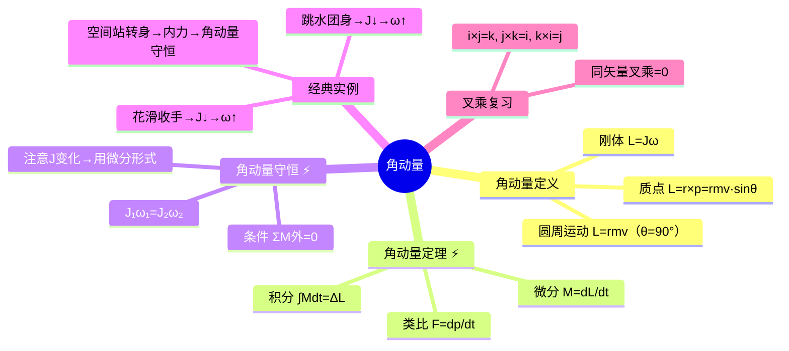

# 大物：角动量定理与守恒定律

> 📌 重构说明：本笔记是刚体动力学中「力矩-角动量」这一对量的完整体系。已按「角动量定义（质点+刚体）→角动量定理（微分）（微分+积分）→角动量守恒→三个生活实例→质点/刚体全线对照表→叉乘复习」的逻辑链重排。特别强调 $M = dL/dt$ 与 $F = dp/dt$ 的深层类比，以及 $J$ 变化时角动量守恒的正确写法。

## 🧠 思维导图

---

## 一、角动量的定义

### 1.1 质点的角动量

对定点 $O$：

$$\vec{L} = \vec{r} \times \vec{p} = \vec{r} \times m\vec{v}$$

大小：$L = rmv\sin\theta$。当质点做圆周运动时 $\theta = 90^\circ$ → $L = rmv$。

方向：==右手螺旋==——四指从 $\vec{r}$ 弯向 $\vec{p}$（或 $\vec{v}$），拇指方向即 $\vec{L}$ 方向。

### 1.2 刚体的角动量

将刚体微分为无数小质元，每个质元 $L_i = r_i m_i v_i = r_i m_i (r_i\omega)$，求和：

$$L = \sum m_i r_i^2 \omega = J\omega$$

$$\boxed{\vec{L} = J\vec{\omega}}$$

这正是质点→刚体类比的完美体现：$p=mv \longleftrightarrow L=J\omega$。

---

## 二、角动量定理

| 形式 | 公式 | 类比 |
|------|------|------|
| ==角动量定理（微分）== | $\vec{M} = \dfrac{d\vec{L}}{dt}$ | $F = dp/dt$ |
| ==角动量定理（积分）== | $\displaystyle\int_{t_1}^{t_2} \vec{M}\,dt = \vec{L}_2 - \vec{L}_1 = \Delta\vec{L}$ | $\int F\,dt = \Delta p$ |

**推导**：

$$\vec{M} = \vec{r} \times \vec{F} = \vec{r} \times \frac{d\vec{p}}{dt} = \frac{d}{dt}(\vec{r}\times\vec{p}) = \frac{d\vec{L}}{dt}$$

> [!warning] 考点
> ⚠️ $\int M\,dt = \Delta L$（冲量矩 = 角动量增量）是高频公式。右侧为 $J\omega_2 - J\omega_1$，左侧为力矩对时间的积分。

---

## 三、角动量守恒定律 ⚡️

### 3.1 条件与结论

==合外力矩 $\sum M_{\text{外}} = 0$ → 角动量守恒。==

$$\sum\vec{M}_{\text{外}} = 0 \quad\Rightarrow\quad \vec{L} = \text{常矢量}$$

### 3.2 转动惯量变化时的写法 ⚡️

若 $J$ 变化（如运动员收手），不能用 $L=J\omega$ 直接代入 $dL/dt = 0$，而应用微分形式：

$$M = \frac{d(J\omega)}{dt}$$

当 $M=0$ → $J\omega$ = 常数，即：

$$\boxed{J_1\omega_1 = J_2\omega_2}$$

> [!warning] 考点
> ⚠️ $J_1\omega_1 = J_2\omega_2$ 是角动量守恒在 $J$ 变化时的标准书写。注意不是 $J\omega^2$ 守恒——那是转动动能，角动量守恒和机械能守恒是两回事。

---

## 四、三个经典实例

| 实例 | $J$ 变化 | $\omega$ 变化 | 原理 |
|------|----------|--------------|------|
| 花样滑冰收手臂 | 收手 → $J\downarrow$ | $\omega\uparrow$（转得更快） | $M_{\text{外}}=0$ → $J\omega$ 守恒 |
| 跳水运动员团身 | 团身 → $J\downarrow$ | $\omega\uparrow$（翻腾更快） | 同上 |
| 空间站转身 | 身一部分转 → 整体转 | 整体反向转 | 初始 $L=0$，始终 $L=0$ |

> 📖 生活类比：坐在转椅上把腿伸出去再收回来——收腿时椅子突然加速旋转。这就是 $J$ 变小、$\omega$ 变大的直接体验。

---

## 五、质点 vs 刚体全线对照表

| | 质点（平动） | 刚体（定轴转动） |
|------|------------|----------------|
| 作用量 | 力 $F$ | 力矩 $M$ |
| 惯性 | 质量 $m$ | 转动惯量 $J$ |
| 运动量 | 动量 $p=mv$ | 角动量 $L=J\omega$ |
| 动力学 | $F=ma=dp/dt$ | $M=J\alpha=dL/dt$ |
| 积分形式 | $\int F\,dt = \Delta p$ | $\int M\,dt = \Delta L$ |
| 守恒律 | $\sum F_{\text{外}}=0 \to p$ 守恒 | $\sum M_{\text{外}}=0 \to L$ 守恒 |

---

## 六、叉乘速查

$$\vec{i}\times\vec{j}=\vec{k},\;\vec{j}\times\vec{k}=\vec{i},\;\vec{k}\times\vec{i}=\vec{j}$$

同矢量叉乘为零：$\vec{i}\times\vec{i}=0$。反序变号：$\vec{j}\times\vec{i}=-\vec{k}$。

---

---

## 🔗 知识网络

### 前置依赖
- 01_质点运动描述的物理量 — 速度和动量的基本概念
- 06_动量定理与解题步骤 — 动量定理的微分/积分形式（角动量定理的平动类比）
- 08_刚体定轴转动定律与转动惯量 — 转动惯量和转动定律

### 后续应用
- 10_三大守恒律复习与简谐振动入门 — 三大守恒律（动量/角动量/机械能）的综合对比
- 碰撞问题 — 碰撞中的角动量守恒分析

### 对比辨析
- 角动量守恒 vs 动量守恒：前者要求合外力矩为零，后者要求合外力为零；二者在碰撞问题中可能同时成立
- $M = dL/dt$ vs $F = dp/dt$：力矩是转动中的力，角动量是转动中的动量，形式完全对称

## 📚 核心词条索引

| 知识点链接 | 类别 | 关键词 |
|------|------|--------|
| [[角动量]] | 核心概念 | $\vec{L}=\vec{r}\times\vec{p}$，描述转动状态的物理量 |
| [[角动量定理（微分）]] | 核心定律 | $\vec{M}=d\vec{L}/dt$，力矩等于角动量变化率 |
| [[角动量守恒]] | 核心定律 | 合外力矩为零时，角动量保持不变 |
| [[叉乘]] | 数学工具 | $\vec{i}\times\vec{j}=\vec{k}$，右手螺旋定则定方向 |
| [[角动量定理（积分）]] | 核心定律 | $\int M dt=\Delta L$，冲量矩等于角动量增量 |
| [[冲量矩]] | 核心概念 | 力矩对时间的积分，$\int M dt$ |
| [[力矩]] | 核心概念 | $\vec{M}=\vec{r}\times\vec{F}$，力使物体转动的效应 |
| [[转动惯量]] | 核心概念 | 刚体转动惯性的量度，$J=\int r^2 dm$ |
| [[动量]] | 核心概念 | $\vec{p}=m\vec{v}$，描述平动状态的物理量 |
