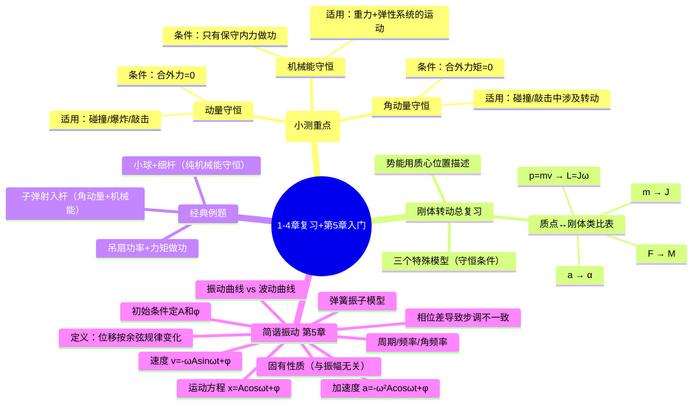

# 大物：1-4章守恒律复习与简谐振动入门

> 📌 重构说明：本录音前半段为1-4章的守恒律总复习（为下周小测准备），后半段进入第5章机械振动的全新内容。已按「守恒律体系→经典例题→简谐振动基础」的知识逻辑重新编排，删除点名、小测时间通知等教务内容。

## 🧠 思维导图

---

## 第一部分：1-4 章守恒律总复习

### 一、三大守恒律速查表

> 老师方法论：「能处理成守恒，我们就尽量处理成守恒来解决问题。因为守恒只需要考虑始末的状态，不需要考虑中间的过程。」

| 守恒律 | 条件 | 适用场景 | 表达式 |
|--------|------|----------|--------|
| **动量守恒** | 合外力 = 0 | 碰撞、爆炸、敲击 | $\sum m_i \vec{v}_i = \text{常数}$ |
| **机械能守恒** | 只有保守内力做功 | 重力+弹性系统 | $E_k + E_p = \text{常数}$ |
| **角动量守恒** | 合外力矩 = 0 | 碰撞/敲击中涉及转动 | $\sum J_i\omega_i = \text{常数}$ |

> [!warning] 考点
> ⚠️ 碰撞、敲击、爆炸这三类问题中，内力远大于外力，因此可以近似认为动量守恒和角动量守恒成立——这是考试中最常见的隐含条件。

### 二、动量守恒的深入理解

==条件：系统所受合外力为零。==

> 📖 补充：在碰撞/敲击/爆炸问题中，虽然外力（如重力、摩擦力）在严格意义上不为零，但在极短的相互作用时间内，内力远大于外力（量级差距可达数百倍），因此外力冲量可忽略，系统动量近似守恒。

### 三、机械能守恒的深入理解

==条件：只有保守内力做功（或合外力做功为0且非保守内力做功也为0）。==

**保守力**：重力、弹簧弹力、万有引力——做功与路径无关。

> [!warning] 考点
> ⚠️ 若题目中有摩擦力或空气阻力做功，则机械能不守恒。必须在分析受力时明确判断是否存在非保守力。

### 四、角动量守恒的深入理解

==条件：系统所受合外力矩为零。==

> [!info] 补充定义
> 角动量守恒是刚体定轴转动中最常用的守恒律。类似动量守恒适用于碰撞中的平动问题，角动量守恒适用于碰撞中涉及转动的问题（如子弹射入旋转的杆、两个转盘突然结合等）。

---

## 第二部分：刚体定轴转动总复习

### 五、质点 ↔ 刚体类比对照表

> 老师核心观点：「刚体定轴转动的所有结论都可以跟质点直线运动类比。把质量换成转动惯量，把线量换成角量——公式形式一模一样。」

| | 质点直线运动 | 刚体定轴转动 |
|------|------------|------------|
| **惯性量度** | 质量 $m$ | 转动惯量 $J$ |
| **运动变化** | 加速度 $a$ | 角加速度 $\alpha$ |
| **作用量** | 力 $F$ | 力矩 $M$ |
| **动力学方程** | $F = ma$ | $M = J\alpha$ |
| **动量** | $p = mv$ | 角动量 $L = J\omega$ |
| **动能** | $\frac{1}{2}mv^2$ | $\frac{1}{2}J\omega^2$ |
| **功** | $\int F\,dx$ | $\int M\,d\theta$ |

### 六、刚体重力势能的处理

> 老师强调：「刚体的重力势能实际上跟质点的重力势能是一样的，只是我们用的是**质心的位置**来描述它的重力势能。」

==因为刚体的重力分布在所有质点上，而重力对质心取矩的结果等价于所有质量集中在质心时重力所做的功。==

### 七、三个特殊模型中的守恒判断

> [!warning] 考点
> ⚠️ 考试喜欢出「以下模型中，什么守恒、什么不守恒」的判断。三个模型的结论必须记牢。

| 模型 | 动量守恒？ | 角动量守恒？ | 机械能守恒？ |
|------|-----------|-------------|-------------|
| 子弹入杆（在水平面内） | ❌ (O点有约束力) | ✅ (外力矩=0) | — |
| 两个转盘突然结合 | ❌ | ✅ | ❌ (有能量损失) |
| 小球+杆绕O转动（竖直面） | ❌ (重力是外力) | — | ✅ (只有重力做功) |

> 老师详解：「子弹射入射入杆时为什么动量不守恒？因为支点O会给杆一个力，这个力在水平方向上有分量，所以水平方向动量不守恒——但O点的力过转轴，外力矩为零，所以角动量守恒。」

---

## 第三部分：经典例题精讲

### 八、例题1：吊扇的功率与力矩做功

**题目要点**：吊扇有静止、一档、二档三档转速，已知阻力矩 $M = k\omega$（与角速度成正比）。求：(1) 二档功率；(2) 从静止匀加速到二档所需时间和阻力矩做功。

#### (1) 功率

==核心公式：$P = M\omega$==

**关键转换**：题目给的是**转速**（转/秒），不是角速度。

$$\omega = 2\pi n \quad \text{（转速→角速度：乘以 }2\pi\text{）}$$

代入 $M = k\omega$ 即可求出功率。

> 📌 易错陷阱：⚠️ 题目给转速 $n$（单位 r/s），而功率公式中需要角速度 $\omega$（单位 rad/s）。忘记乘 $2\pi$ 直接代入——这是最经典的扣分点。

#### (2) 力矩做功

==力矩做功公式：$W = \int M \, d\theta$==

**解法流程**：

1. 匀变速转动，$\omega = \omega_0 + \alpha t$（从静止开始，$\omega_0 = 0$）
2. 由末状态的角速度反求：$\alpha = \dfrac{\omega}{t}$
3. 角位移与角速度关系：$\omega^2 - \omega_0^2 = 2\alpha\theta$
4. 将 $d\theta$ 换为与 $dt$ 的关系，统一积分变量
5. $M = k\omega = k\alpha t$，代入积分 $\int_0^t M \cdot \omega \, dt$

> [!warning] 考点
> ⚠️ 力矩做功需**统一积分变量**——将 $M$、$\omega$、$d\theta$ 都表达为同一变量（如时间 $t$）的函数后才能积分。

### 九、例题2：子弹射入杆（两段法）

**题目**：子弹以速率 $v$ 水平射入竖直悬挂的细杆，嵌入后一起绕上端O点转动，问出速率。

==关键：题目分**两段**处理——==

| 阶段 | 过程 | 守恒律 | 为什么？ |
|------|------|--------|----------|
| **第一段** | 子弹射入杆（极短时间） | **角动量守恒** | 碰撞过程，O点外力矩为零 |
| **第二段** | 子弹+杆一起转到30° | **机械能守恒** | 只有重力（保守力）做功 |

#### 第一段：角动量守恒

子弹射入前的角动量（对O点）：

$$L_{\text{前}} = mva \quad \text{（或写成 } L = mr^2 \cdot \frac{v}{r} = mva \text{）}$$

> 📖 补充：质点的角动量有两种等价表示：$L = mvr$ 或 $L = J\omega = mr^2\omega$。它们自洽——因为 $\omega = v/r$，代入即得 $L = mr^2 \cdot v/r = mvr$。

子弹+杆一起转动的角动量：

$$L_{\text{后}} = J_{\text{总}} \cdot \omega = \left(J_{\text{杆}} + ma^2\right) \cdot \omega$$

其中 $J_{\text{杆}}$ 查课本89页表（细杆绕端点垂直于杆）。

由 $L_{\text{前}} = L_{\text{后}}$ 得：$mva = (J_{\text{杆}} + ma^2) \cdot \omega$ ——（式①）

#### 第二段：机械能守恒

定义初始垂直位置为零势能面。

**始状态**（垂直）：只有动能：

$$E_{\text{始}} = \frac{1}{2}J_{\text{总}}\omega^2$$

**末状态**（30°角）：速度为零（最高点），只有势能。

分别计算杆和子弹上升的高度：

==杆（质心上升）==：杆的质心在 $L/2$ 处，转30°后上升高度 = $\dfrac{L}{2} - \dfrac{L}{2}\cos\theta = \dfrac{L}{2}(1 - \cos\theta)$

==子弹上升==：子弹距O点 $a$，上升高度 = $a - a\cos\theta = a(1 - \cos\theta)$

$$E_{\text{末}} = m_{\text{杆}}g \cdot \frac{L}{2}(1 - \cos\theta) + m_{\text{子}}g \cdot a(1 - \cos\theta)$$

由 $E_{\text{始}} = E_{\text{末}}$ 解出 $\omega$ → 代入式① → 解出 $v$。

> [!warning] 考点
> ⚠️ 杆和子弹的重力势能必须**分开写**！杆的势能变化看质心，子弹的势能变化看子弹自身的高度。

### 十、例题3：小球+细杆（纯机械能守恒）

**题目**：细杆一端固定，另一端附小球，从水平位置静止释放，求与竖直方向成 $\beta$ 角时的角速度。

==这是例题2的后半程简化版——直接机械能守恒。==

**分析**：以细杆+小球+地球为系统，只有重力（保守内力）做功 → 机械能守恒。

| 状态 | 动能 | 势能（设水平位置为零势能） |
|------|------|--------------------------|
| **A（水平）** | $E_k = 0$（静止释放） | $E_p = 0$（定义为零势能） → $E_A = 0$ |
| **B（成 $\beta$ 角）** | $\frac{1}{2}J_{\text{总}}\omega^2$ | 杆：$-m_{\text{杆}}g \cdot \frac{L}{2}\sin\beta$；小球：$-m_{\text{球}}g \cdot L\sin\beta$ |

注意：==势能带负号——因为物体从零势能面**下降**了。==

$$J_{\text{总}} = J_{\text{杆}} + m_{\text{球}}L^2$$

由 $E_A = E_B = 0$：

$$\frac{1}{2}J_{\text{总}}\omega^2 - m_{\text{杆}}g \cdot \frac{L}{2}\sin\beta - m_{\text{球}}g \cdot L\sin\beta = 0$$

解出 $\omega$ 即可。

> 📌 易错陷阱：⚠️ 势能带**负号**（下降）是最高频错误。很多同学忘记加负号，导致结果差一个符号。

---

## 第四部分：第5章 机械振动——简谐振动

### 十一、什么是简谐振动？

> 老师定义：「物体运动时，离开平衡位置的位移按**余弦规律**随时间变化，这种运动称为简谐振动。」

$$
\boxed{x = A\cos(\omega t + \varphi)}
$$

**三种常见简谐振动实例**：

| 实例 | 条件 |
|------|------|
| 弹簧振子 | 光滑水平面 |
| 单摆 | ==摆角 < 5°==（小角度才能近似为简谐振动） |
| 浮在水面的木块 | 压下后松手，上下振动可近似为简谐振动 |

> [!warning] 考点
> ⚠️ 单摆只在**小角度（< 5°）**下才是简谐振动。为什么？因为 $\sin\theta \approx \theta$ 只在小角度成立。一会用例题说明。

### 十二、动力学特征

> 老师强调：「力跟位移成**反比线性关系**，这是简谐振动最重要的特征—— $F = -kx$。」

这是判断一个系统是否做简谐振动的**标志**：

$$F = -kx \quad \text{（恢复力与位移成正比，方向相反）}$$

结合牛顿第二定律 $F = ma$ 和 $a = \ddot{x}$：

$$-kx = m\ddot{x} \quad \Rightarrow \quad \ddot{x} + \frac{k}{m}x = 0$$

令 $\omega^2 = \dfrac{k}{m}$：

$$\ddot{x} + \omega^2 x = 0$$

==这是一个二阶常微分方程，经过两次积分，其解为一个余弦函数==：

$$x = A\cos(\omega t + \varphi)$$

其中 $A$ 和 $\varphi$ 是两个积分常量，由初始条件决定。

> [!info] 补充定义
> 二阶常微分方程 $\ddot{x} + \omega^2 x = 0$ 称为简谐振动的**运动学特征方程**。$F = -kx$ 称为**动力学特征**。两者等价——只要力与位移成反比线性关系，运动一定是简谐振动。

### 十三、运动方程的三个导出量

| 物理量 | 公式 | 最大值的名称 |
|--------|------|-------------|
| 位移 | $x = A\cos(\omega t + \varphi)$ | 振幅 $A$ |
| 速度 | $v = -\omega A\sin(\omega t + \varphi) = \omega A\cos(\omega t + \varphi + \frac{\pi}{2})$ | 速度振幅 $v_m = \omega A$ |
| 加速度 | $a = -\omega^2 A\cos(\omega t + \varphi) = \omega^2 A\cos(\omega t + \varphi + \pi)$ | 加速度振幅 $a_m = \omega^2 A$ |

> [!warning] 考点
> ⚠️ 速度振幅 $v_m = \omega A$、加速度振幅 $a_m = \omega^2 A$ 是高频填空题。注意与振动方程中 $A$ 的区别——$A$ 是位移振幅。

### 十四、为什么要统一写成余弦形式？——相位的意义

> 老师核心观点：「为什么非得把速度和加速度都转成余弦函数？因为余弦函数括号内的式子——**相位**——决定了物体的运动状态。」

| 物理量 | 相位 | 与位移相位的差 |
|--------|------|---------------|
| 位移 $x$ | $\omega t + \varphi$ | 0（基准） |
| 速度 $v$ | $\omega t + \varphi + \frac{\pi}{2}$ | 超前 $\frac{\pi}{2}$ |
| 加速度 $a$ | $\omega t + \varphi + \pi$ | 超前 $\pi$ |

==由于相位不同，$x$、$v$、$a$ 的**步调不一致**==：

- 当物体在最大位移处（$x = A$）时，速度 $v = 0$，加速度 $a = -\omega^2 A$（最大负值）
- 当物体经过平衡位置（$x = 0$）时，速度最大 $v = \omega A$，加速度 $a = 0$

> 老师强调：「统一写成余弦函数后，我们直接从相位就能读到所有信息——判断物体正处于什么状态、速度多大、加速度多大。」

### 十五、描述简谐振动的关键参数

| 参数 | 符号 | 含义 | 关系式 |
|------|------|------|--------|
| **振幅** | $A$ | 离开平衡位置的最大位移的绝对值 | 由初始条件决定 |
| **周期** | $T$ | 完成一次全振动所需时间 | $T = \dfrac{2\pi}{\omega}$ |
| **频率** | $\nu$ | 单位时间内完成的全振动次数 | $\nu = \dfrac{1}{T} = \dfrac{\omega}{2\pi}$ |
| **角频率** | $\omega$ | $2\pi$ 秒内的振动次数 | $\omega = 2\pi\nu = \dfrac{2\pi}{T}$ |

> 一次全振动：平衡位置 → 正最大 → 平衡位置 → 负最大 → 平衡位置。此时运动开始重复。

==**固有**性质：==

- $\omega = \sqrt{\dfrac{k}{m}}$ 只由弹簧振子本身的性质（$k$ 和 $m$）决定
- $T$ 和 $\nu$ 也由 $\omega$ 决定 → 与**振幅无关**

> [!warning] 考点
> ⚠️ 「周期与振幅无关」是选择题/判断题经典陷阱——出一个表达式中包含 $A$ 的干扰项，诱导选错。

### 十六、振动曲线的识别

> 老师提醒：「振动曲线 vs 波动曲线从图上看几乎一模一样——区别就在横坐标。」

| | 振动曲线 | 波动曲线 |
|------|----------|----------|
| **横坐标** | **时间 $t$** | 空间坐标 $x$ |
| **含义** | ==同一个质点在不同时刻的位移== | 不同质点在**同一时刻**的位移 |
| **对象** | 一个质点 | 多个质点（连续介质） |

### 十七、相位的时间周期性与相位周期性

**时间周期性**：$x(t + T) = x(t)$（加一个周期，运动开始重复）

**相位周期性**：$x(\varphi + 2\pi) = x(\varphi)$（==相位改 $2\pi$，振动恢复原状==）

> 两个周期性等价——因为 $\omega T = 2\pi$。

### 十八、由初始条件确定 $A$ 和 $\varphi$

> 老师强调：「求 $A$ 和 $\varphi$ 是一定要会的。能背公式就背公式，背不下来就把运动方程和速度方程记牢，代入初始条件自己解。」

已知 $t = 0$ 时 $x(0) = x_0$，$v(0) = v_0$：

代入运动方程和速度方程：

$$\begin{cases} x_0 = A\cos\varphi \\ v_0 = -\omega A\sin\varphi \end{cases}$$

解得：

$$\boxed{A = \sqrt{x_0^2 + \left(\frac{v_0}{\omega}\right)^2}}$$

$$\boxed{\varphi = \arctan\left(-\frac{v_0}{\omega x_0}\right)}$$

> 📖 推导思路：从 $\cos\varphi = x_0/A$ 和 $\sin\varphi = -v_0/(\omega A)$ 出发，利用 $\cos^2\varphi + \sin^2\varphi = 1$ 消去 $\varphi$ 即得 $A$；再两式相除得 $\tan\varphi = -v_0/(\omega x_0)$。

> [!warning] 考点
> ⚠️ 注意初相位 $\varphi$ 的象限判定。$\arctan$ 主值只在 $(-\pi/2, \pi/2)$，而简谐振动中初相位可以是任意角度。需要结合 $\sin\varphi$ 和 $\cos\varphi$ 的符号共同判断象限。

---

---

## 🔗 知识网络

### 前置依赖
- [[06_动量定理与解题步骤]] — 动量定理与动量守恒
- [[08_刚体定轴转动定律与转动惯量]] — 转动定律基础
- [[09_角动量定理与守恒定律]] — 角动量定理与守恒

### 后续应用
- [[11_旋转矢量法与简谐振动描述]] — 简谐振动的旋转矢量表示
- [[机械能守恒]] — 机械能守恒在简谐振动中的应用
- [[简谐振动]] — 简谐振动的完整描述

### 对比辨析
- 动量守恒 vs 角动量守恒 vs 机械能守恒：分别对应空间平移对称性、空间旋转对称性、时间平移对称性；各自守恒条件不同
- 三大守恒律 vs 牛顿定律：守恒律是更基本的时空对称性结果，适用范围比牛顿定律更广

## 📚 核心词条索引

| 知识点链接 | 类别 | 关键词 |
|------|------|--------|
| [[简谐振动]] | 核心概念 | 物体离开平衡位置的位移按余弦规律随时间变化的振动 |
| [[动量守恒]] | 核心定律 | 系统所受合外力为零时，系统总动量保持不变 |
| [[角动量守恒]] | 核心定律 | 系统所受合外力矩为零时，系统总角动量保持不变 |
| [[机械能守恒]] | 核心定律 | 只有保守内力做功时，系统动能与势能之和保持不变 |
| [[刚体]] | 核心模型 | 有形状、有体积，但不可变形的理想物体 |
| [[转动惯量]] | 核心概念 | 刚体转动惯性的量度，$J=\int r^2 dm$ |
| [[角加速度]] | 核心概念 | 角速度随时间的变化率，$\alpha = d\omega/dt$ |
| [[力矩]] | 核心概念 | 力使物体转动的效应，$\vec{M}=\vec{r}\times\vec{F}$ |
| [[角动量]] | 核心概念 | 描述转动状态的物理量，$L=J\omega$ 或 $L=mvr$ |
| [[子弹入杆]] | 典型模型 | 子弹射入可绕固定轴转动的细杆，角动量守恒但动量不守恒 |
| [[角速度]] | 核心概念 | 描述转动快慢的物理量，$\omega = d\theta/dt$ |
| [[力矩做功]] | 核心概念 | 力矩使刚体转动所做的功，$W=\int M d\theta$ |
| [[匀变速转动]] | 运动类型 | 角加速度恒定的转动，$\omega = \omega_0 + \alpha t$ |
| [[弹簧振子]] | 典型模型 | 弹簧连接质点在光滑水平面上的简谐振动系统 |
| [[振幅]] | 核心概念 | 离开平衡位置的最大位移的绝对值 |
| [[相位]] | 核心概念 | 决定振动状态的物理量，$\phi = \omega t + \varphi$ |
| [[周期]] | 核心概念 | 完成一次全振动所需时间，$T=2\pi/\omega$ |
| [[频率]] | 核心概念 | 单位时间内完成全振动的次数，$\nu=1/T$ |
| [[角频率]] | 核心概念 | $2\pi$秒内的振动次数，$\omega=2\pi\nu$ |
| [[振动曲线 vs 波动曲线]] | 易混概念 | 振动曲线横坐标为时间t，波动曲线横坐标为位置x |
| [[初相位]] | 核心概念 | t=0时刻的相位，由初始条件决定 |
