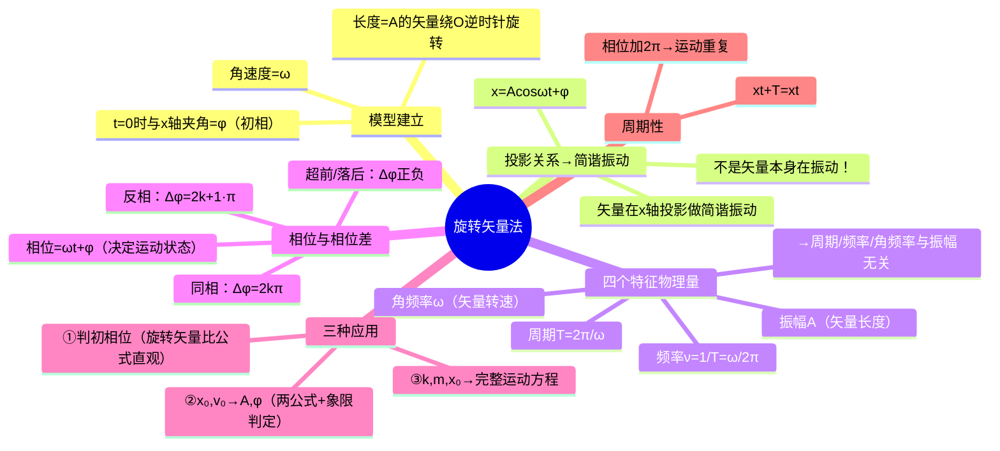

# 大物：旋转矢量法与简谐振动描述

> 📌 重构说明：旋转矢量法是将抽象的简谐振动可视化、定量化的核心工具。本笔记按「旋转矢量模型→投影关系→四个特征物理量→相位与相位差→三种应用场景（判初相、求运动方程、解析振）→周期性」的逻辑链重排，完整保留了原笔记中的所有定量计算（弹簧振子数值例、初始条件法求 $A$ 和 $\varphi$），并补充了同相/反相的旋转矢量可视化思路。

## 🧠 思维导图

---

## 一、旋转矢量模型

==旋转矢量法是一个辅助可视化工具，不是真实的物理矢量。==

长度为 $A$ 的矢量绕原点 $O$ 以角速度 $\omega$**逆时针**匀速旋转。$t$ 时刻矢量与 $x$ 轴的夹角 = $\omega t + \varphi$（$\varphi$ 为 $t=0$ 时的夹角 = 初相位）。

### 投影 = 简谐振动

==矢量在 $x$ 轴上的投影点做简谐振动——不是矢量本身在振动。==

$$x = A\cos(\omega t + \varphi)$$

| 旋转矢量参数 | → 简谐振动物理量 |
|-------------|-----------------|
| 矢量长度 $A$ | 振幅 $A$ |
| 旋转角速度 $\omega$ | 角频率 $\omega$ |
| $t$ 时刻与 $x$ 轴夹角 | 相位 $\omega t + \varphi$ |
| $t=0$ 时与 $x$ 轴夹角 | 初相位 $\varphi$ |

> [!warning] 考点
> ⚠️ 「旋转矢量在 x 轴上的投影做简谐振动」，主语是投影，不是矢量本身。这是选择题/判断题经典陷阱。

---

## 二、简谐振动的三方程与三个最大值

位移方程、速度方程、加速度方程——三者是逐级求导关系：

| 方程 | 公式 | 最大值 |
|------|------|--------|
| 位移 | $x = A\cos(\omega t + \varphi)$ | $x_{\max} = A$ |
| 速度 | $v = -\omega A\sin(\omega t + \varphi) = \omega A\cos(\omega t + \varphi + \frac{\pi}{2})$ | $v_{\max} = \omega A$（速度振幅） |
| 加速度 | $a = -\omega^2 A\cos(\omega t + \varphi) = \omega^2 A\cos(\omega t + \varphi + \pi)$ | $a_{\max} = \omega^2 A$（加速度振幅） |

注意：$\omega^2$ 出现在 $\omega$ 上（即 $(\omega)^2 A$），不是在 $A$ 上。

---

## 三、特征物理量——四个固有参数

==周期 $T$、频率 $\nu$、角频率 $\omega$ 都是固有属性，与振幅 $A$ 无关。==

$$\omega = \sqrt{\frac{k}{m}} \quad\text{（只由 } k,m \text{ 决定）}$$

$$T = \frac{2\pi}{\omega}$$

$$\nu = \frac{1}{T} = \frac{\omega}{2\pi}$$

$$\omega = 2\pi\nu = \frac{2\pi}{T}$$

> [!warning] 考点
> ⚠️ 周期、频率、角频率与**振幅无关**——这是选择题/判断题高频陷阱。公式中不出现 $A$。

---

## 四、相位与相位差——「步调」的量化

### 4.1 什么是相位？

$\omega t + \varphi$ 决定了此刻物体的运动状态（位置 + 运动方向）。偷换 1 分子 → 状态改变。

### 4.2 初相位的取值范围

通常取 $[0, 2\pi]$ 或 $[-\pi, \pi]$。

### 4.3 相位差（前提：两振动 $\omega$ 相同）

$$\Delta\varphi = \varphi_2 - \varphi_1$$

| 关系 | 条件 | 旋转矢量表现 | 运动表现 |
|------|------|-------------|----------|
| ==同相== | $\Delta\varphi = 2k\pi$ | 两矢量重合（同向） | 步调完全一致，同时达最大/过零 |
| ==反相== | $\Delta\varphi = (2k+1)\pi$ | 两矢量反向 | 步调完全相反，一端正最大时另一端负最大 |
| ==超前/落后== | $\Delta\varphi > 0$：$\varphi_2$ 超前；$\Delta\varphi < 0$：$\varphi_2$ 落后 | 旋转矢量更「前面」 | 比对方先达到同样状态 |

> [!warning] 考点
> ⚠️ 相位差 $2k\pi$ = 同相，$(2k+1)\pi$ = 反相，是高频判断。

---

## 五、旋转矢量法的三种核心应用

### 5.1 应用①：判断初相位（比公式直观！）

**方法**：
1. 画 $x$ 轴 + 圆的垂直参考线
2. 由初始位置在 $x$ 轴上的投影点确定可能的两个矢量位置（上下对称）
3. 根据初始运动方向**筛掉**一个，留下来的矢量与 $x$ 轴的夹角 = 初相位

**例题**：$t=0$ 时 $x = -\frac{\sqrt{2}}{2}A$，向 $x$ 轴负方向运动。

- 在 $x = -\frac{\sqrt{2}}{2}A$ 处作垂线交圆于两点（上、下）
- 向负方向运动 → 投影点必须正向左移 → 选**上方**矢量（逆时针旋转投影向左）
- → $\varphi = \frac{5\pi}{4}$

### 5.2 应用②：由初始条件求 $A$ 和 $\varphi$（必考计算）

已知 $t=0$ 时 $x(0) = x_0$、$v(0) = v_0$：

$$\boxed{A = \sqrt{x_0^2 + \frac{v_0^2}{\omega^2}}}$$

$$\boxed{\tan\varphi = -\frac{v_0}{\omega x_0}}$$

> [!warning] 考点
> ⚠️ $\tan\varphi$ 只能给出 $\varphi$ 的模，实际象限需结合 $x_0$ 和 $v_0$ 的符号共同判断（$\arctan$ 主值只在 $(-\pi/2,\pi/2)$）。旋转矢量法更直观，可几何验证。

### 5.3 应用③：由 $k$、$m$、初始条件求完整运动方程

**完整步骤**（以弹簧振子为例）：

1. 由 $k$ 和 $m$ 求角频率：$\omega = \sqrt{k/m}$
2. 由初始条件求振幅 $A$（公式见 5.2）
3. 用旋转矢量法画图判断初相位 $\varphi$
4. 组装：$x = A\cos(\omega t + \varphi)$

**数值例题**：$k=1.26\,\mathrm{N/m}$，$m=0.02\,\mathrm{kg}$，向右拉到 $0.05\,\mathrm{m}$ 释放。

1. $\omega = \sqrt{1.26/0.02} = 7.9\,\mathrm{rad/s}$
2. 释放（$v_0=0$）→ $A = x_0 = 0.05\,\mathrm{m}$
3. 初始在正最大位移处 → $\varphi = 0$
4. $x = 0.05\cos(7.9t)\,\mathrm{m}$

---

## 六、周期性

旋转矢量每转 $2\pi$ → 投影运动重复一次 → $x(t+T) = x(t)$。相位加 $2\pi$ = 振动恢复原状。

---

---

## 🔗 知识网络

### 前置依赖
- [[10_三大守恒律复习与简谐振动入门]] — 简谐振动的入门概念
- [[简谐振动]] — 简谐振动的定义和特征

### 后续应用
- [[12_机械波与波函数概述]] — 波函数中的旋转矢量表示
- [[13_波动方程与相位分析]] — 波动中的相位差分析
- [[机械波]] — 机械波中相位关系的应用

### 对比辨析
- 旋转矢量法 vs 振动曲线法：旋转矢量法直观展示相位关系，振动曲线法精确展示位移-时间关系；旋转矢量一个点在竖直方向的投影=简谐振动位移
- 同相 vs 反相：Δφ=2kπ 时同相（步调一致），Δφ=(2k+1)π 时反相（步调相反）

## 📚 核心词条索引

| 知识点链接 | 类别 | 关键词 |
|------|------|--------|
| [[旋转矢量法]] | 核心方法 | 长度为A的矢量逆时针旋转，其在x轴投影做简谐振动 |
| [[简谐振动]] | 核心概念 | 位移按余弦规律随时间变化的振动 |
| [[相位]] | 核心概念 | $\omega t+\varphi$，决定振动状态的物理量 |
| [[相位差]] | 核心概念 | 两振动初相差，判断同相、反相、超前落后 |
| [[同相]] | 相位关系 | $\Delta\varphi=2k\pi$，步调完全一致 |
| [[反相]] | 相位关系 | $\Delta\varphi=(2k+1)\pi$，步调完全相反 |
| [[初相位]] | 核心概念 | t=0时刻的相位，由初始条件决定 |
| [[振幅]] | 核心概念 | 离开平衡位置的最大位移 |
| [[角频率]] | 核心概念 | $\omega=2\pi\nu$，$2\pi$秒内振动次数 |
| [[周期]] | 核心概念 | $T=2\pi/\omega$，完成一次全振动时间 |
| [[频率]] | 核心概念 | $\nu=1/T$，单位时间全振动次数 |
