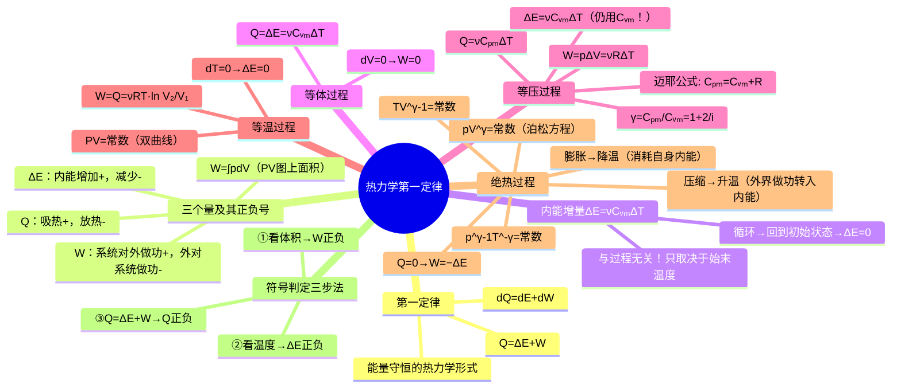

# 大物：热力学第一定律与四大过程

> 📌 重构说明：本笔记是热力学第二大支柱——四大过程的能量分析。已按「热力学第一定律→内能增量 $\Delta E$ 的过程无关性→四个过程逐一展开（定义+能量关系+过程方程+物理意义）→符号判定三步法」的逻辑链重排。完整保留了原文档中的摩尔定体热容 $C_{V,m} = \frac{i}{2}R$、迈耶公式 $C_{p,m} = C_{V,m} + R$、比热容比 $\gamma = \frac{i+2}{i}$、等温膨胀/压缩的功与热量公式 $W=Q=\nu RT\ln(V_2/V_1)$、绝热过程的泊松方程，以及等压膨胀/压缩的双重用途（部分增温+部分做功）的深入解析。

## 🧠 思维导图

---

## 一、热力学第一定律

$$\boxed{Q = \Delta E + W}$$

**三个量及其正负号规定**：

| 量 | 符号 | 含义 | 正号条件 | 负号条件 |
|------|:----:|------|----------|----------|
| 热量 $Q$ | 过程量 | 系统与外界的热交换 | 从外界吸热 | 向外界放热 |
| 功 $W$ | 过程量 | 系统与外界之间的功交换 | ==系统对外做功== | 外界对系统做功 |
| 内能增量 $\Delta E$ | 状态增量 | 系统内能的变化 | 内能增加（$T$ 升） | 内能减少（$T$ 降） |

做功的计算：$W = \displaystyle\int_{V_1}^{V_2} p\,dV$（在 $p$-$V$ 图上是过程曲线下的面积）。

> [!warning] 考点
> ⚠️ $Q = \Delta E + W$ 中 $W$ 是**系统对外界**的功。有些教材定义 $W$ 是外界对系统做的功 → 这里等式会变成 $Q = \Delta E - W'$。务必确认自己使用的是哪个版本。

### 内能增量的「过程无关性」

==$\Delta E = \nu C_{V,m}\Delta T$ 只与始末态温度有关，与中间经历什么过程无关。== 这是一条贯穿所有四大过程的共用公式——无论你在等体过程/等压过程/等温过程/绝热过程哪个过程中，内能增量都是 $\nu C_{V,m}\Delta T$。循环回到初始状态 → 净 $\Delta E = 0$。

---

## 二、等体过程

| 特征 | $dV = 0$，$pv$ 图上为竖直线 |
|------|---------------------------|
| 功 | ==$W = 0$==（体积不变，不做功） |
| 热量 | $Q = \Delta E = \nu C_{V,m}\Delta T$ |
| 摩尔定体热容 | $C_{V,m} = \dfrac{i}{2}R$ |
| 能量图景 | 吸的全部热量→全部转化为内能增量 |

---

## 三、等压过程

| 特征 | $dp = 0$，$pv$ 图上为水平线 |
|------|---------------------------|
| 功 | $W = p\Delta V = \nu R\Delta T$ |
| 热量 | $Q = \nu C_{p,m}\Delta T$ |
| 内能增量 | $\Delta E = \nu C_{V,m}\Delta T$（注意：仍用 $C_{V,m}$！） |

**迈耶公式**（$C_{p,m}$ 与 $C_{V,m}$ 的关系）：

$$\boxed{C_{p,m} = C_{V,m} + R = \frac{i+2}{2}R}$$

> 📖 物理原因：等压下加热，一部分热量用于提升内能（$C_{V,m}\Delta T$），另一部分用于对外做功（$p\Delta V = R\Delta T$ 每摩尔），因此 $C_{p,m} = C_{V,m} + R$。

**比热容比**：$\gamma = \dfrac{C_{p,m}}{C_{V,m}} = \dfrac{i+2}{i}$

| 等压过程（$V\uparrow$） | 等压过程（$V\downarrow$） |
|----------------------|------------------------|
| $W > 0$，$T\uparrow$ → $\Delta E > 0$ | $W < 0$，$T\downarrow$ → $\Delta E < 0$ |
| $Q > 0$：吸热，部分增温 + 部分对外做功 | $Q < 0$：外界做功压缩 + 内能减少 → 放热 |

---

## 四、等温过程

| 特征 | $dT = 0$ → $\Delta E = 0$ |
|------|---------------------------|
| $pv$ 图 | $pV = \text{常数}$（双曲线的一支，反比） |
| 功与热量 | ==$Q = W = \nu RT\ln\dfrac{V_2}{V_1} = p_1V_1\ln\dfrac{V_2}{V_1}$== |
| 热容 | 等温过程**没有热容**（$C = \infty$，$dT=0$ 时不定义） |

| 等温过程（$V\uparrow$） | 等温过程（$V\downarrow$） |
|----------------------|------------------------|
| $W > 0$，$T$ 不变 → $\Delta E = 0$ | $W < 0$，$T$ 不变 → $\Delta E = 0$ |
| $Q > 0$：从外界吸热，**全部转为对外做功** | $Q < 0$：外界做功，**全部以热量形式放出** |

---

## 五、绝热过程

| 特征 | $Q = 0$（无热交换） |
|------|---------------------|
| 功 | ==$W = -\Delta E = -\nu C_{V,m}\Delta T$==（完全靠消耗自身内能做功） |
| 实现方法 | ① 绝热材料包裹系统；② 过程极快，来不及热交换 |

**泊松方程**（绝热过程的过程方程）：

$$\boxed{pV^\gamma = \text{常数}}$$

$$\boxed{TV^{\gamma-1} = \text{常数}}$$

$$\boxed{p^{\gamma-1}T^{-\gamma} = \text{常数}}$$

> [!warning] 考点
> ⚠️ $Q=0$ → $W=-\Delta E$，即绝热过程中系统对外做功完全靠消耗自身内能。$pV^\gamma = \text{常数}$ 是绝热过程标志性方程，要与等温过程的 $pV=\text{常数}$ 区分开。

| 绝热过程（$V\uparrow$） | 绝热过程（$V\downarrow$） |
|----------------------|------------------------|
| $W > 0$ → $\Delta E < 0$ → $T\downarrow$ | $W < 0$ → $\Delta E > 0$ → $T\uparrow$ |
| 系统对外做功 → 消耗自身内能 → 降温 | 外界对系统做功 → 转入内能 → 升温 |

---

## 六、符号判定三步法

==顺序不能乱==——因为 $\Delta E$ 和 $W$ 可由状态判断，而 $Q$ 必须由它们推算。

1. **看体积变化** → 判断 $W$ 正负：$V\uparrow \to W>0$，$V\downarrow \to W<0$
2. **看温度变化** → 判断 $\Delta E$ 正负：$T\uparrow \to \Delta E>0$，$T\downarrow \to \Delta E<0$
3. **由 $Q = \Delta E + W$** → 得到 $Q$ 的正负

---

## 七、四大过程速查表

| 过程 | 条件 | $W$ | $\Delta E$ | $Q$ | 过程方程 |
|------|------|-----|-----------|-----|----------|
| 等体过程 | $V$ 不变 | $0$ | $\nu C_{V,m}\Delta T$ | $=\Delta E$ | $p/T =\text{常数}$ |
| 等压过程 | $p$ 不变 | $p\Delta V = \nu R\Delta T$ | $\nu C_{V,m}\Delta T$ | $\nu C_{p,m}\Delta T$ | $V/T =\text{常数}$ |
| 等温过程 | $T$ 不变 | $\nu RT\ln(V_2/V_1)$ | $0$ | $=W$ | $pV =\text{常数}$ |
| 绝热过程 | $Q=0$ | $-\nu C_{V,m}\Delta T$ | $\nu C_{V,m}\Delta T$ | $0$ | $pV^\gamma =\text{常数}$ |

---

---

## 🔗 知识网络

### 前置依赖
- [[14_气体动理论基础]] — 理想气体状态方程 PV=νRT
- [[15_分子自由度与速率分布]] — 分子自由度 i、内能公式 E=iνRT/2

### 后续应用
- [[17_热力学循环与效率计算]] — 各过程的组合构成循环
- [[热机效率]] — 循环效率的计算
- [[卡诺循环]] — 卡诺热机的四个过程

### 对比辨析
- 等温 vs 绝热：等温过程中温度不变（内能不变），吸热全部用于对外做功；绝热过程中无热交换，对外做功全部来自内能减少
- 等容 vs 等压：等容过程中气体不做功，吸热全部转化为内能；等压过程中吸热一部分对外做功，一部分增加内能

## 📚 核心词条索引

| 知识点链接 | 类别 | 关键词 |
|------|------|--------|
| [[热力学第一定律]] | 核心定律 | $Q=\Delta E+W$，能量守恒的热力学形式 |
| [[内能增量]] | 核心概念 | $\Delta E=\nu C_{V,m}\Delta T$，只与始末温度有关 |
| [[摩尔定体热容]] | 核心概念 | $C_{V,m}=\frac{i}{2}R$，等体过程每摩尔升温1K吸热 |
| [[迈耶公式]] | 核心公式 | $C_{p,m}=C_{V,m}+R$，定压与定体热容的关系 |
| [[比热容比]] | 核心概念 | $\gamma=C_{p,m}/C_{V,m}=(i+2)/i$ |
| [[绝热过程]] | 热力学过程 | $Q=0$，$W=-\Delta E$，$pV^\gamma$=常数 |
| [[泊松方程]] | 核心公式 | $pV^\gamma$=常数，绝热过程的过程方程 |
| [[等体过程]] | 热力学过程 | $V$不变，$W=0$，$Q=\Delta E$ |
| [[等压过程]] | 热力学过程 | $p$不变，$W=p\Delta V$，$Q=\nu C_{p,m}\Delta T$ |
| [[等温过程]] | 热力学过程 | $T$不变，$\Delta E=0$，$Q=W=\nu RT\ln(V_2/V_1)$ |
