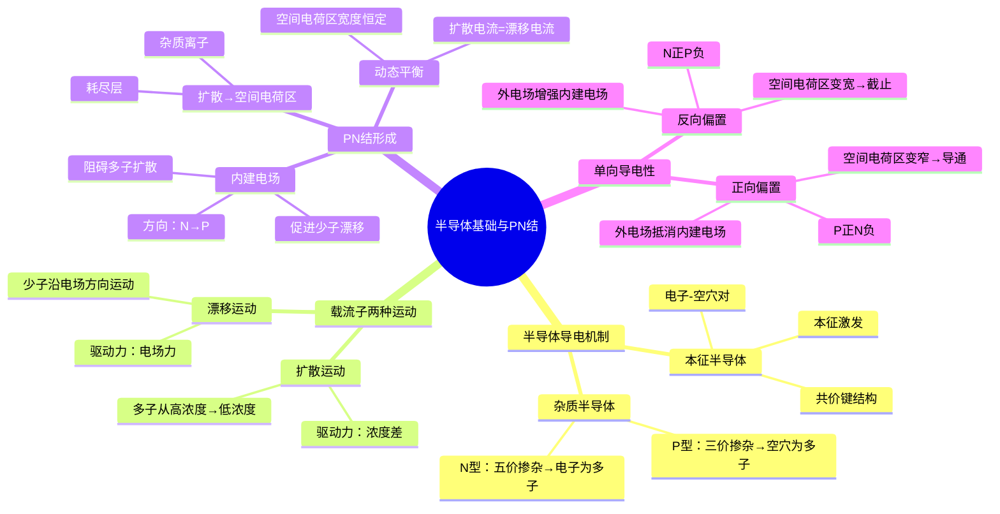

# 电子技术：半导体基础与PN结

> 📌 重构说明：本笔记整合了半导体导电机制与PN结形成、单向导电性的完整推导，按物理过程→结构性质→工程应用的逻辑链重组。

## 🧠 思维导图

---

## 一、半导体的导电本质

### 1.1 本征半导体

**定义**：纯净的、不含杂质的半导体单晶（如硅Si、锗Ge）。

**共价键结构**：每个原子用4个价电子与相邻4个原子形成共价键，构成稳定的晶体结构。

**本征激发**：当温度升高或光照时，共价键中的电子获得能量挣脱束缚，成为==自由电子==，同时在原位留下一个==空穴==。这一过程同时产生一个电子和一个空穴，称为产生==电子-空穴对==。

==本征半导体中：自由电子浓度 n = 空穴浓度 p = 本征载流子浓度 $n_i$==。

> [!info] 补充定义
> $n_i$ 是温度的函数，室温下硅的 $n_i \approx 1.5 \times 10^{10} / \text{cm}^3$。温度每升高 8°C，$n_i$ 约翻一倍——这解释了为什么半导体器件对温度敏感。

### 1.2 杂质半导体

在本征半导体中==有控制地掺入微量杂质==，可以大幅改变导电性能。

| 类型 | 掺杂元素 | 掺杂价态 | 多子 | 少子 | 形成机制 |
|:---:|------|:---:|------|------|------|
| ==N型== | 磷P、砷As | 五价 | ==电子== | 空穴 | 多余一个电子成为自由电子 |
| ==P型== | 硼B、铝Al | 三价 | ==空穴== | 电子 | 缺少一个电子形成空穴 |

**浓度关系**（以N型为例）：
- 多子浓度 ≈ 掺杂浓度（$N_D$，通常在 $10^{15} \sim 10^{18}/\text{cm}^3$）
- 少子浓度 = $n_i^2 / N_D$（远小于多子浓度）

> [!warning] 考点
> ⚠️ N型半导体的多子是电子（带负电），但半导体整体仍为电中性——因为杂质离子带正电恰好中和。同理，P型半导体中空穴为多子，整体仍电中性。

---

## 二、载流子的两种运动机制

这是理解PN结所有特性的关键——半导体中同时存在两种驱动机制完全不同的运动。

### 2.1 扩散运动

**驱动力**：==浓度差==（与重力场、电场无关）。

**本质**：粒子从高浓度区域向低浓度区域自发迁移，是热力学的必然趋势。

**在PN结中的表现**：P区多子（空穴）→ 向N区扩散 / N区多子（电子）→ 向P区扩散。

> 📖 直观类比：一滴墨水滴入清水中，墨水分子从高浓度向低浓度扩散——这个过程不需要外加电场驱动。PN结中的多子扩散同理。

### 2.2 漂移运动

**驱动力**：==电场力==。

**本质**：带电粒子在电场作用下定向移动。

**在PN结中的表现**：少子在内建电场（或外电场）作用下沿电场方向移动。

### 2.3 对比总结

| 维度 | 扩散运动 | 漂移运动 |
|------|---------|----------|
| 驱动力 | ==浓度差== | ==电场力== |
| 参与载流子 | ==多子== | ==少子== |
| 方向 | 高浓度 → 低浓度 | 正电荷沿电场方向、负电荷逆电场方向 |
| 在PN结中的作用 | 形成空间电荷区 | 形成反向饱和电流 |

---

## 三、PN结的形成过程

### 3.1 形成四步推导

**第一步——扩散**：P型半导体与N型半导体接触后，交界面两侧存在巨大的浓度差。==P区多子（空穴）向N区扩散==，==N区多子（电子）向P区扩散==。

**第二步——复合**：扩散到对方区域的电子和空穴相遇后复合消失，在交界面附近留下==不能移动的杂质离子==（P区侧：负离子 / N区侧：正离子）。

**第三步——空间电荷区形成**：这些固定的杂质离子构成==空间电荷区==（也称==耗尽层==）。此区域内：
- 几乎没有自由载流子（已被复合耗尽）
- 只有带正负电的杂质离子
- 等效于一个从N指向P的==内建电场==

**第四步——动态平衡**：内建电场的方向恰好==阻碍多子继续扩散==（扩散势垒），同时又==促进少子漂移==。当扩散电流 = 漂移电流时，达到==动态平衡==——此时空间电荷区宽度恒定，宏观电流为零。

### 3.2 核心结论

==PN结的内建电场是扩散运动"自限"产生的——扩散越多，空间电荷区越宽，内建电场越强，对扩散的阻碍越大。最终达到平衡时，不再有净电流。==

> [!warning] 考点
> ⚠️ 内建电场方向（N→P）与扩散方向（P→N和N→P）之间的关系是理解外加电压如何影响PN结的关键。正向偏置=外电场与内建电场反向→削弱势垒→导通；反向偏置=同向→增强势垒→截止。

---

## 四、单向导电性——正偏与反偏的物理机制

### 4.1 正向偏置 → 导通

**接法**：P区接高电位（+），N区接低电位（-）。

**物理过程三步推导**：
1. ==外电场方向与内建电场相反== → 削弱内建电场
2. 空间电荷区==变窄==，势垒==降低==
3. 多子扩散运动==大幅增强== → 形成==正向大电流==

**工程数值**：硅管存在==死区电压≈0.5V==，外加电压超过此值后电流才明显增长。==导通电压：硅管 0.6~0.7V，锗管 0.2~0.3V==。

### 4.2 反向偏置 → 截止

**接法**：N区接高电位（+），P区接低电位（-）。

**物理过程**：
1. ==外电场方向与内建电场相同== → 增强内建电场
2. 空间电荷区==变宽==，势垒==升高==
3. 多子扩散被==完全阻挡==，只剩==少子漂移电流==

**反向饱和电流 $I_S$**：由少子漂移形成，数值极小（硅管 $<1\mu A$，锗管 $<1mA$），且==基本不随反向电压增大==（少子数量有限，被电场全部扫过后无法再增加）。

### 4.3 单向导电性总结表

| 偏置 | 外电场 vs 内建电场 | 空间电荷区 | 多子扩散 | 电流 |
|------|:---:|:---:|------|------|
| ==正向== | 相反（抵消） | 变窄 | 大幅增强 | ==大电流（导通）== |
| ==反向== | 相同（增强） | 变宽 | 被阻挡 | ==极小电流（截止）== |

---

## 五、PN结伏安特性

### 5.1 伏安特性方程

$$I = I_S\left(e^{\frac{V}{V_T}} - 1\right)$$

其中 $V_T = \frac{kT}{q} \approx 26\text{mV}$（常温300K时的==温度电压当量==）。

**方程解读**：
- $V > 0$（正偏）：$e^{V/V_T} \gg 1$，$I \approx I_S e^{V/V_T}$，电流随电压==指数增长==
- $V < 0$（反偏）：$e^{V/V_T} \approx 0$，$I \approx -I_S$，恒定为反向饱和电流
- $V=0$：$I=0$

### 5.2 反向击穿

当反向电压增大到==击穿电压 $V_{BR}$== 时，反向电流急剧增大。

| 击穿类型 | 掺杂浓度 | 空间电荷区宽度 | 击穿机制 | 温度系数 |
|------|:---:|:---:|------|:---:|
| ==齐纳击穿== | 高掺杂 | 很窄 | 强电场直接破坏共价键（场致电离） | 负温度系数 |
| ==雪崩击穿== | 低掺杂 | 较宽 | 载流子被电场加速后碰撞电离，连锁反应 | 正温度系数 |

> [!warning] 考点
> ⚠️ 击穿电压 $V_{BR} < 5V$ 一般为齐纳击穿，$V_{BR} > 7V$ 一般为雪崩击穿，$5V \sim 7V$ 之间两者共存。齐纳击穿是稳压二极管的工作基础——但必须串联限流电阻，否则电流过大会烧毁。

---

---

## 🔗 知识网络

### 前置依赖
- [[原子物理基础]] — 原子核外电子排布与能级

### 后续应用
- [[02_二极管特性与等效模型]] — PN结的应用——二极管
- [[03_半导体三极管原理]] — 双PN结构成三极管
- [[06_三极管放大电路——静态分析]] — 三极管放大电路的基础

### 对比辨析
- 本征半导体 vs 杂质半导体：本征半导体是纯硅/锗（载流子浓度低），杂质半导体通过掺杂大幅提高载流子浓度
- 漂移运动 vs 扩散运动：漂移是电场力驱动（载流子从低浓度→高浓度区），扩散是浓度梯度驱动（从高→低浓度）

## 📚 核心词条索引

| 词条 | 类别 | 关键词 |
|------|:---:|------|
| [[PN结]] | 核心结构 | 空间电荷区、耗尽层 |
| [[本征半导体]] | 材料基础 | 电子-空穴对、本征激发 |
| [[杂质半导体]] | 材料基础 | N型/P型、掺杂、多子/少子 |
| [[扩散运动]] | 物理机制 | 浓度差、多子 |
| [[漂移运动]] | 物理机制 | 电场力、少子 |
| [[内建电场]] | 核心概念 | N→P方向、动态平衡 |
| [[单向导电性]] | 核心特性 | 正向导通、反向截止 |
| [[正向偏置]] | 工作状态 | 空间电荷区变窄 |
| [[反向偏置]] | 工作状态 | 空间电荷区变宽 |
| [[伏安特性]] | 工程参数 | 指数关系、死区电压 |
| [[反向饱和电流]] | 工程参数 | $I_S$、温度敏感 |
| [[齐纳击穿]] | 极限状态 | 高掺杂、场致电离 |
| [[雪崩击穿]] | 极限状态 | 低掺杂、碰撞电离 |
