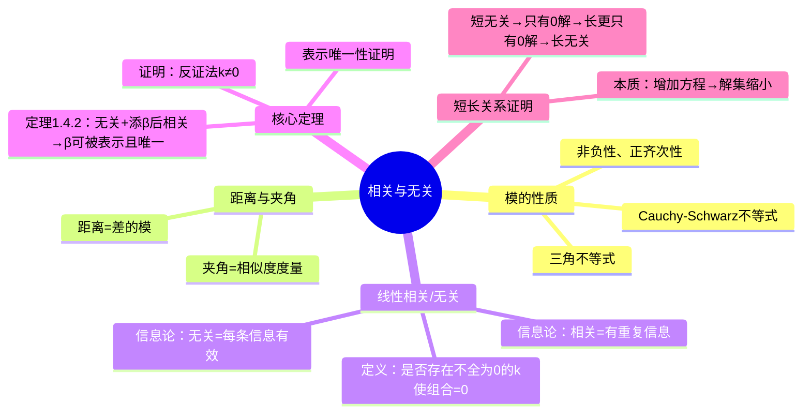

# 线性相关与无关的概念理解

> 📌 重构说明：本笔记聚焦「模与内积性质」「短长关系严格证明」「信息论下的相关性理解」，均为之前笔记中未深度展开的核心内容。

---

## 🧠 思维导图

---

## 第一部分：向量的模与内积

### 一、模的四大性质（课本第5页）

#### 1.1 非负性

$$ \|\alpha\| \geq 0, \quad \|\alpha\| = 0 \Longleftrightarrow \alpha = 0 $$

#### 1.2 正齐次性

$$ \|k\alpha\| = |k| \cdot \|\alpha\| $$

> 注意：提出来的是**绝对值** $|k|$，不是 $k$ 本身。

#### 1.3 Cauchy-Schwarz不等式的证明（必考）

$$ -|\alpha| \cdot \|\beta\| \leq \langle \alpha, \beta \rangle \leq \|\alpha\| \cdot \|\beta\| $$

> 📌 ⚠️ 老师强调：在课本原有不等式基础上加个**绝对值**或**负号**：
>
> $$ |\langle \alpha, \beta \rangle| \leq \|\alpha\| \cdot \|\beta\| $$
>
> 这比课本原有的单边上界更强——内积既不会太大也不会太小，被夹在两个模的乘积中间。

#### 1.4 三角不等式

$$ \big| \|\alpha\| - \|\beta\| \big| \leq \|\alpha \pm \beta\| \leq \|\alpha\| + \|\beta\| $$

- 放缩方向：往大 → $\|\alpha\| + \|\beta\|$；往小 → $\big| \|\alpha\| - \|\beta\| \big|$
- $\pm$ 号成立：无论加还是减，三角不等式都成立

---

### 二、距离与夹角

#### 2.1 距离

$$ d(\alpha, \beta) = \|\alpha - \beta\| $$

衡量两个向量的远近——数值越大越远。

#### 2.2 夹角（相似度）

$$ \cos\theta = \frac{\langle \alpha, \beta \rangle}{\|\alpha\| \cdot \|\beta\|} $$

> 🟢 拓展：夹角用来衡量两向量的**相似性（similarity）**。课本第6页的例子很有启发——两个人体数据向量（身高、胸围、颈围、体重），如果夹角很小，说明两人**身材维度非常相似**，哪怕一个150斤一个100斤。这就是「方向相似性」在实际中的意义。

---

## 第二部分：线性相关与无关定义的深度理解

### 三、从几何直观到信息论

#### 3.1 线性表示的几何意义

$\beta$ 可被 $\alpha_1, \alpha_2$ 线性表示 $\Longleftrightarrow$ 存在 $k_1, k_2$ 使 $\beta = k_1\alpha_1 + k_2\alpha_2$

- **数乘** = 伸缩（同方向或反方向）
- **加法** = 平行四边形法则

必要条件：$\beta$ 必须在 $\alpha_1, \alpha_2$ 张成的**平面内**。如果 $\beta$ 垂直地「飞出」了这个平面 → **不可被表示**。

> 📌 ⚠️ 不是任意给的 $\beta$ 都能被任意向量组表示！

#### 3.2 信息论角度理解相关性总结表

||
||
||
||
||

#### 3.3 宿舍体重例子（贯穿始终的核心例子）

||
||
||
||
||

---

### 四、相关/无关的判定方法

#### 4.1 标准操作流程

1. 设线性组合等于 0：$k_1\alpha_1 + \cdots + k_s\alpha_s = 0$
2. 这等价于一个**齐次线性方程组解空间**
   - 未知数个数 = 向量个数（s 个 k）
   - 方程个数 = 向量维数（n 个分量方程）
3. 判定：
   - **只有零解** → 线性相关与无关定义
   - **有非零解** → 线性相关与无关定义

#### 4.2 三种小情况速判

||
||
||
||
||

---

## 第三部分：定理1.4.2 表示与唯一性 的严格证明

### 五、定理回顾

> 📖 **定理1.4.2 表示与唯一性**：若 $\alpha_1,\cdots,\alpha_m$ 线性相关与无关定义，而 $\alpha_1,\cdots,\alpha_m,\beta$ 线性相关与无关定义，则 $\beta$ 可由 $\alpha_1,\cdots,\alpha_m$ 线性表示，且表示系数**唯一**。

### 六、证明（分两半）

#### 6.1 前半：证明 $\beta$ 可被表示

已知 $\alpha$ 组无关，添加 $\beta$ 后整个组相关。

由相关性定义：存在**不全为零**的 $k_1,\cdots,k_m, k$ 使

$$ k_1\alpha_1 + \cdots + k_m\alpha_m + k\beta = 0 $$

关键：要证明 **$k \neq 0$**。

**反证法**：假设 $k = 0$，则上式变为 $k_1\alpha_1 + \cdots + k_m\alpha_m = 0$

由于 $\alpha$ 组线性相关与无关定义 → $k_1 = \cdots = k_m = 0$

但这与「$k_1,\cdots,k_m,k$ 不全为零」矛盾！（因为所有系数都等于 0 了）

因此 $k \neq 0$，移项除以 $k$：

$$ \beta = -\frac{k_1}{k}\alpha_1 - \cdots - \frac{k_m}{k}\alpha_m $$

$\beta$ 可被 $\alpha$ 组线性表示。$\square$

#### 6.2 后半：证明表示系数唯一

设 $\beta$ 有两种表示：

$$ \beta = k_1\alpha_1 + \cdots + k_m\alpha_m = l_1\alpha_1 + \cdots + l_m\alpha_m $$

两式相减：

$$ (k_1 - l_1)\alpha_1 + \cdots + (k_m - l_m)\alpha_m = 0 $$

由于 $\alpha$ 组线性相关与无关定义 → $k_1 - l_1 = \cdots = k_m - l_m = 0$

即 $k_1 = l_1, \cdots, k_m = l_m$ → **表示系数唯一**。$\square$

> 📌 ⚠️ 考点：从前半部分可以看出，**反证法证明 $k \neq 0$** 是这一定理证明中最精妙的部分。核心逻辑链条：如果 $k=0$，则 $\alpha$ 组出现非零解 → 与「$\alpha$ 组无关」矛盾。

---

## 第四部分：部分与整体的关系

### 七、口诀与证明

||
||
||
||

#### 7.1 严格证明（部分相关则整体相关）

设部分 $\{\alpha_1,\cdots,\alpha_s\}$ 线性相关与无关定义。

由定义，存在不全为零的 $k_1,\cdots,k_s$，使 $\sum_{i=1}^{s} k_i\alpha_i = 0$。

对整体 $\{\alpha_1,\cdots,\alpha_s,\alpha_{s+1},\cdots,\alpha_n\}$：

取系数为 $k_1,\cdots,k_s, 0,\cdots,0$（部分的不全为零 + 后面全取 0），必然不全为零。

→ 整体线性相关与无关定义。$\square$

> 证明核心：在「部分」的线性组合基础上，把剩余向量的系数全取 0 即可。

#### 7.2 无需证明的逆否

「整体无关则部分无关」是「部分相关则整体相关」的逆否命题，逻辑等价。

---

## 第五部分：短长关系证明（核心重难点）

### 八、问题设定

||
||
||
||

**关键前提**：2 号向量组的上半截（前 n 个分量）与 1 号向量组**完全一致**。

### 九、经典口诀

||
||
||
||

### 十、严格证明（通过方程组视角）

> 这是老师重点强调的「底层逻辑」证明，必须掌握。

#### 10.1 核心底层原理

$$ \text{增加方程} = \text{增加约束} \Rightarrow \text{解集只会缩小（不会扩大）} $$

#### 10.2 证明「短无关则长无关」

设 1 号向量组有 $s$ 个向量（$n$ 维），2 号向量组有 $s$ 个向量（$n+m$ 维）。

**1号对应的齐次线性方程组解空间**：
- 未知数个数 = $s$（$k_1,\cdots,k_s$）
- 方程个数 = $n$（每个分量一个方程）

**2号对应的齐次线性方程组解空间**：
- 未知数个数 = $s$（相同！）
- 方程个数 = $n+m$（多了 m 个约束）

**论证**：

1. 「短无关」 → 1 号对应的齐次方程只有零解
2. 2 号的方程比 1 号**更多** → 对自变量的约束更多 → 解的集合更小
3. 1 号都只有零解（解集最小情况之一），2 号解集≤1号解集 → 2 号也只能有零解
4. → 2 号线性相关与无关定义（长无关）

#### 10.3 证明「长相关则短相关」（逆向）

1. 「长相关」 → 2 号对应齐次线性方程组解空间有非零解
2. 1 号的方程比 2 号**更少** → 约束更少 → 解的集合更大
3. 2 号有非零解 → 1 号的解集包含 2 号的解集 → 1 号也有非零解
4. → 1 号线性相关与无关定义（短相关）

> 📌 ⚠️ 记忆技巧：「增加方程减少解，减少方程增加解」——这是贯穿线性代数的底层直觉。在第四章学习解空间维数时会更精确。

---

## 第六部分：定理1.4.2 表示与唯一性 的实战应用题

### 十一、板书例题（课堂随堂练习）

**题目**：已知 $\alpha_1, \alpha_2, \alpha_3$ 线性相关与无关定义，$\alpha_2, \alpha_3, \alpha_4$ 线性相关与无关定义。证明：

(1) $\alpha_1$ 可由 $\alpha_2, \alpha_3$ 线性表示
(2) $\alpha_4$ 不能由 $\alpha_1, \alpha_2, \alpha_3$ 线性表示

#### (1) 的证明

**只用两句话，不用写任何公式**：

1. $\alpha_2, \alpha_3, \alpha_4$ 无关 → 由「整体无关则部分无关」→ $\alpha_2, \alpha_3$ 无关
2. $\alpha_1, \alpha_2, \alpha_3$ 相关，且 $\alpha_2, \alpha_3$ 无关 → 由**定理1.4.2 表示与唯一性**：$\alpha_1$ 可由 $\alpha_2, \alpha_3$ 线性表示（且系数唯一）

#### (2) 的证明（反证法）

假设 $\alpha_4$ 可由 $\alpha_1, \alpha_2, \alpha_3$ 线性表示：

$$ \alpha_4 = k_1\alpha_1 + k_2\alpha_2 + k_3\alpha_3 $$

由 (1) 知 $\alpha_1 = l_2\alpha_2 + l_3\alpha_3$，代入：

$$ \alpha_4 = (k_1 l_2 + k_2)\alpha_2 + (k_1 l_3 + k_3)\alpha_3 $$

→ $\alpha_4$ 可由 $\alpha_2, \alpha_3$ 线性表示

→ $\alpha_2, \alpha_3, \alpha_4$ 线性相关与无关定义（有向量可被其余表示）

→ 与题设「$\alpha_2, \alpha_3, \alpha_4$ 无关」矛盾！

$\therefore$ 原假设不成立，$\alpha_4$ 不能由 $\alpha_1, \alpha_2, \alpha_3$ 线性表示。$\square$

---

## 第七部分：AI 时代的数学思辨

> 老师课堂深度讨论（删除了无关闲聊，保留核心观点）：

- AI（ChatGPT/DeepSeek）在文字处理上很强，但在**符号推理和数学证明**上仍有严重缺陷
- AI 会「一本正经地胡说八道」——给一个看似正确的例子和伪证明
- **如果不锻炼自己的数学思维，你就无法识破 AI 的错误**
- 数学课是所有课程中最能**锻炼逻辑推理能力**的课程
- 结论：别让 AI 替你想，保持自己的脑力锻炼

---

---

## 🔗 知识网络

### 前置依赖
- [[向量]] — 向量的基本概念和运算
- [[线性组合]] — 向量组的线性表示

### 后续应用
- [[02_线性空间与基底维数]] — 线性相关/无关与基底的关系
- [[04_向量组的秩与极大无关组]] — 极大无关组的求解
- [[08_特征值与特征向量基础]] — 特征向量的线性无关性

### 对比辨析
- 线性相关 vs 线性无关：一组向量存在不全为零的系数使线性组合为零则相关，否则无关——相关意味着存在冗余向量
- 线性相关 vs 线性表示：线性相关是向量组内部的关系，线性表示是一个向量与一个向量组之间的关系

## 📚 核心词条索引

||
||
||
||
||
||
||
||
||
||
||
||
||
||
||
