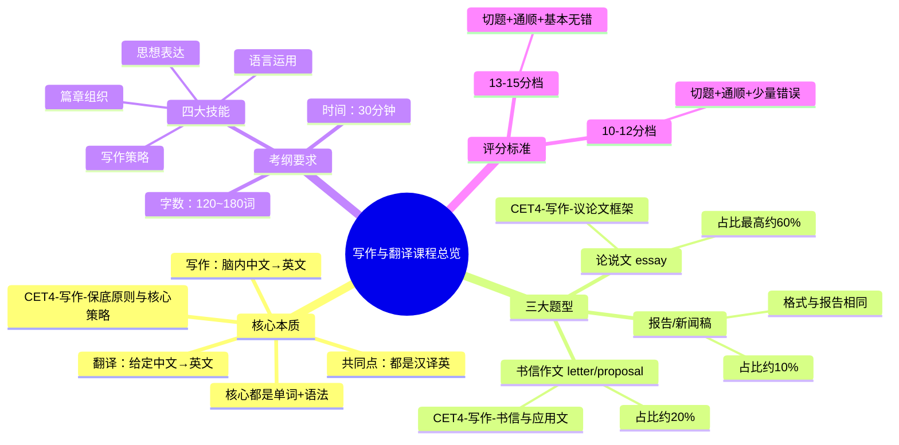

# CET-4：写作与翻译课程总览与考纲解读

> 📌 重构说明：本笔记融合了课程概述、考纲要求、评分标准和题型分布，按知识逻辑重组，打破原始录音的时间顺序。

## 🧠 思维导图

---

## 一、写作与翻译的底层逻辑

### 为什么写作和翻译一起讲？

写作和翻译的核心本质完全相同：**都是把中文译成英文**。

| | 翻译 | 写作 |
|---|---|---|
| 输入 | 考题给出的中文文本 | 你脑中构思的中文内容 |
| 输出 | 英文 | 英文 |
| 核心能力 | 单词 + 语法 | 单词 + 语法 |

> [!info] 汉译英（Chinese-English Translation）的核心能力就是词汇量（单词）和句法能力（语法），二者不可偏废。写作的本质就是"先自己想中文，再翻译成英文"。

---

## 二、考纲解读与评分标准

### 2.1 考试基本要求

| 项目 | 要求 |
|---|---|
| 时间 | 30分钟 |
| 字数 | 120~180个单词 |
| 建议策略 | 25分钟写作（含2分钟审题+20分钟写作+3分钟检查），留5分钟给听力 |

> [!warning] ⚠️ 不要少于120词，也不要超过180词。150词左右（约10行）最合适。

### 2.2 四大考察技能

1. **思想表达**（你的中文构思能力）
2. **篇章组织**（段落框架安排）— 这是老师的任务
3. **语言运用**（单词不写错 + 语法不出错 + 尽量高端句型）
4. **写作策略**（逻辑关系词清晰、不会写的单词如何绕过去）

> [!warning] ⚠️ 思想表达你至少要有20%的能力，如果一句中文都写不来，谁也帮不了你。但如果只会写一点，三大论证方式可以补足。 🔗 

### 2.3 满分作文标准（13-15分档）

> ==目标：13-15分档（满分作文）==

- **切题**：不跑题，写题目要求的内容
- **表达思想清楚**：逻辑通顺
- **文字通顺连贯**：==逻辑关系词==必须使用恰当
- **基本上无语言错误**：单词全对、语法全对，仅有个别小错

---

## 三、四节课内容结构

> 本课程分为四节课，按能力递进排列：

| 课次 | 内容 | 核心目标 | 对应笔记 |
|---|---|---|---|
| 第一节 | 写作概述 + 考纲解读 | 知道考什么、满分标准 | 📍 本篇 |
| 第二节 | 写作核心原则和策略 | 句子怎么写长、写美 | 🔗  |
| 第三节 | 写作常用论证方式 | 中文想不到时怎么办 | 🔗  |
| 第四节 | 写作题型精讲 + 高分框架 | 各题型模板与框架 | 🔗  + 🔗  |

---

## 四、历年题型统计（64篇文章大数据）

### 4.1 议论文 vs 应用文占比

| 大类 | 占比 | 细分 |
|---|---|---|
| 议论文 | **64%** | 论点分析型（27次）、问题解决型（5次）、对比选择型（9次） |
| 应用文 | **36%** | 书信作文（感谢信/推荐信/邀请信/申请信/建议信等）、其他（广告/提案/新闻稿/报告） |

### 4.2 议论文三大子类型

| 子类型 | 特征 | 示例题目 | 出现频率 |
|---|---|---|---|
| 论点分析型 | 对一个事物/观点发表看法 | "如何看待中国快递业的发展" | ⭐⭐⭐⭐⭐ 最高频 |
| 问题解决型 | 如何做某事 | "如何丰富大学生对中国传统文化的知识" | ⭐⭐ 较少 |
| 对比选择型 | 正反两面选择立场 | "网络暴力游戏会带来暴力行为吗？" | ⭐⭐⭐ |

### 4.3 应用文两大子类型

| 子类型 | 特征 | 关键词识别 |
|---|---|---|
| 书信作文 | 写信给某人/机构提建议、感谢、邀请等 | letter, proposal, email |
| 其他应用文 | 新闻稿、报告、广告、提案 | news report, report, advertisement |

---

## 五、关键时间分配策略

> ==25分钟写作法==

| 阶段 | 时间 | 任务 |
|---|---|---|
| 审题 | 2分钟 | 识别题型（essay/letter/report），画出关键词，脑中确定框架 |
| 写作 | 20分钟 | 按框架逐段写，第一段2句、第二段4-5句、第三段2句 |
| 检查 | 3分钟 | 扫读全文，检查常见错误（名词单复数、主谓一致、不可数名词等） |

---

> 📂 所属分类：

## 🔗 相关知识点

| 知识点 | 类型 | 说明 |
|--------|------|------|
| 三段式框架 | 结构模板 | 议论文标准结构 |
| 正反论证 | 论证方法 | 通过对比正反两方面论证观点 |
| 分类论证 | 论证方法 | 从不同层次分类论述 |
| 举例论证 | 论证方法 | 通过具体例子支撑论点 |
| 视听一致原则 | 听力技巧 | 听到的与选项贴合度越高越优先 |
| 读中心法 | 阅读策略 | 快速把握文章中心 |
