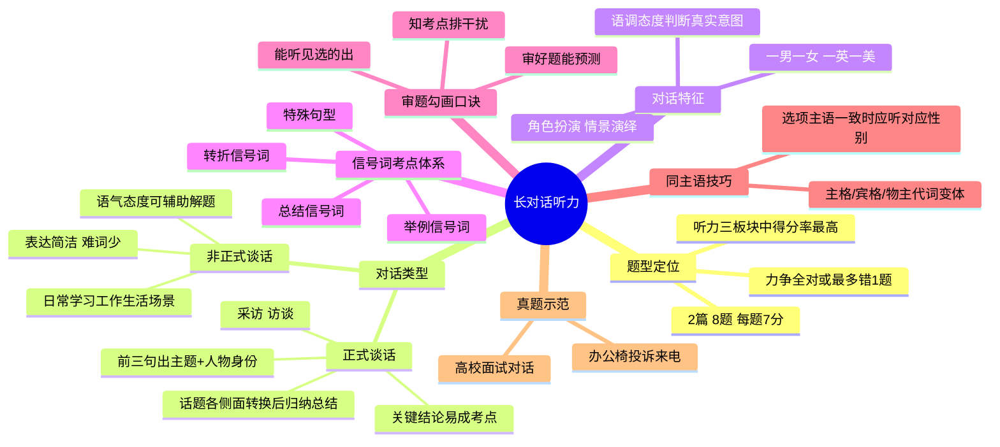

# CET-4：长对话听力——题型认知与解题方法

> 📌 重构说明：源文件为两次长对话课程录音。第一次讲方法论（对话类型、难度分析、信号词体系），第二次讲真题带练（审题勾画口诀、同主语技巧）。合并后按「题型全景→难度策略→对话特征→信号词考点→审题勾画→真题示范→口诀总结」的知识树重组。

---

## 🧠 思维导图

---

## 第一部分：题型定位与分数策略

### 一、长对话在全卷中的位置

| 对比维度 | 短篇新闻 | 长对话 | 篇章/短文 |
|----------|:---:|:---:|:---:|
| 篇数 | 3篇 | 2篇 | 3篇 |
| 题数 | 7题 | 8题 | 10题 |
| 每题分值 | ≈7分 | 7分 | 14分 |
| 时长 | 1分20~30秒 | 1分50秒左右 | 更长 |
| 内容难度 | 高（正式用语，词汇规范） | 低（日常表达，简洁） | 中高（加长版新闻） |
| **得分率** | **最低** | **最高** | 中等 |

### 二、分数线策略

> 听力及格线 = **150分**（满分248.5分的60%）

| 板块 | 目标 | 策略 |
|------|------|------|
| 长对话 | **尽量全对**（56分全拿） | 最多错1题，两题以上就拉开差距 |
| 篇章/短文 | 力争高分 | 可操作性强、提分空间大 |
| 短篇新闻 | 不投入过多时间 | 投入产出比低，大家都不好 |

> ⚠️ 老师反复强调：你的发力方向不要用错地方！新闻做得差一点不碍事（单个分值低），但长对话差了你很难到及格线。

---

## 第二部分：对话类型与特征

### 三、两类对话

#### 3.1 正式谈话（采访/访谈类）

| 特征 | 说明 |
|------|------|
| 主题位置 | 对话**前三句**即交代主题 + 人物身份 |
| 展开方式 | 围绕一个话题的各个**侧面**转换讨论 |
| 结尾模式 | 聊完各侧面后进行**归纳总结**，得出关键结论 |
| 考点提示 | 关键结论 → 极易成为考点 |

#### 3.2 非正式谈话（日常场景类）

| 特征 | 说明 |
|------|------|
| 场景 | 日常学习、工作、生活 |
| 语言 | 表达简洁，较少难词 |
| 考频 | 最常考的类型 |

### 四、对话播放特征

| 要素 | 细节 |
|------|------|
| 人数 | **一男一女** |
| 发音 | **一英一美**（英美音交替） |
| 形式 | 角色扮演、情景演绎 |

### 五、语调态度判断法

> 因为对话是**情景演绎**，说话人会有语气和态度变化。这一点新闻和篇章听力都不具备。

**核心技巧**：通过语调/态度判断说话人真实意图。

> 例：男邀请女看电影。女说「Well...」而是拖长音的「We~ll...」，虽然well字面是「好」，但语调暴露了她有下文、要推脱。这就是**正话反说**——字面肯定，实际否定。

适用题型：**态度题、推断题**。

---

## 第三部分：题型分布

### 六、长对话题型

| 题型 | 占比 | 特点 |
|------|:---:|------|
| **细节题** | 绝对主流 | 占绝大多数题量 |
| 主旨题 | 极少 | 不像新闻那样依赖主旨定位 |

> 与新闻的关键区别：新闻主旨题多（依赖首句优先原则），长对话细节题多（依赖信号词和视听一致原则）。

---

## 第四部分：信号词考点体系

### 七、三大类信号词

#### 7.1 转折信号词

| 信号词 | 备注 |
|--------|------|
| but, however | 最高频 |
| in fact | 实际上 |
| yet | 但注意发音短促，容易听漏 |
| now | 表时间前后对比的转折 |

> 听到转折词 → **立即收心**，后面句子=答案句/考点句。

#### 7.2 总结信号词

对话快结束时，某人说总结词 → 后文就是对话的**结论**，极易成为考点：

| 信号词 | 含义 |
|--------|------|
| OK / all right | 好了 |
| so / now | 那么（引出结论） |
| above all | 最重要的 |
| as a result / therefore | 因此 |
| all in all | 总之 |
| in brief / in short | 简而言之 |
| in conclusion / to conclude | 总结 |
| generally speaking | 一般而言 |

#### 7.3 举例信号词

| 信号词 | 说明 |
|--------|------|
| e.g. | 例如（最高频） |
| for instance | 变体，偶尔考 |
| such as | 常见 |

> 举例后出现的细节 → 细节题的来源。

### 八、特殊句型考点

#### 8.1 强调句式

> **It is ... that ...** → 被强调的部分往往是关键信息，容易设考点。

在写作中是加分句型，在听力中就是考点句。

#### 8.2 副词修饰动词

> **particularly + 动词**、**in particular** 等 → 突出强调某个动作，后面的内容易设考点。

---

## 第五部分：审题勾画与解题口诀

### 九、三句核心口诀

| 口诀 | 核心操作 |
|------|---------|
| **审好题，能预测** | 提炼勾画题干关键信息 + 题干串联预判接下来要听到的内容 |
| **能听见，选的出** | 视听一致原则（第一原则）+ 辨别并选中同义替换的选项 |
| **知考点，排干扰** | 熟知每种题型的考点 + 利用考点排除选项中的干扰 |

### 十、同主语规律

> 在长对话题中，如果同一道题的选项主语一致，就可以确定**应该听谁说话**。

| 选项主语 | 应听对象 | 说明 |
|----------|---------|------|
| He / his / him | 听**男**的 | 主格、物主代词、宾格都是同一规律 |
| She / her / her | 听**女**的 |
> 这种题在真题中非常常见——一旦发现同主语，直接把注意力聚焦到对应性别说话人的内容上，答题效率翻倍。

---

## 第六部分：真题示范——办公椅投诉来电

### 十一、审题过程

**Q8-Q11 审题（40秒）**

| 题号 | 选项概要 | 关键词勾画 | 角色判断 |
|:---:|------|------|:---:|
| Q8 | complex records / training purpose / company rule / information security | 名+动 | 其中一人要做某事（for/to体现目的性） |
| Q9 | customer reference number / price of office chairs / get money back / customer service complaints | number, price, money back, complaints | her → **听女的** |
| Q10 | update info / forgot where put / lost 3 days ago / got new card issued | 动词为主 | she → **听女的** |
| Q11 | 收尾性问题 | 关注男/女态度 | 完整听 |

#### 题干串联预判

Q8「有人要做某事」+ Q9-Q10「her的号码/价格/退钱/投诉」 + Q11「对事件的态度」

→ **预判：一位女顾客来电投诉办公椅相关问题，寻求退钱或其他解决方案。**

### 十二、听中执行

| 题号 | 答案模式 | 技巧 |
|:---:|------|------|
| Q9 | her → 聚焦女声 | 同主语规律 |
| Q10 | her → 聚焦女声 | 同上 |
| Q8/Q11 | 完整听两句 | 无同主语时全面监听 |

---

## 第七部分：考场口诀汇总

| 序号 | 口诀 | 对应操作 |
|:---:|------|------|
| 1 | 名词优先，能少则少 | 勾画原则 |
| 2 | 转折一响，魂归原位 | 转折信号的警觉 |
| 3 | 同主语题，锁定性别 | 长对话专属技巧 |
| 4 | OK/so/now一出，结论就来 | 总结信号=考点预警 |
| 5 | 语调是第二语言 | 情景演绎的态度判断 |
| 6 | 长对话全对，150才有底 | 分数策略 |

---

> 📂 所属分类：

## 🔗 相关知识点

| 知识点 | 类型 | 说明 |
|--------|------|------|
| 首句优先原则 | 新闻解题 | 导语=开篇第一句，涵盖六大要素 |
| 视听一致原则 | 听中技巧 | 听到的与选项贴合度越高越优先 |
| 同义替换 | 听中技巧 | 找不到原词匹配时的第二策略 |
| 信号词 | 考点定位 | 转折、总结、举例等信号词提示考点 |
