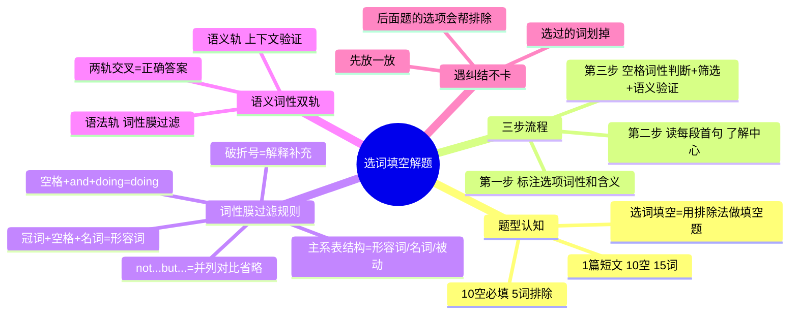

# CET-4：选词填空——词性判定法与语义词性双轨解题

> 📌 重构说明：两段录音分别讲选词填空 passage 1（塑料瓶装水）和 passage 3（经济压力类型），共享同一套解题方法。合并后按「题型认知→三步流程→词性判定规则→语义词性双轨→真题示范」的知识树重构。

---

## 🧠 思维导图



---

## 第一部分：题型定位

### 一、选词填空是什么

| 维度 | 说明 |
|------|------|
| 题型 | **选词填空**——一篇短文挖掉 10 个词，给 15 个备选词 |
| 本质 | 10 空必填，5 词排除——本质是**用排除法做的填空题** |
| 每题平均 | 约 1 分钟 |

### 二、做题两大维度

> 选词填空只需要保质两件事：

| 维度 | 考察内容 | 操作 |
|------|------|------|
| **语法** | 词性 | 根据空格前后结构，判断此处该填什么词性 |
| **语义** | 含义 | 把符合词性的候选词带入，读上下文——意思通顺就对了 |

> 两轨交叉处，就是正确答案。

---

## 第二部分：三步流程

### 三、第一步：标注词性与含义（开始前）

| 操作 | 说明 |
|------|------|
| 拿到 15 个选项 | 在每个单词旁边快速标注词性（n. / v. / adj. / adv. / doing / done） |
| 同时标注含义 | 如果有不认识的就猜测，实在不认识先放一边 |
| 归纳归类 | 同一词性的放在一起（脑子里的分类），方便后续筛选 |

> 为什么要先做这一步？——因为后面十个空一个个判断词性时，你需要一眼看到「所有候选的形容词有哪些」。

### 四、第二步：读每段首句（1分钟）

| 操作 | 说明 |
|------|------|
| 只读每段首句 | 不逐句翻译，只找方向 |
| 串联 | 在脑子里串一下：这篇文章讲啥 |
| 目标 | 了解中心内容，不是精读 |

**示例——塑料瓶装水文章**：

| 段落首句关键词 | 串联 |
|------|------|
| traveling overseas, water, plastic bottles | → 国外旅游 + 塑料瓶装水 |
| study, 259 bottles | → 一项关于塑料瓶装水的研究 |
| bottle water manufacturers | → 瓶装水生产商 |

→ 文章中心：关于塑料瓶装水的一项调查研究。

> 为什么要读中心？——因为选词填空的词都是围绕中心选的，你知道中心=你知道「我要找和中心匹配的词」。

### 五、第三步：空格词性判断→筛选→语义验证

这是每道题的循环操作，详见第三部分。

---

## 第三部分：词性判定规则

### 六、七大高频结构速判表

| 结构模式 | 判定结果 | 示例 |
|------|:---:|------|
| 冠词 + `____` + 名词 | **形容词** | the `____` ups and downs |
| `____` + and + doing | **doing** | wandering or `____` |
| be + `____` | **形容词** / 名词 / 被动(done) | The bottle is `____` |
| 名词已有 + `____` | **形容词**（修饰名词） | the `____` ups and downs |
| 完整句 + `____` | **副词** | ...but `____` they |
| 破折号 + `____` | **解释或补充说明**，词性不固定 |
| not...but... 结构 | **前后并列对称**，可省略重复部分 | not so much the ups, but `____` the downs |

### 七、副词的首选规则

> 判断为副词时，**优先考虑以 -ly 结尾的常见副词**。常规的做不出来再考虑特殊的。

| 优先 | 次选 |
|------|------|
| possibly, definitely, terribly... | 非 -ly 的副词（still, even 等） |

---

## 第四部分：语义词性双轨解题法

### 八、每道题的操作循环

```
判断空格词性
    ↓
从备选词中筛出符合该词性的所有词
    ↓
将候选词逐一代入空格
    ↓
读上下文——哪个词让整句话意思通顺？
    ↓
通顺 + 符合语法 = 正确答案 ✅
```

### 九、真题示范 26 题（塑料瓶装水）

> Imagine you are wandering about on a Thai island **or** the ruins of Angkor.

| 步骤 | 操作 |
|:---:|------|
| 判断 | `wandering` + or + `____` → **or 前后并列** → 空格应填 doing 形式 |
| 筛选 | 15 选项中 doing 形式：admiring（欣赏）、defending（保护）、revealing（显露） |
| 代入验证 | 你在泰国岛上漫步/旅游 → admiring 最符合旅游语境 |
| 排除 | defending（不是去保护地球）、revealing（不是去揭露景观） |
| ✅ | **admiring** |

### 十、真题示范 27 题（塑料瓶装水）

> The bottle is `____`, and the label says "pure water".

| 步骤 | 操作 |
|:---:|------|
| 判断 | `is` + `____` → 可以是形容词/名词/被动 |
| 但 and 后面是 the label says pure water → 前后语义平行 |
| 这个选择太多，不纠结 | ✅ **先放一放，后面的题帮你排除** |

> 这是选词填空的核心操作心态——**第一道题做不出来就跳过**，做后面的。
>
> 提示：通过==词性膜过滤==先缩小范围，再通过==语义验证==确定答案。

### 十一、真题示范 26 题（经济压力）

> The first type is people being stressed about the `____` ups and downs of investing markets.

| 步骤 | 操作 |
|:---:|------|
| 判断 | `the` + `____` + `ups and downs` → **冠词+空格+名词** → 形容词 |
| 筛选 | considerable（大量的）、extreme（极端的）、normal（正常的）、traditional（传统的） |
| 代入 | 金融市场的起伏→「大量的起伏」「正常的起伏」都可以 |
| 纠结 | considerable 和 normal 都说的通 |
| ✅ | **先放着不选！做后面的题，后面有一题选了 considerable，所以这里选 normal** |

> 这就是选词填空的精髓：**纠结不要死磕，后面的题会自动帮你排除**。

---

## 第五部分：陷阱与策略

### 十二、三大陷阱

| 陷阱 | 说明 | 应对 |
|------|------|------|
| **一个空多个词性可能** | 比如 `is ____` 可以是 adj/n/done | 三种都筛出来，代入看语义 |
| **开局第一题就纠结** | 正常！因为可选的词还很多 | 跳过，做到后面候选词变少了，筛选变快 |
| **be 动词 + 空格** | 可能填形容词、名词、被动式三种 | 先判断语义方向，再排除 |

### 十三、操作纪律

| 规则 | 说明 |
|------|------|
| **选过的单词立即划掉** | 每选一个，15 变 14...14 变 13...候选词越来越少 |
| **纠结就跳过** | 不要卡在第一题，做后面题会让答案越来越清晰 |
| **词性膜过滤是第一步** | 先筛词性（一般能排除 10/15），只剩 2-3 个再带语义 |
| **读连词！** | or、and、but 会暴露空格和前后词的并列关系 |

---

> 📂 所属分类：

## 🔗 相关知识点

| 知识点 | 类型 | 说明 |
|--------|------|------|
| 词性膜过滤 | 核心方法 | 先筛词性排除大部分选项，只剩 2-3 个再带语义 |
| 读中心法 | 辅助策略 | 读每段首句了解文章中心，帮助语义验证 |
