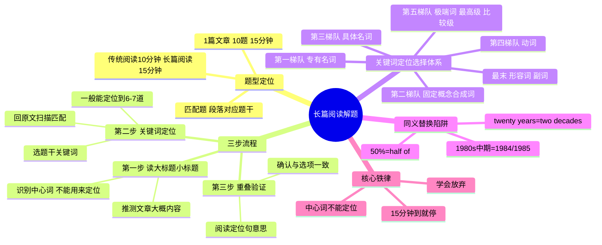

# CET-4：长篇阅读——关键词定位法与三步流程

> 📌 重构说明：两段录音分别讲长篇阅读的方法论和真题示范，合并后按「题型认知→三步流程→关键词选择体系→数字替换陷阱→放弃策略→真题示范」的知识树重构。

---

## 🧠 思维导图

---

## 第一部分：题型定位

### 一、长篇阅读是什么

| 维度 | 说明 |
|------|------|
| 题型 | **匹配题**——十个题干，对应文章中的十个段落 |
| 题量 | 10 题 |
| 时间 | **15 分钟**（国家给的时间） |
| 难度 | 找的时候比较痛苦，一提到就头疼 |

### 二、和仔细阅读的关键区别

| 对比维度 | 仔细阅读 | 长篇阅读 |
|------|------|------|
| 时间 | 10 分钟/篇 | 15 分钟/篇 |
| 做题方式 | 先读中心法再定位 | 直接关键词定位 |
| 读文章方式 | 读首段+各段首句+尾段 | 浏览标题→扫描关键词 |
| 中心的作用 | 中心=解题核心 | **中心词不能用来定位！** |
| 目标正确率 | 力争全对 | 一般能做对 6-7 道 |

---

## 第二部分：三步流程

### 三、第一步：读标题（30秒）

| 有标题时 | 无标题时 |
|------|------|
| 读大标题 + 小标题 | 直接进入定位 |
| 推测文章大概在讲什么 |
**为什么要读标题？**

> 因为**中心词不能拿来定位**。如果文章的中心是「大雁是个美女」，那么大雁、美女这两个词在整篇文章中会出现太多次——用它们定位，你会发现**每个段落都有**。
>
> 先读标题确认中心词，定位时就知道**哪些词不能用**了。

### 四、第二步：关键词定位（核心操作）

#### 4.1 关键词选择优先级

| 优先级 | 类型 | 示例 | 说明 |
|:---:|------|------|------|
| ⭐⭐⭐ | **专有名词** | 人名、地名、国名、机构名、首字母大写的词 | 最佳！几乎不会被替换 |
| ⭐⭐⭐ | **数字/时间** | eight years, 21st century, 50% | 非常好，但注意数字可能被改写 |
| ⭐⭐ | **固定概念/合成词** | lifelong learning, crowdfunding | 长得奇怪、很难被替换的词 |
| ⭐⭐ | **具体名词** | a cup of water, a phone, a computer, window, curtain | 普通但具体的名词 |
| ⭐ | **动词** | 以上都没有时可用 | 定位范围较宽 |
| ⭐ | **极端词** | absolutely, extremely, completely | 即使被替换，替换词也还是极端词 |
| ⭐ | **最高级/比较级** | the most beautiful, more important | 对应段落必定有最高级/比较级 |
| ❌ | **形容词/副词** | 普通形容词副词 | 力量太弱，一般不用于定位 |
| 🚫 | **中心词** | 文章主题词 | **绝对不能用！每段都有=没法定位** |

#### 4.2 关键词要具备两个特征

| 特征 | 说明 |
|------|------|
| **出现次数少**（独特性） | 不能被泛泛的词替代 |
| **聚焦**（具体性） | 不能像「people」一样宽泛 |

### 五、第三步：重叠选项，验证一致

| 情况 | 操作 |
|------|------|
| 定位词**只在一个段落**中出现 | 不用读句意，直接选 |
| 定位词在**两到三个段落**中出现 | 必须阅读每处定位句的意思，确认和题干一致再选 |
| 阅读定位句时 | 确认「大概一致，没有太跑偏」即可 |

---

## 第三部分：数字替换陷阱

### 六、数字不再是原版照搬

> 「现在考试已经很灵活了。」

| 题干原文 | 文章中可能出现 | 判断方法 |
|------|------|------|
| 50% of students | half of students | 数字变分数/文字——但**位置必定也有一个数字/数量表达** |
| the mid-1980s | 1984 / 1985 | 找一个在这个时间区间的具体年份 |
| twenty years | two decades | 同义替换，但都和「时间长度」有关 |

> 核心原则：题干中有数字，文章中对应位置**必定也有数字**。数字形式可能不同，但「数字」这个特征不会消失。

---

## 第四部分：放弃策略

### 七、学会放弃的勇气

> 「我再说一遍：15 分钟做完。定位能定位到 6-7 道已经很好了。」

| 原则 | 说明 |
|------|------|
| 15 分钟到就停 | 平时训练就严格卡表 15 分钟 |
| 一般能对多少 | 6-7 道就合格 |
| 不要死磕 | 找不到就跳过，不要在一题上耗费 3 分钟 |
| 做不完的放弃 | 剩余 3 分钟内没做的题，用「长得和题干像的」蒙 |

---

## 第五部分：真题示范——活到100岁工作会怎样

### 八、实战案例

> 文章标题：**How work will change when most of us live to one hundred**

**第一步：读标题**

→ 中心词 = longer life / lifespan / live to 100 → **这些词一律不能用来定位！**

**第二步：选关键词**

| 题号 | 关键词 | 类型 | 定位难度 |
|:---:|------|------|:---:|
| 36 | more careers than now | 职业（但可能较泛） | ⚠️ 需配合其他词 |
| 37 | positive and negative effects | 宽泛词，可能替换为具体正负面表达 | ⚠️ |
| 38 | **Eight years** + Americans + marry later | 数字 + 具体名词 | ✅ 容易 |
| 39 | **May twenty first century** + longer lifespan | 时间 + 主题词(不用于定位) | ⚠️ 用时间定位 |
| 40 | **more people live past 100** + 21st century | 数字 | ✅ 容易 |
| 41 | radical changes + approach to life | 极端词 radical | ⭐ 中等 |
| 42-45 | (依次类推) |
**第三步：扫描定位**

38 题关键词「eight years」→ 在文章中找到「eight years」附近的段落 → 验证句意一致 → 选。

40 题时间「21st century」→ 找到对应段落 → 验证 → 选。

> 本题中中心词（lifespan, longer life, live longer）在十个段落中大量出现，选了它定位就废了。

---

> 📂 所属分类：

## 🔗 相关知识点

| 知识点       | 类型   | 说明                 |
| --------- | ---- | ------------------ |
| 关键词定位 | 核心策略 | 通过题干关键词快速定位到文章对应位置 |
| 读中心法  | 辅助策略 | 读标题确认中心词，避免用中心词定位  |
| 同义替换  | 注意事项 | 数字等可能被同义改写，需注意识别   |
