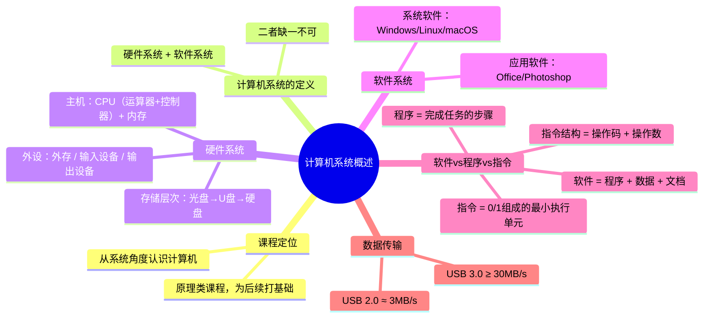
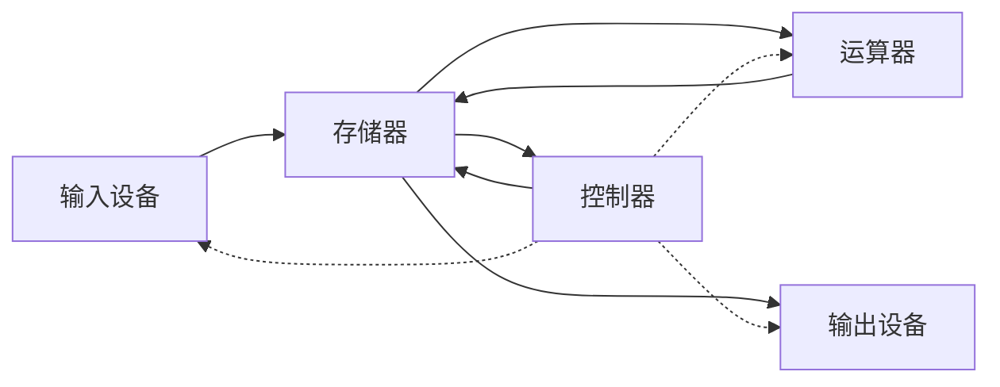

# 计算机系统概述与硬件组成

> 📌 重构说明：本笔记合并了课程简介与计算机发展简史两份录音内容，打破原始时间线，按「定义→直观理解→组成→运行原理→例题→陷阱」的知识树逻辑深度重构。

---

## 🧠 思维导图



---

## 第一部分：课程定位——为什么是「系统」？

### 一、课程名称的深意

这门课叫「计算机**系统**基础」而非「计算机基础」或「计算机概述」。老师在第一节课强调：

> 多了「系统」两个字，所以我们这门课程更强调大家从**系统上**去认识计算机。

这意味着不仅仅要知道计算机「怎么用」，还要理解它的内部如何运作——从高级语言代码到硬件电路之间，每一层是如何转换的。

### 二、这门课的性质

| 维度 | 说明 |
|------|------|
| **类型** | 原理类课程（非应用类/编程类） |
| **作用** | 为后续专业课打基础 |
| **体验** | 不像编程课学了立刻能用，比较「枯燥」但有后劲 |
| **定位** | 帮助理解算法和程序的底层原理、调试和性能优化 |

> 老师原话补充：之前开座谈会的时候，很多师兄师姐反馈这门课对后面认识计算机、编算法、编程是有帮助的。

---

## 第二部分：计算机系统的定义与组成

### 三、计算机系统 = 硬件 + 软件

$$ \text{计算机系统} = \text{硬件系统} + \text{软件} $$

**二者缺一不可**。老师用最直白的话解释：

> 你有硬件没有软件，那你的电脑就是一堆废铁。有软件没有硬件，那你软件就没有一个具体的运行载体。

### 四、硬件系统——「看得见摸得着」的部分

#### 4.1 主机（机箱内部）

以台式机为例，机箱里包含：

| 组件 | 子部件 | 功能 |
|------|--------|------|
| **CPU**（中央处理器） | ALU + 控制器 | 执行计算和控制 |
| **内存/存储器** | ROM（只读）、主存RAM、Cache高速缓存 | 存储正在运行的程序和数据 |

#### 4.2 外部设备

| 类别 | 设备 | 说明 |
|------|------|------|
| **外存** | 硬盘、U盘（闪存）、光盘（CD/DVD） | 持久化存储 |
| **输入设备** | 键盘、鼠标、扫描仪、相机、话筒 | 将人可识别信息 → 二进制 |
| **输出设备** | 显示器、打印机、音箱 | 将二进制处理结果 → 人可识别形式 |
| **网络设备** | 网卡、交换机、集线器 | 通信连接 |

#### 4.3 课堂互动：话筒是输入还是输出？

老师举着话筒问：「我手里拿着这个话筒，它是输入设备还是输出设备？」

**答案**：输入设备。它采集声音 → 经过放大 → 通过音箱输出。

> [!warning] 考点
> ⚠️ 关键判断标准——输入设备将外部信息**转换为**二进制送入计算机；输出设备将计算机处理结果**转换回**人可识别的形式。

---

### 五、存储设备详解（课堂展开内容）

#### 5.1 光盘（CD/DVD）

- 光存储介质
- 老师回忆：「小时候看电影，是不是都去租光盘？」[补充：指的是 2000 年代 DVD 租赁盛行时期]

#### 5.2 U 盘（闪存 Flash）

- 部分 U 盘带指示灯，拷贝资料时灯会闪烁
- 属于第二代存储介质（相比光盘）

#### 5.3 移动硬盘

- 磁存储技术

#### 5.4 USB 接口速度对比（重要数值）

| USB 版本 | 实际传输速度 |
|----------|-------------|
| USB 2.0 | 约 **3 MB/s** |
| USB 3.0 | **≥ 30 MB/s**（10 倍差距） |

> 老师原话：「我们读大学的时候都是 USB 2.0，去同学那里考部电影，大一点的一个多 GB，可能要烤十几分钟。」

> 📌 实用提示：台式机上蓝色接口 = USB 3.0，传输速度更快。

---

### 六、软件系统——「看不见」的部分

#### 6.1 软件的层次

| 类别 | 例子 | 说明 |
|------|------|------|
| **系统软件** | Windows、Linux、Unix、macOS | 计算机**必不可少**的底层软件 |
| **语言处理程序** | 编译器、解释器 | 将高级语言 → 机器代码 |
| **数据库管理系统** | MySQL、Oracle | 管理数据的系统软件 |
| **应用软件** | Office、Photoshop | 用户直接使用的软件 |

#### 6.2 应用软件——大家接触最多的

> 老师补充：「应用软件是大家接触最多的——办公软件 Office、图形处理软件 Photoshop 等等。」

---

## 第三部分：软件、程序、指令——三个核心概念的层级

### 七、从大到小：软件 → 程序 → 指令

```
软件 ⊃ 程序 ⊃ 指令
```

这是贯穿整门课的核心概念链，理解它们的层次关系是后续学习的基础。

#### 7.1 软件（Software）

> 📖 标准定义：计算机软件是指示计算机完成任务的**程序**、相关**数据**，以及开发、使用和维护程序所需要的相关**文档**的集合。

三个关键词：**程序 + 数据 + 文档**。三者一体才是软件，单独的某个文件不是软件。

#### 7.2 程序（Program）

> 📖 标准定义：程序是指示计算机如何去解决问题或完成任务的一切**步骤**。

- 算法 → 程序：算法是思想，程序是用语言描述的步骤
- 你写的 C/Python 代码 = 告诉计算机「先做什么、再做什么」

#### 7.3 指令（Instruction）

> 📖 标准定义：指令是能够被计算机识别并执行的**二进制代码**，规定了计算机能够完成某一种操作。

- 指令就是一串 0/1 序列
- 一条指令告诉计算机做**一件事**（加减乘除、数据传送、跳转等）

#### 7.4 指令的结构：操作码 + 操作数

$$
\text{一条指令} = \underbrace{\text{操作码}}_{\text{做什么}} + \underbrace{\text{操作数（地址码）}}_{\text{对谁做}}
$$

| 部分 | 功能 | 例子 |
|------|------|------|
| **操作码** | 指明操作类型/性质 | 加法、减法、数据传送 |
| **操作数** | 指明操作对象 | 哪个寄存器、哪个内存地址 |

---

## 第四部分：五大组成部件（冯·诺依曼模型）

### 八、五大部件的数据流



### 九、各部件职责一览

| 部件 | 核心职责 | 老师原话关键词 |
|------|----------|---------------|
| **输入设备** | 把人可识别的信息（声音、文字、图形）→ 二进制 | 「采集转换功能」 |
| **存储器** | 存放程序和数据 | 「内存条」「只读/随机/高速缓存」 |
| **运算器** | 算术运算 + 逻辑运算 | CPU 内的核心计算单元 |
| **控制器** | 指挥各部件协调工作 | 「控制信号」 |
| **输出设备** | 二进制处理结果 → 人可识别的形式（声音、文字、图形） | 「显示器最好理解」 |

---

## 第五部分：系统思维案例——int 溢出

### 十、一个让你怀疑 C 语言的例子

```c
-2147483648 < 2147483647  // 结果竟然是 false?!
```

#### 10.1 原因分析

| 数据 | 范围 |
|------|------|
| `int` 类型 | [-2147483648, 2147483647] |
| `abs(-2147483648)` | 2147483648 → **超出 int 范围** |

C 语言在比较 `-2147483648 < 2147483647` 时，如果先对 `-2147483648` 取绝对值，结果就会溢出，导致比较结果异常。

#### 10.2 正确写法

```c
int i = -2147483648;
i < 2147483647;  // true —— 强制以 int 变量比较
```

#### 10.3 启示

> 老师强调：**表面相同的表达式，内部转换机制可能不同**。需要用系统思维理解底层行为，否则代码可能会产生意想不到的结果。

---

> 📂 所属分类：

## 📚 核心词条索引

| 词条 | 类型 | 位置 |
|------|------|------|
| 计算机系统 = 硬件 + 软件 | 核心定义 | §3 |
| 计算机系统 = 硬件 + 软件 | 核心定义 | §3 |
| 硬件系统——「看得见摸得着」的部分 | 核心组成 | §4 |
| 硬件系统——「看得见摸得着」的部分 | 核心组成 | §4 |
| USB 接口速度对比（重要数值） | 数据传输 | §5.4 |
| 软件（Software） | 核心概念 | §7.1 |
| 程序（Program） | 核心概念 | §7.2 |
| 指令（Instruction） | 核心概念 | §7.3 |
| 指令的结构：操作码 + 操作数 | 指令结构 | §7.4 |
| 指令的结构：操作码 + 操作数 | 指令结构 | §7.4 |
| 五大部件的数据流 | 五大部件 | §8 |
| 五大部件的数据流 | 五大部件 | §8 |
| 五大部件的数据流 | 五大部件 | §8 |
| 五大部件的数据流 | 五大部件 | §8 |
| 五大部件的数据流 | 五大部件 | §8 |
| 一个让你怀疑 C 语言的例子 | 系统思维 | §10 |
| 硬件系统——「看得见摸得着」的部分 | 后续概念 | §4 |
| 硬件系统——「看得见摸得着」的部分 | 后续概念 | §4 |
| 存储设备详解（课堂展开内容） | 后续概念 | §5 |
| 存储设备详解（课堂展开内容） | 后续概念 | §5 |
| 软件的层次 | 后续概念 | §6.1 |
| 软件的层次 | 后续概念 | §6.1 |
