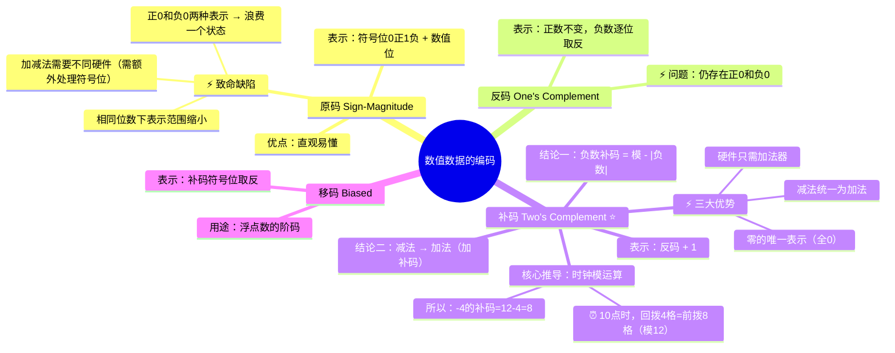

# 数值数据的编码表示——原码、反码、补码

> 📌 重构说明：本笔记遵循老师课堂的推导逻辑——先讲原码（直观但有缺陷），再用「时钟模运算」的生动例子引出补码（计算机实际采用方案），完整还原每一步推导和老师强调的易错点。前置依赖：。

---

## 🧠 思维导图



---

## 第一部分：原码——最直觉但也最「笨」的编码

### 一、原码的定义与直观理解

> 📖 标准定义：一个数的原码由**符号位**直接跟**数值位**构成。最高位为符号位：**0 代表正数，1 代表负数**。其余位表示数值的绝对值。

这也是人类最自然的想法——在一串二进制前面加个正负标记。老师把它跟浮点数的符号表示联系了起来：

> 老师原话：「任何实数 $x = (-1)^s \times$ 数值部分。$s = 0$ 时是正数，$s = 1$ 时是负数。所以我们可以用 0 代表正数，1 代表负数。」

### 二、原码的编码实例

**假设 4 位二进制（最高位 = 符号位，剩余 3 位 = 数值位）：**

||
||
||
||
||
||
||
||
||
||

> [!warning] 考点
> ⚠️ 原码中 **+0 和 -0 是两个不同的编码**！这浪费了一个表示状态，也增加了比较逻辑的复杂度。

### 三、原码的四个致命缺陷

#### 3.1 零的表示不唯一

存在「正零」(0000) 和「负零」(1000) 两种编码。程序员写 `if (x == 0)` 时，硬件需要判断两种可能。

#### 3.2 加减运算方式不统一

> 老师原话重点：「计算机里面是没有减法器的，它只有唯一的一个零部件叫**加法器**。所以计算机只做加法，不做减法。」

原码做减法需要额外处理符号位——需要专门的减法器或复杂的符号判断逻辑，增加了硬件成本。

#### 3.3 表示范围缩小

4 位二进制原码：理论上 $2^4 = 16$ 个状态，但原码只用到 $-7$ 到 $+7$（15 个数，因为 ±0 浪费了一个）。

||
||
||
||

#### 3.4 不利于硬件设计

> 老师原话：「它还需要额外的一位专门对符号位进行处理，独立于硬件设计。也就是说在设计硬件的时候，专门要多出一部分去处理一个符号位。」

---

## 第二部分：反码——通往补码的桥梁

### 四、反码的定义

> 📖 标准定义：反码（One's Complement）：正数的反码与原码相同；负数的反码是**保留符号位为 1，其余数值位逐位取反**（0→1, 1→0）。

### 五、反码编码实例（4位）

||
||
||
||
||
||

**反码仍然有 ±0 的问题**（0000 和 1111 都代表 0），所以它只是一个过渡方案。

---

## 第三部分：补码——计算机真正的选择

### 六、为什么要补码？——时钟拨针的启示

这是本课最精彩的推导。老师用一个**时钟**的例子让学生秒懂补码的数学原理：

#### 6.1 场景：把 10 点拨到 6 点

```
时钟是模 12 系统（每走 12 格回到原地）
当前：10 点
目标：6 点

方法一（逆时针/减法）：10 - 4 = 6   拨回 4 格
方法二（顺时针/加法）：10 + 8 = 18  转一圈回到 6 点
                         18 mod 12 = 6
```

**关键发现**：在模 12 系统中，$10 - 4$ 与 $10 + 8$ 是**等价**的！

$$
10 - 4 \equiv 10 + 8 \pmod{12}
$$

> 老师原话：「所以我们就可以称，**8 是 -4 对模 12 的补码**。」

#### 6.2 延伸验证

||
||
||
||
||

### 七、两个核心结论

> 老师原话逐层推进：

**结论一：**
$$ \text{一个负数的补码} = \text{模} - |\text{该负数}| $$

**结论二：**
$$ \text{任何减法都可以用该数加上减数的补码来替代！} $$

$$
A - B = A + (模 - B) = A + B_{\text{补}} \pmod{模}
$$

> [!warning] 考点
> ⚠️ **结论二是整个补码体系的核心**——它是「计算机只需要加法器」这一论断的数学基础。

#### 6.3 算盘的启发——十进制模系统中的「减法变加法」

> 📌 补充说明：本节内容来自老师后来的补充讲解，用一个十进制算盘实操例子，帮助在进入二进制之前更直观地理解模运算。

算盘是一个天然的「模 10000」系统（4 位算盘最多表示 0~9999）。算盘只能做加法，不能做减法。

**例题**：用算盘计算 $9828 - 1928$

根据**结论二**（减法 = 加补码）：

$$9828 - 1928 = 9828 + (1928)_{\text{补}} \pmod{10000}$$

由**结论一**（补码 = 模 $-$ 绝对值）：

$$(1928)_{\text{补}} = 10000 - 1928 = 8072$$

算盘上执行：

$$9828 + 8072 = 17900$$

但算盘只有 4 位，第 5 位（万位）溢出消失：

$$17900 \mod 10000 = 7900$$

**验证**：$9828 - 1928 = 7900$ ✓ ——用加法实现了减法！

> 老师强调：「在算盘上，最下面那颗珠子永远都不会被拨起来——就像二进制的最高位溢出会自然丢失一样。这就是模运算中进位自动丢弃的物理直觉。」

#### 6.4 从十进制算盘到二进制算盘

将 4 位十进制算盘替换为 8 位二进制算盘：

||
||
||
||
||

**关键洞察**：在二进制中，==全 1 减任何数 = 逐位取反==

> 老师演示：「用 $11111111$ 去减任意一个数，本质上就是把这个数按位取反。因为 $1 - 0 = 1$（取反），$1 - 1 = 0$（取反）。」

由此得出最简计算法：

$$(-X)_{\text{补}} = (2^8 - X) = (11111111 - X) + 1 = \overline{X} + 1$$

==即：负数补码 = 对应正数逐位取反 + 1。== 这是从「模减」到「取反加一」的完整推导链条。

### 八、从「模运算」到「补码计算」

将时钟的模 12 系统推广到计算机的二进制：

||
||
||
||
||

### 九、补码的正式定义与计算方法

> 📖 标准定义：对于一个 n 位二进制数，正数的补码 = 原码（符号位 0 + 数值位）；负数的补码 = 反码 + 1（或 = $2^n - |负数|$）。

**两种计算方法的等价性验证：**

以 4 位系统中求 -6 的补码为例：

**方法 A（反码+1）：**
```
|6| = 0110
反码（逐位取反）= 1001
        + 1
补码 =     1010
```

**方法 B（模 - 绝对值）：**
```
2^4 - 6 = 16 - 6 = 10
10 的二进制 = 1010（4位）  ✓ 一致！
```

### 十、补码编码速查表（4 位）

||
||
||
||
||
||
||
||
||
||
||
||
||
||
||
||
||
||

> [!warning] 考点
> ⚠️ 4 位补码的范围是 **-8 到 +7**，不是对称的！负数比正数多一个（-8 没有对应的 +8）。这是补码系统中频繁考查的细节。

### 十一、补码的三大优势总结

||
||
||
||
||

> 老师原话：「从 50 年代开始，整数都采用补码去表示。现在计算机里面的所有整数都是用补码形式。」

---

## 第四部分：补码加减法实战

### 十二、用补码做减法（关键例题）

**例题 1**：$7 - 3$（4 位补码系统）

```
 7 的补码 = 0111
-3 的补码 = 1101（因为 -3 补 = 16-3 = 13 = 1101）

      0111    ( 7)
    + 1101    (-3)
    ──────
     10100    → 去掉最高进位 → 0100 = 4 ✓
```

**例题 2**：$3 - 7$（结果为负数）

```
 3 的补码 = 0011
-7 的补码 = 1001

      0011    ( 3)
    + 1001    (-7)
    ──────
      1100    → 最高位=1 → 负数
                这是 -4 的补码（16-4=12=1100）→ 结果 = -4 ✓
```

### 十三、溢出判断

**例题 3**：$7 + 5$（正溢出）

```
 7 的补码 = 0111
 5 的补码 = 0101

      0111    ( 7)
    + 0101    ( 5)
    ──────
      1100    → 最高位=1 → 这看起来像负数！
                1100 = -4？（错误！7+5 不可能等于 -4）
```

**溢出判断规则**：

||
||
||
||
||

> [!warning] 考点
> ⚠️ 计算题高频陷阱——两个正数相加得到负数，说明发生了正溢出。两个负数相加得到正数，说明发生了负溢出。 4 位补码的合法范围是 [-8, +7]。

---

## 第五部分：移码——浮点数的桥梁

### 十四、移码的定义

> 📖 标准定义：移码（Biased Representation）：将补码的符号位**取反**得到。主要用于浮点数中**阶码**的表示。

||
||
||
||
||
||
||

**移码的好处**：移码后数值的大小关系与二进制编码的大小关系一致（可以直接比较大小排序），这对于浮点数中比较指数大小非常方便。

---

> 📂 所属分类：
