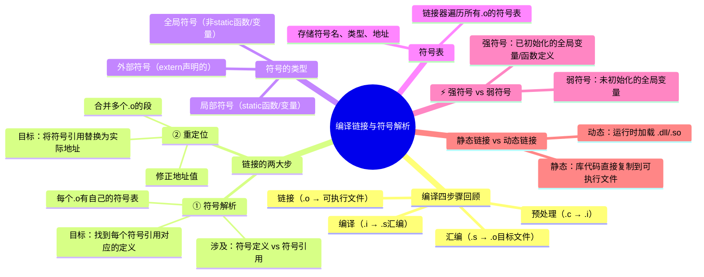
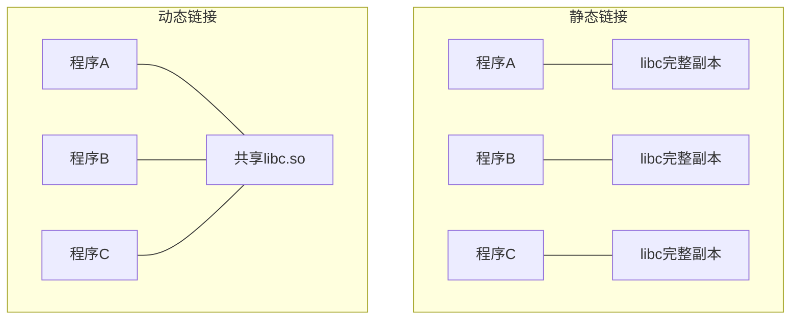

# 程序的编译、链接与符号解析

> 📌 重构说明：本笔记以老师课堂中「main函数 ↔ swap函数」的具体案例为线索，完整的展开从源文件到可执行文件的最后一步——链接（Linking）——包括符号解析和重定位两个核心步骤。

---

## 🧠 思维导图



---

## 第一部分：从源代码到可执行文件

### 一、回顾四步编译流程


| 阶段 | 输入 → 输出 | 做什么 |
|------|-------------|--------|
| **预处理** | `.c` → `.i` | 展开宏、`#include`、删除注释 |
| **编译** | `.i` → `.s` | C 代码 → 汇编语言 |
| **汇编** | `.s` → `.o` | 汇编 → 机器码（目标文件） |
| **链接** | `.o` → 可执行文件 | 合并目标文件、符号解析、重定位 |

### 二、为什么需要链接？

考虑一个简单程序：

**main.c：**
```c
extern void swap(int *a, int *b);  // 声明：swap 在别处定义

int buf[2] = {1, 2};

int main() {
    swap(&buf[0], &buf[1]);
    return 0;
}
```

**swap.c：**
```c
extern int buf[];  // 声明：buf 在别处定义

void swap(int *a, int *b) {
    int tmp = *a;
    *a = *b;
    *b = tmp;
}
```

`main.c` 编译成 `main.o` 时，编译器不知道 `swap` 函数的机器码在哪（它在 `swap.o` 里）。`swap.o` 也不知道 `buf` 的地址在哪。**链接器的工作就是把这些缺口补上。**

---

## 第二部分：链接的两大步——符号解析与重定位

### 三、符号解析（Symbol Resolution）

> 老师原话：「链接它的主要两个步骤，一个叫符号解析，一个叫重定位。对于符号解析，它主要是要找到它定义了哪些符号，还要找到哪个地方引用了这个符号。」

#### 3.1 什么是「符号」？

在链接器的视角中，**符号 = 函数名或全局变量名**。

| 符号来源 | 例子 |
|----------|------|
| 函数名 | `main`, `swap`, `printf` |
| 全局变量名 | `buf`, `bufp0` |
| `static` 局部变量 | 编译器内部命名 |

#### 3.2 老师课堂案例分析

> 老师拿着 `main.c` 和 `swap.c` 逐行分析哪里是「定义」、哪里是「引用」：

**main.c 中的符号：**

| 行 | 代码 | 符号角色 | 说明 |
|----|------|----------|------|
| `int buf[2] = {1,2};` | `buf` | **定义** | 定义了全局数组 buf |
| `int main()` | `main` | **定义** | 定义了函数 main |
| `swap(&buf[0], &buf[1]);` | `swap` | **引用** | 引用了外部函数 swap |
| `swap` 的函数体 | | **引用 → 无定义** | main.o 里找不到 swap 的实现 |

**swap.c 中的符号：**

| 行 | 代码 | 符号角色 | 说明 |
|----|------|----------|------|
| `extern int buf[];` | `buf` | **引用** | 引用了外部数组 buf |
| `void swap(...)` | `swap` | **定义** | 定义了函数 swap |

> 老师原话总结：「符号解析就是要找到符号定义和符号引用这两者之间的关系。」

#### 3.3 符号解析的结果

```
符号 'buf': → main.o 中定义，swap.o 中引用 → 匹配成功 ✓
符号 'main': → main.o 中定义，crt0.o 中引用 → 匹配成功 ✓
符号 'swap': → swap.o 中定义，main.o 中引用 → 匹配成功 ✓
```

### 四、重定位（Relocation）

符号解析找到了「谁调用了谁」，重定位则解决「调用的地址是多少」。

#### 4.1 重定位做了什么？

| 步骤 | 操作 |
|------|------|
| ① | 合并所有 `.o` 文件的相同段（.text 段、.data 段等） |
| ② | 为每个符号计算最终的内存地址 |
| ③ | 将指令中「待填充」的符号引用替换为实际地址值 |

#### 4.2 具体示例

```
main.o 中调用 swap 的位置：
    call 0x00000000     ← 地址还没填（占位符 0）

链接器找到 swap 定义后的地址（假定 swap 最终在 0x080483a0）：
    call 0x080483a0     ← 替换为真地址！
```

---

## 第三部分：符号的分类与符号表

### 五、三种符号类型

| 类型 | 关键字 | 可见性 | 例子 |
|------|--------|--------|------|
| **全局符号** | 无 `static` 修饰的函数/变量 | 整个程序可见 | `int buf[]; void swap(){};` |
| **外部符号** | `extern` 声明的 | 在本模块引用、在其他模块定义 | `extern void swap();` |
| **局部符号** | `static` 修饰的函数/变量 | 仅本模块可见 | `static int counter;` |

> [!warning] 考点
> ⚠️ `static` 改变了符号的链接属性——`static` 函数/变量是**局部符号**，不会出现在全局符号表中，其他模块无法引用。

### 六、符号表的结构

```c
// 每个 .o 文件包含一个「符号表」，是链接器工作的核心数据

typedef struct {
    int    name;       // 符号名称（在字符串表中的偏移）
    int    value;      // 符号的值（地址或偏移）
    int    size;       // 符号的大小（字节数）
    char   type:4;     // 符号类型（数据 / 函数 / ...）
    char   bind:4;     // 绑定属性（局部 / 全局 / 弱）
    char   section;    // 所属段（.text / .data / .bss）
    // ...
} Elf_Symbol;
```

**符号表示例（main.o 中）：**

| 符号名 | 类型 | 绑定 | 段 | 含义 |
|--------|------|------|-----|------|
| `buf` | 数据 | 全局 | .data | 已初始化的全局数组 |
| `main` | 函数 | 全局 | .text | main 函数的入口 |
| `swap` | — | 全局 | **UND** | 未定义——等待链接器找到定义 |

---

## 第四部分：强符号与弱符号

### 七、定义与区分

> [!info] 补充定义
> **强符号（Strong Symbol）**：已初始化的全局变量定义和函数定义。**弱符号（Weak Symbol）**：未初始化的全局变量定义。

| 代码 | 符号类型 | 为什么 |
|------|----------|--------|
| `int a = 5;` | **强符号** | 已初始化的全局变量 |
| `int b;` | **弱符号** | 未初始化的全局变量 |
| `void f() {}` | **强符号** | 函数定义 |
| `static int c;` | 局部符号 | static 修饰，不参与强弱判断 |

### 八、多重定义的解决规则

当多个 `.o` 文件中有重名的符号时，链接器按以下规则处理：

| 情况 | 规则 | 后果 |
|------|------|------|
| 只有一个强符号 | 使用这个强符号 | ✅ 正常 |
| **多个强符号** | **直接报错** | ❌ 链接失败（Linker Error） |
| 一个强符号 + N个弱符号 | 使用强符号 | ✅ 正常 |
| 全是弱符号 | 任意选一个 | ⚠️ 潜在 bug |

> [!warning] 考点
> ⚠️ 多个文件的全局变量同名是常见错误——如果不小心在两个 `.c` 文件中都写了 `int global = 1;`，链接器会报「重定义」错误。

---

## 第五部分：静态链接 vs 动态链接

### 九、两种链接方式的对比

| | 静态链接 | 动态链接 |
|------|----------|----------|
| **库文件格式** | `.a` (Linux) / `.lib` (Windows) | `.so` (Linux) / `.dll` (Windows) |
| **链接时机** | 编译时（库代码复制到可执行文件） | 运行时（OS 加载器加载） |
| **可执行文件大小** | 大（包含库代码） | 小（只记录引用） |
| **内存使用** | 每个程序各自一份库代码 | 多个程序共享同一份库代码 |
| **更新库** | 需重新编译链接 | 替换 .so/.dll 即可 |
| **启动速度** | 稍慢（文件大） | 稍快 |

### 十、动态链接的优势——共享库



> 动态链接下，内存中 libc 只有一份，所有程序共享——大幅节省内存。

---

## 第六部分：链接过程的完整追踪

### 十一、一个例子走完全程

**源文件：**

`main.c`:
```c
extern void print_hello();

int main() {
    print_hello();
    return 0;
}
```

`hello.c`:
```c
#include <stdio.h>

void print_hello() {
    printf("Hello, World!\n");
}
```

**链接过程逐步追踪：**

```
步骤 1: 编译 main.c → main.o
  main.o 的符号表：
    main    : 函数, 全局, .text, 已定义
    print_hello : 函数, 全局, UND  ← 未定义！

步骤 2: 编译 hello.c → hello.o
  hello.o 的符号表：
    print_hello : 函数, 全局, .text, 已定义
    printf  : 函数, 全局, UND  ← 未定义（在 libc 里）

步骤 3: 链接 main.o + hello.o + libc.a
  → 符号解析：print_hello 匹配 hello.o 中的定义 ✓
              printf 匹配 libc.a 中的定义 ✓
  → 重定位：main 中 call print_hello 替换为真地址
            print_hello 中 call printf 替换为真地址
  → 生成可执行文件 a.out ✓
```

---

> 📂 所属分类：
