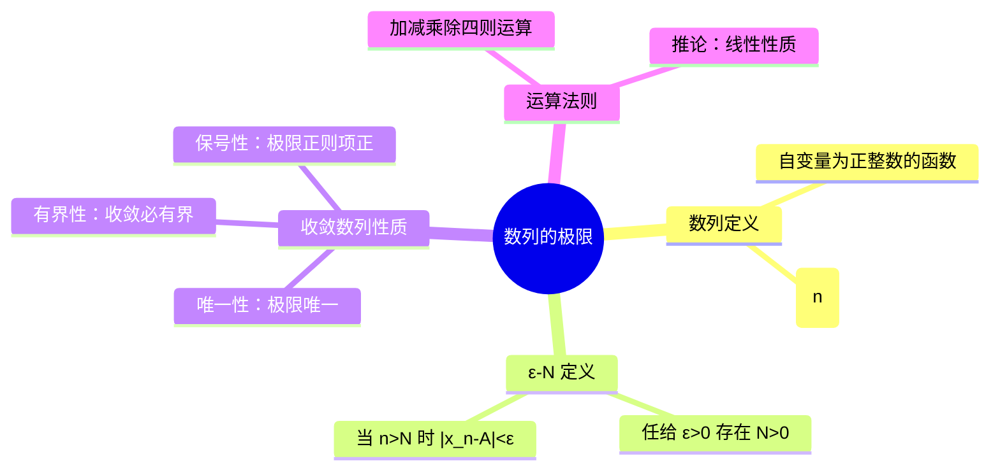

# 高数：数列的极限

> 📌 重构说明：本笔记按「数列定义 → 极限的 ε-N 定义 → 收敛数列性质（唯一性、有界性、保号性）→ 数列极限运算法则」重构。

## 🧠 思维导图

---

## 一、数列的概念

### 1.1 数列定义

**数列**是定义在正整数集 $\mathbb{N}^*$ 上的函数：

$$x_n = f(n), \quad n = 1,2,3,\dots$$

按对应法则列出的一列数称为数列，记作 $\{x_n\}$。

### 1.2 数列的极限

若存在常数 $A$，使得当 $n$ 无限增大时，$x_n$ 无限趋近于 $A$，则称数列 $\{x_n\}$ **收敛于** $A$，记作：

$$\boxed{\lim_{n \to \infty} x_n = A}$$

---

## 二、ε-N 定义

### 2.1 定义

> 📖 补充定义：$\lim_{n \to \infty} x_n = A \iff \forall \varepsilon > 0, \exists N \in \mathbb{N}^*$，使得当 $n > N$ 时，恒有 $|x_n - A| < \varepsilon$。

直观理解：从第 $N+1$ 项开始，后面所有的项都落到 $(A-\varepsilon, A+\varepsilon)$ 这个邻域内。

> [!warning] 考点
> ⚠️ $N$ 依赖于 $\varepsilon$，$\varepsilon$ 越小，$N$ 通常越大。但 $\varepsilon$ 是任意给的，不是固定的。

---

## 三、收敛数列的性质

### 3.1 唯一性

若数列收敛，则其极限唯一。

### 3.2 有界性

若 $\{x_n\}$ 收敛，则 $\{x_n\}$ **一定有界**。反之不成立（有界不一定收敛，如 $\{(-1)^n\}$）。

| 命题 | 是否成立 | 反例 |
|:----:|:--------:|:----:|
| 收敛 ⇒ 有界 | ✅ 成立 | — |
| 有界 ⇒ 收敛 | ❌ 不成立 | $x_n = (-1)^n$ |

### 3.2 保号性

若 $\lim_{n\to\infty} x_n = A > 0$，则存在 $N$，当 $n > N$ 时 $x_n > 0$。

---

## 🔗 知识网络

### 前置依赖
-  — 数列是定义在正整数集上的函数
- 实数集的完备性

### 后续应用
-  — 函数极限推广自数列极限
-  — 夹逼准则用于数列极限

### 对比辨析
- 数列极限 vs 函数极限：自变量为离散正整数 vs 连续实数

---

## 📚 核心词条索引

| 知识点链接 | 类别 | 关键词 |
|------|------|--------|
| [[数列]] | 核心概念 | 定义在 $\mathbb{N}^*$ 上的函数 |
| [[极限]] | 核心概念 | 无限趋近于某常数 |
| [[ε-N 定义]] | 定义 | $\forall\varepsilon>0,\exists N,\ n>N \Rightarrow |x_n-A|<\varepsilon$ |
| [[收敛数列]] | 概念 | 存在极限的数列 |
| [[唯一性]] | 性质 | 收敛则极限唯一 |
| [[有界性]] | 性质 | 收敛必有界 |
