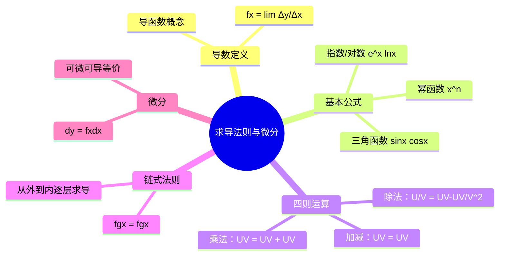

# 高数：求导法则与基本公式

> 📌 重构说明：本笔记按「导数定义 → 基本求导公式 → 四则运算法则 → 复合函数链式法则」重构，来源于语音片段中关于求导公式的讲解。

## 🧠 思维导图

---

## 一、导数的定义

### 1.1 定义

函数 $y = f(x)$ 在 $x_0$ 处的**导数**定义为：

$$\boxed{f'(x_0) = \lim_{\Delta x \to 0} \frac{f(x_0 + \Delta x) - f(x_0)}{\Delta x}}$$

若极限存在，则称 $f(x)$ 在 $x_0$ 处**可导**。

> 📖 补充定义：导数的几何意义是曲线 $y=f(x)$ 在点 $(x_0, f(x_0))$ 处切线的斜率。

### 1.2 导函数

若 $f(x)$ 在区间 $I$ 上每一点都可导，则 $f'(x)$ 称为 $f(x)$ 的**导函数**（简称导数）。

---

## 二、基本求导公式

| 类型 | 函数 | 导数 |
|:----:|:----:|:----:|
| 常数 | $C$ | $0$ |
| 幂函数 | $x^n$ | $n x^{n-1}$ |
| 指数函数 | $e^x$ | $e^x$ |
| 指数函数 | $a^x$ | $a^x \ln a$ |
| 对数函数 | $\ln x$ | $\frac{1}{x}$ |
| 三角函数 | $\sin x$ | $\cos x$ |
| 三角函数 | $\cos x$ | $-\sin x$ |
| 三角函数 | $\tan x$ | $\sec^2 x$ |

---

## 三、四则运算法则

### 3.1 加减法

$$\boxed{(u \pm v)' = u' \pm v'}$$

加减求导可以拆开分别求，这是最不容易出错的部分。

### 3.2 乘法法则

$$\boxed{(uv)' = u'v + uv'}$$

> [!warning] 考点
> ⚠️ 乘法求导**不是** $u'v'$！常见的错误就是先求导再相乘。正确做法是"左导右不导 + 左不导右导"。

**例**：$(x \sin x)' = 1 \cdot \sin x + x \cdot \cos x = \sin x + x \cos x$

推广到三个函数相乘：
$$(uvw)' = u'vw + uv'w + uvw'$$

### 3.3 除法法则

$$\boxed{\left(\frac{u}{v}\right)' = \frac{u'v - uv'}{v^2}}$$

> [!warning] 考点
> ⚠️ 分子是减法，顺序不能颠倒——分子先求导乘分母，减分子乘分母求导。分母是原分母的平方。

---

## 四、复合函数求导（链式法则）

### 4.1 链式法则

设 $y = f(u)$，$u = g(x)$，则复合函数 $y = f(g(x))$ 的导数为：

$$\boxed{\frac{dy}{dx} = \frac{dy}{du} \cdot \frac{du}{dx} = f'(g(x)) \cdot g'(x)}$$

理解方式：**从外到内，逐层求导，逐层相乘**。

---

## 五、典型求导例题

> [!example] 例题1：多项式求导
> **题目**：$y = 2x^3 - 5x^2 + 3x - 7$，求 $y'$。
> **关键步骤**：逐项求导 $y' = 2\cdot 3x^2 - 5\cdot 2x + 3\cdot 1 - 0 = 6x^2 - 10x + 3$
> **答案**：$y' = 6x^2 - 10x + 3$

> [!example] 例题2：含三角函数的求导
> **题目**：$y = x^3 + 4\cos x - \sin\frac{\pi}{2}$，求 $y'$ 和 $y'(\frac{\pi}{2})$。
> **关键步骤**：
> ① $y' = 3x^2 - 4\sin x - 0$（注意 $\sin\frac{\pi}{2}$ 是常数，$\cos\frac{\pi}{2} = 0$）
> ② $y'(\frac{\pi}{2}) = 3(\frac{\pi}{2})^2 - 4\cdot 1 = \frac{3\pi^2}{4} - 4$
> **答案**：$y' = 3x^2 - 4\sin x$

---

## 六、微分

### 6.1 微分的引入

设正方形边长 $x_0$ 增加 $\Delta x$，面积改变量 $\Delta A = 2x_0\Delta x + (\Delta x)^2$。当 $\Delta x \to 0$ 时，$(\Delta x)^2$ 可忽略，主要部分 $2x_0\Delta x$ 即为**微分**。

### 6.2 可微的定义

> 📖 补充定义：若 $\Delta y = f(x_0+\Delta x)-f(x_0) = A\Delta x + o(\Delta x)$，其中 $A$ 与 $\Delta x$ 无关，则称 $f(x)$ 在 $x_0$ 处**可微**，记 $dy = A\Delta x$，称为**线性主部**。

### 6.3 可微与可导的关系

**一元函数可微 $\iff$ 可导**，且 $A = f'(x_0)$，即：

$$\boxed{dy = f'(x)\,dx}$$

> [!warning] 考点
> ⚠️ 微分公式就是导函数乘以 $dx$：$dy = f'(x)dx$。只要会求导，就会求微分。

### 6.4 微分例题

> [!example] 例题3：求微分
> **题目**：$y = x^3$，求在 $x=2$，$\Delta x = 0.02$ 时的微分 $dy$。
> **关键步骤**：
> ① $y' = 3x^2$，$y'(2) = 12$
> ② $dy = y'(2)\cdot \Delta x = 12 \times 0.02 = 0.24$
> **答案**：$dy = 0.24$

> [!example] 例题4：复合函数微分
> **题目**：$y = e^x$ 和 $y = \cos x$ 的微分。
> **关键步骤**：
> ① $y = e^x \Rightarrow dy = e^x dx$
> ② $y = \cos x \Rightarrow dy = -\sin x\,dx$
> **答案**：$d(e^x) = e^x dx$，$d(\cos x) = -\sin x\,dx$

### 6.5 微分的几何意义

微分 $dy$ 是曲线在点 $(x_0, f(x_0))$ 处切线纵坐标的改变量，而 $\Delta y$ 是曲线本身的改变量。当 $\Delta x$ 很小时，$dy \approx \Delta y$。

---

## 🔗 知识网络

### 前置依赖
-  — 导数的定义基于极限
-  — 复合函数概念

### 后续应用
-  — 积分是微分的逆运算
-  — 曲率、单调性、凹凸性
- 微分方程求解

---

## 📚 核心词条索引

| 知识点链接 | 类别 | 关键词 |
|------|------|--------|
| [[导数]] | 核心概念 | 函数变化率，$\lim \Delta y/\Delta x$ |
| [[导函数]] | 概念 | 可导点的导数构成的函数 |
| [[乘法法则]] | 法则 | $(uv)' = u'v + uv'$ |
| [[除法法则]] | 法则 | $(u/v)' = (u'v - uv')/v^2$ |
| [[链式法则]] | 法则 | 复合函数从外到内逐层求导 |
| [[微分]] | 概念 | $dy = f'(x)dx$，一元函数可微 $\iff$ 可导 |
| [[基本求导公式]] | 公式表 | 幂/三角/指数/对数的导数 |
