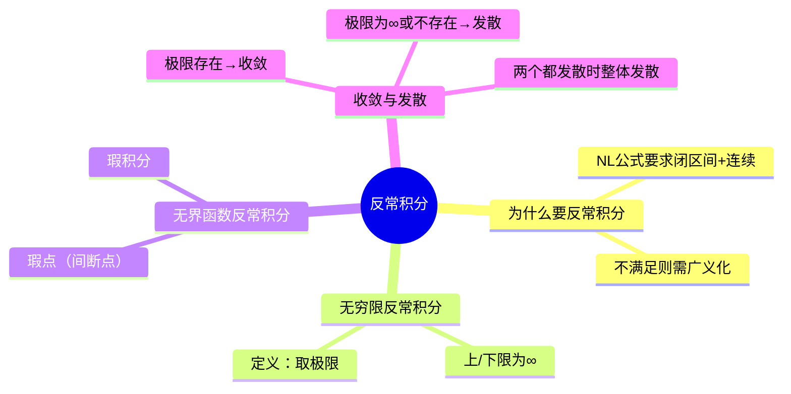

# 高数：反常积分

> 📌 重构说明：本笔记按「反常积分的引入（牛顿-莱布尼兹公式的局限）→ 无穷限反常积分 → 无界函数反常积分 → 收敛性判定」重构，来源于语音片段中关于反常积分的系统讲解。

## 🧠 思维导图

---

## 一、反常积分的引入

### 1.1 牛顿-莱布尼兹公式的局限

定积分 $\int_a^b f(x)\,dx = F(b) - F(a)$ 成立需要两个条件：

1. **闭区间** $[a,b]$ — 区间有限
2. **$f(x)$ 连续** — 函数良好

当这两个条件不满足时，需要引入**反常积分**（广义积分）。

### 1.2 两类反常积分

| 类型 | 原因 | 示例 |
|:----:|:----:|:----:|
| **无穷限** | 积分区间无限 | $\int_a^{+\infty} f(x)\,dx$ |
| **无界函数** | 被积函数有间断点（瑕点） | $\int_a^b \frac{1}{(x-a)^p}\,dx$ |

---

## 二、无穷限反常积分

### 2.1 定义

| 情形 | 定义 |
|:----:|:----:|
| $\int_a^{+\infty} f(x)\,dx$ | $\lim_{b \to +\infty} \int_a^b f(x)\,dx$ |
| $\int_{-\infty}^b f(x)\,dx$ | $\lim_{a \to -\infty} \int_a^b f(x)\,dx$ |
| $\int_{-\infty}^{+\infty} f(x)\,dx$ | $\int_{-\infty}^c f(x)\,dx + \int_c^{+\infty} f(x)\,dx$（均收敛时才收敛） |

### 2.2 收敛性判定

$$\boxed{\text{收敛} \iff \lim_{b\to\infty} \int_a^b f(x)\,dx \text{ 存在且有限}}$$

> [!warning] 考点
> ⚠️ $\int_{-\infty}^{+\infty} f(x)\,dx$ 要求 $\int_{-\infty}^c$ 和 $\int_c^{+\infty}$ **两者都收敛**才整体收敛。即使一个发散到 $+\infty$ 另一个到 $-\infty$ 在数值上互相抵消，也定义为发散。

### 2.3 计算方法

反常积分的计算仍然使用牛顿-莱布尼兹公式，但以极限形式代入：

$$\int_a^{+\infty} f(x)\,dx = \lim_{b\to+\infty} [F(b) - F(a)]$$

---

## 三、p-积分的敛散性

**重要结论**：

$$\boxed{\int_1^{+\infty} \frac{1}{x^p}\,dx \begin{cases} \text{收敛}, & p > 1 \\ \text{发散}, & p \le 1 \end{cases}}$$

$$\boxed{\int_0^1 \frac{1}{x^p}\,dx \begin{cases} \text{收敛}, & p < 1 \\ \text{发散}, & p \ge 1 \end{cases}}$$

---

## 四、典型例题

> [!example] 例题1：含指数函数的反常积分
> **题目**：求 $\int_0^{+\infty} t e^{-pt}\,dt$（$p > 0$）。
> **关键步骤**：
> ① 使用分部积分法：令 $u = t$，$dv = e^{-pt}dt$，则 $du = dt$，$v = -\frac{1}{p}e^{-pt}$
> ② $\int t e^{-pt}\,dt = -\frac{t}{p}e^{-pt} + \frac{1}{p}\int e^{-pt}\,dt = -\frac{t}{p}e^{-pt} - \frac{1}{p^2}e^{-pt} + C$
> ③ 代入上下限：$\lim_{b\to+\infty}\left[-\frac{t}{p}e^{-pt} - \frac{1}{p^2}e^{-pt}\right]_0^b$
> ④ 上限 $b\to+\infty$ 时，$e^{-pb}\to 0$，$b e^{-pb}\to 0$（指数衰减主导）
> ⑤ 代入下限 $t=0$：$0 + \frac{1}{p^2}$
> **答案**：$\int_0^{+\infty} t e^{-pt}\,dt = \frac{1}{p^2}$

> [!warning] 考点
> ⚠️ 洛必达法则应用：$b e^{-pb} = \frac{b}{e^{pb}} \overset{\text{洛必达}}{\longrightarrow} 0$，这是反常积分中的常见技巧。

---

## 🔗 知识网络

### 前置依赖
-  — 需要先求出原函数
- 定积分的概念与牛顿-莱布尼兹公式

### 后续应用
- 概率论中的正态分布积分
- 积分变换（拉普拉斯变换、傅里叶变换）

### 对比辨析
- 定积分 vs 反常积分：定积分在闭区间连续函数上定义，反常积分推广到无穷区间或无界函数

---

## 📚 核心词条索引

| 知识点链接 | 类别 | 关键词 |
|------|------|--------|
| [[反常积分]] | 核心概念 | 广义积分，突破闭区间+连续限制 |
| [[无穷限反常积分]] | 类型 | 积分上限/下限为无穷 |
| [[瑕积分]] | 类型 | 被积函数有瑕点（间断点） |
| [[收敛]] | 概念 | 极限存在且有限 |
| [[发散]] | 概念 | 极限不存在（含无穷大） |
| [[p-积分]] | 重要结论 | $\int_1^\infty 1/x^p$ 在 $p>1$ 时收敛 |
