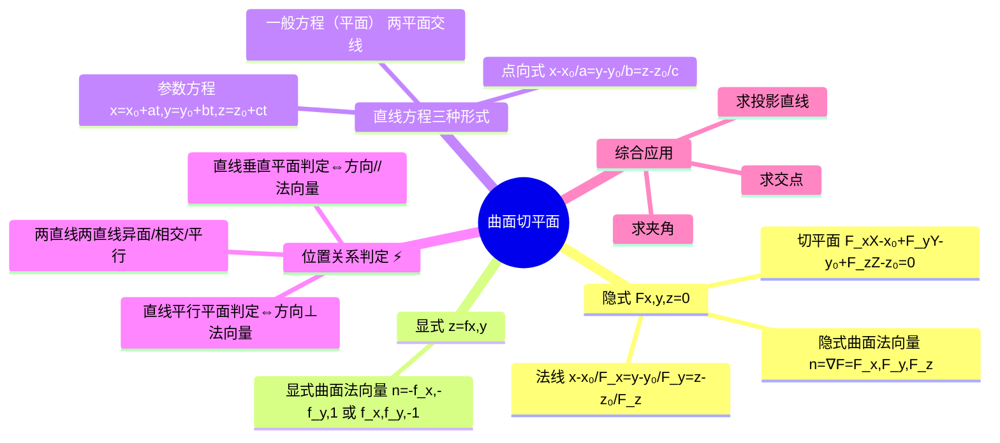

# 高数：曲面的切平面与空间位置关系

> 📌 重构说明：本笔记是空间解析几何的收官集成——从曲面切平面到空间位置关系判定及直线方程转化。已按「隐式曲面法向量 $F(x,y,z)=0$ 的切平面与法线（法向量 = $\nabla F$→切平面 = 点法式→法线 = 点向式）→显式曲面法向量 $z=f(x,y)$ 的法向量（改用 $\vec{n}=(-f_x,-f_y,1)$ 或 $(f_x,f_y,-1)$→Awk格式对准一致）→曲线切线与法平面的综合关系→直线方程的三种形式及相互转化（点向式↔一般方程（平面）的两个方向）→位置关系判定（直线垂直平面判定/直线平行平面判定/直线在平面上条件、两直线平行/相交/两直线异面）」的逻辑链重排。合并了「解析空间曲线与曲面问题」和「数学课堂讲解实录」两篇核心内容。

## 🧠 思维导图

---

## 第一部分：曲面切平面与法线

### 一、隐式曲面 $F(x,y,z)=0$

#### 法向量

$$\boxed{\vec{n} = \nabla F = (F_x, F_y, F_z)}$$

==梯度 = 隐式曲面法向量==。

#### 切平面方程

$$\boxed{F_x(M_0)(x-x_0) + F_y(M_0)(y-y_0) + F_z(M_0)(z-z_0) = 0}$$

> 📖 几何解释：切平面是所有过 $M_0$ 且与法向量垂直的方向构成的平面 = 法向量为 $\vec{n}$ 的点法式。

#### 法线方程

$$\frac{x-x_0}{F_x(M_0)} = \frac{y-y_0}{F_y(M_0)} = \frac{z-z_0}{F_z(M_0)}$$

==法线 = 以法向量为方向向量的直线。==

### 二、显式曲面 $z=f(x,y)$

改写为 $F(x,y,z) = f(x,y)-z = 0$：

==显式曲面法向量==：$\boxed{\vec{n} = (-f_x,\,-f_y,\,1)\;\text{或}\;(f_x,\,f_y,\,-1)}$

两个写法方向相反——都垂直于曲面，取法视向上/向下方向而定。

### 三、曲面相切条件

两张曲面 $F=0$ 和 $G=0$ 在某点==相切== ⇔ 两曲面的==法向量在交点处平行==：

$$\nabla F \parallel \nabla G$$

---

## 第二部分：空间曲线的切线与法平面 (综合)

回顾 ：

| 曲线定义                       | 切向量求法                            |
| -------------------------- | ------------------------------------ |
| 参数方程                   | $\vec{T} = (x'(t), y'(t), z'(t))$    |
| 一般方程（曲线） $\{F=0,G=0\}$ | $\vec{T} = \nabla F \times \nabla G$ |

==两个曲面的法向量叉积 = 交线的切向量。==

---

## 第三部分：直线方程的形式与转化

### 一、三种形式

| 形式 | 表达式 | 要素 |
|------|--------|------|
| ==点向式== | $\frac{x-x_0}{a}=\frac{y-y_0}{b}=\frac{z-z_0}{c}$ | 点 + 方向向量 ($a,b,c$) |
| ==参数方程== | $\{x=x_0+at, y=y_0+bt, z=z_0+ct\}$ | 令点向式 $=t$ |
| ==一般方程（平面）== | $\{A_1x+B_1y+C_1z+D_1=0, A_2x+B_2y+C_2z+D_2=0\}$ | 两平面相交 |

### 二、点向式 → 一般方程

将连等式拆成两个等式 → 整理为三元一次方程组。

### 三、一般方程 → 点向式 ⚡️

两步操作：

1. ==方向向量 = 两平面法向量叉积==：$\vec{s} = \vec{n_1} \times \vec{n_2} = (A_1,B_1,C_1) \times (A_2,B_2,C_2)$
2. ==找一点==：三个未知量两个方程 → 随意定一个变量值（如令 $x=0$）→ 解二元一次方程组求另外两个。

> [!warning] 考点
> ⚠️ 一般方程（平面） → 点向式是期末必考的基础操作。

---

## 第四部分：位置关系判定 ⚡️

### 一、直线-平面关系

| 关系 | 判定条件 |
|------|----------|
| ==直线垂直平面判定== | $\vec{s} \cdot \vec{n} = |\vec{s}||\vec{n}|$（方向 ∥ 法向量） |
| ==直线平行平面判定== | $\vec{s} \cdot \vec{n} = 0$（方向 ⊥ 法向量） |
| ==直线在平面上== | 直线上两个点都在平面上 |

**直线与平面的夹角公式**：

$$\sin\theta = \frac{|\vec{s}\cdot\vec{n}|}{|\vec{s}||\vec{n}|}$$

> 📖 为什么是 $\sin$ 而不是 $\cos$？方向向量与法向量的夹角和直线与平面的夹角互余。

### 二、两直线关系

| 关系 | 判定 |
|------|------|
| ==平行== | 方向向量平行（坐标成比例） |
| ==相交== | 联立有唯一解（共面 + 不平行） |
| ==两直线异面== | 不平行也不相交 |

### 三、两平面关系

| 关系 | 判定 |
|------|------|
| ==平行== | 法向量平行 |
| ==重合== | 对应系数成比例（$\frac{A_1}{A_2}=\frac{B_1}{B_2}=\frac{C_1}{C_2}=\frac{D_1}{D_2}$） |

## 第五部分：核心工具总结

| 对象 | 关键向量 | 来源 |
|------|----------|------|
| ==直线== | 方向向量 $\vec{s}$ | 两点 / 两法向量叉积 |
| ==平面== | 法向量 $\vec{n}$ | 一般方程（平面）系数 / 梯度 |
| ==曲线== | 切向量 $\vec{T}$ | 参数求导 / 梯度叉积 |
| ==曲面== | 法向量 $\vec{n}$ | 梯度 |
| ==曲线切线== | 方向 = 切向量 | 同曲线 |
| ==法平面== | 法向量 = 切向量 | 切线方向即法平面法向 |

---

> 📂 所属分类：高数-空间几何

## 📚 核心词条索引

| 知识点链接 | 类别 | 关键词 |
|------|------|--------|
| [[参数方程]] | 曲线表示 | $x=x(t), y=y(t), z=z(t)$ |
| [[点法式]] | 平面方程 | $A(x-x_0)+B(y-y_0)+C(z-z_0)=0$ |
| [[法平面]] | 几何对象 | 过切点且与切线垂直的平面 |
| [[两直线异面]] | 位置关系 | 两直线既不平行也不相交 |
| [[切向量]] | 核心概念 | 曲线方向向量$(x'(t), y'(t), z'(t))$ |
| [[显式曲面法向量]] | 计算公式 | $z=f(x,y)$的法向量$(-f_x,-f_y,1)$ |
| [[一般方程（平面）]] | 平面表示 | $Ax+By+Cz+D=0$ |
| [[一般方程（曲线）]] | 曲线表示 | 两曲面交线$\{F=0, G=0\}$ |
| [[隐式曲面法向量]] | 计算公式 | $F(x,y,z)=0$的法向量$\nabla F$ |
| [[直线垂直平面判定]] | 判定条件 | 方向向量$\parallel$法向量 |
| [[直线平行平面判定]] | 判定条件 | 方向向量$\perp$法向量 |
