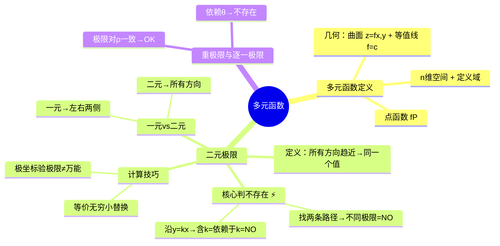

# 高数：多元函数的概念与极限

> 📌 重构说明：本笔记是高数下册从「一元」到「多元」的转折点。已按「多元函数定义（$n$ 维空间→定义域→几何表示：曲面 $z=f(x,y)$+等值线 $f(x,y)=c$）→二元极限（二重点趋近→全部方向收敛才存在→核心判不存在：找两方向得不同极限）→计算技巧（有理化→级数逼近）→一元函数极限在同一时间只沿直线趋近→重极限与逐一极限」的逻辑链重排。完整保留了经典反例 $\frac{xy}{x^2+y^2}$ 沿 $x$ 轴和 $y=x$ 的收敛性对比及等价无穷小代换技巧。

## 🧠 思维导图

---

## 一、多元函数定义

$f: R^n \to R$，每个 $P(x_1,\dots,x_n)$ 映射到一个实数。

### 二元函数的几何表示

| 表示 | 含义 |
|------|------|
| ==$z=f(x,y)$== | 空间曲面 |
| ==$f(x,y)=c$== | 等值线 / 等高线 |

### 定义域确定

找使表达式有意义的点集。例如 $z=\sqrt{1-x^2-y^2}$ 的定义域 = $x^2+y^2 \le 1$（闭圆盘）。

---

## 二、二元函数极限 ⚡️

### 定义

$$\lim_{(x,y)\to(x_0,y_0)} f(x,y) = A$$

==要求==：$(x,y)$ 以==任何方式==趋近 $(x_0,y_0)$ 时，$f(x,y)$ 都趋近于同一个值 $A$。

> 📖 深度理解：一元极限只有左和右两个方向，二元极限有无穷多方向（沿曲线、射线、螺旋……）。这是二元极限比一元极限更严格、更难判的根本原因。

### 核心判不存在 ⚡️

==找两条不同路径，得到不同极限值 → 极限不存在。==

**经典反例**：$\displaystyle\lim_{(x,y)\to(0,0)}\frac{xy}{x^2+y^2}$

| 路径 | 结果 |
|------|------|
| 沿 $x$ 轴 ($y=0$) | $\frac{x\cdot0}{x^2+0}=0 \to 0$ |
| 沿 $y=x$ | $\frac{x^2}{2x^2}=\frac{1}{2} \to \frac{1}{2}$ |

==$0 \neq \frac{1}{2}$ → 极限不存在判别！==

**路径通用套路**：沿 $y=kx$ 代入 → 若结果含 $k$ → 极限值依赖于 $k$ → ==极限不存在判别==。

---

## 三、计算技巧

### 等价无穷小替换

$$\sin(xy) \sim xy \;(xy\to 0) \quad \text{→ 化简分式}$$

但慎用：必须是「整体趋于 0」的等价替换。

### 二元极坐标与一元极限对比

| 维度 | 一元 | 二元 |
|------|------|------|
| 趋近方式 | $x \to 0$（左右） | 所有方向（无穷多） |
| 极坐标 | 无 | 可以 $x=\rho\cos\theta, y=\rho\sin\theta$ |
| 存在条件 | 左右极限相等 | ==需要所有 $\theta$ 下的极限一致== |

极坐标验极限：代入 $x=\rho\cos\theta,y=\rho\sin\theta$（$\rho\to0$）→ 若结果依赖于 $\theta$，极限不存在。

---

## 四、重极限与逐一极限对比

| 类型 | 记号 | 意义 |
|------|------|------|
| ==重极限与逐一极限（重极限）== | $\lim_{(x,y)\to(x_0,y_0)}$ | 同时趋近 |
| ==重极限与逐一极限（逐一极限）== | $\lim_{x\to x_0}\lim_{y\to y_0}$ $f$ | 先 $y$ 后 $x$（顺序不可交换） |

> [!warning] 考点
> 重极限存在不能推出逐一极限存在；逐一极限存在且相等也不能推出重极限存在。

---

> 📂 所属分类：高数-多元函数微积分

## 📚 核心词条索引

| 知识点链接 | 类别 | 关键词 |
|------|------|--------|
| [[多元函数]] | 核心概念 | $f: R^n \to R$，多变量映射到实数 |
| [[二元极限]] | 核心概念 | $(x,y)\to(x_0,y_0)$时$f(x,y)$的极限 |
| [[极限不存在判别]] | 判别方法 | 找两条路径得不同极限值→不存在 |
| [[极坐标验极限]] | 计算技巧 | 令$x=\rho\cos\theta, y=\rho\sin\theta$ |
| [[重极限与逐一极限]] | 概念对比 | 重极限同时趋近，逐一极限依次趋近 |
