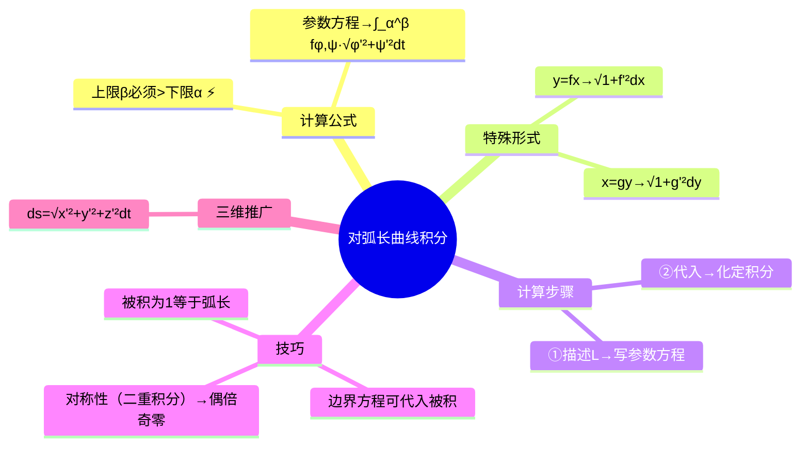

# 高数：对弧长的曲线积分

> 📌 重构说明：本笔记是曲线积分的开篇——第一类曲线积分（对弧长）。已按「公式化定积分（参数方程→$ds=\sqrt{x'^2+y'^2}dt$→定积分，上限必须大于下限！）→计算两步法（描述 L→参数化→代入计算→化定积分）→特殊参数方程（$y=f(x)$ 化 $x$ / $x=g(y)$ 化 $y$）→对称性（二重积分）（偶倍奇零）→被积为1等于弧长→三维推广」的逻辑链重排。完整保留了上限必须大于下限这一与定积分不同的关键区别，以及弧长微分的推导。

## 🧠 思维导图

---

## 一、计算公式

曲线 $L: x=\varphi(t), y=\psi(t), t\in[\alpha,\beta]$：

$$\boxed{\int_L f(x,y)\,ds = \int_\alpha^\beta f(\varphi(t),\psi(t)) \sqrt{\varphi'^2(t)+\psi'^2(t)}\,dt}$$

==弧长微分==：$ds = \sqrt{dx^2+dy^2} = \sqrt{\varphi'^2+\psi'^2}\,dt$

> [!warning] 考点
> ⚠️ 上限必须大于下限（$\alpha < \beta$）！定积分上限可以比下限小——但对弧长的曲线积分不行，因为 $ds>0$。

---

## 二、计算两步法

1. ==描述 $L$==：写出积分弧段的参数方程 + 参数范围
2. ==代入计算==：将参数方程代入被积函数 + $ds$ 化参数形式 → 计算定积分

==为什么能代入边界方程？== 积分变量在弧段 $L$ 上变化，$L$ 上的点满足参数方程 → 可将 $L$ 方程代入被积函数。（二重积分不能代入边界——变量在整个区域上变化。）

---

## 三、特殊参数方程

| 形式 | 积分 |
|------|------|
| $y=f(x), x\in[a,b]$ | $\int_a^b f(x,f(x))\sqrt{1+f'^2(x)}\,dx$ |
| $x=g(y), y\in[c,d]$ | $\int_c^d f(g(y),y)\sqrt{1+g'^2(y)}\,dy$ |

---

## 四、技巧与特例

| 技巧 | 说明 |
|------|------|
| 被积 $=1$ | ==$\int_L 1\,ds = L$ 的弧长==（被积为1等于弧长） |
| $x^2+y^2$ 在单位圆上 | 代入 $=1$ → $\int_L 1\,ds = 2\pi$ |
| 对称性（二重积分） | 弧段对称 + $f$ 奇偶 → 偶倍奇零 |

### 三维推广

$$\int_L f(x,y,z)\,ds = \int_\alpha^\beta f(\varphi,\psi,\omega)\sqrt{\varphi'^2+\psi'^2+\omega'^2}\,dt$$

---

## 五、两类曲线积分的关系

| 类别 | 名称 | 记法 | 物理含义 |
|------|------|------|----------|
| 第一类 | 对弧长 | $\int_L f\,ds$ | 曲线质量 |
| 第二类 | 对坐标 | $\int_L Pdx+Qdy$ | 变力做功 |

---

> 📂 所属分类：高数-重积分与曲线积分

## 📚 核心词条索引

| 知识点链接 | 类别 | 关键词 |
|------|------|--------|
| [[被积为1等于弧长]] | 特殊情况 | $\int_L 1\,ds$等于弧段L的长度 |
| [[参数方程]] | 核心概念 | $x=\varphi(t), y=\psi(t)$，用参数描述曲线 |
| [[第一类曲线积分]] | 核心概念 | 对弧长的曲线积分$\int_L f\,ds$，物理意义为曲线质量 |
| [[对称性（二重积分）]] | 计算技巧 | 弧段对称+被积函数奇偶→偶倍奇零 |
| [[二重积分]] | 核心概念 | $\iint_D f(x,y)dxdy$，区域上的二重积分 |
| [[弧长微分]] | 核心概念 | $ds=\sqrt{dx^2+dy^2}=\sqrt{\varphi'^2+\psi'^2}dt$ |
