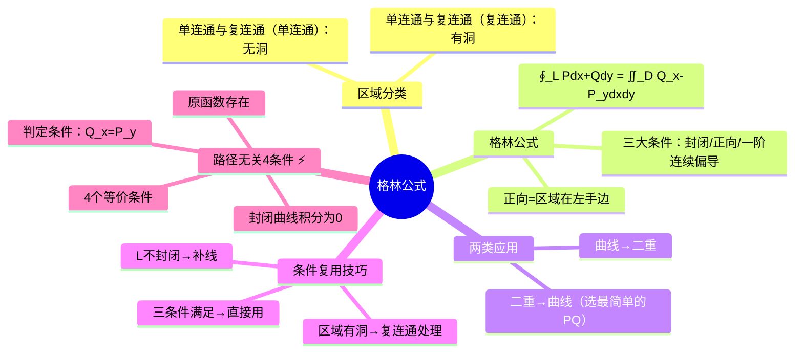

# 高数：格林公式及其应用

> 📌 重构说明：本笔记是高数下册「封闭曲线上的曲线积分 → 二重积分」的核心公式——格林公式。已按「格林公式（$\oint_L Pdx+Qdy = \iint_D(Q_x-P_y)dxdy$ 两边拆）→三大条件（$L$ 封闭+正向即区域在左手边+$P,Q$ 有一阶连续偏导——单连通与复连通=逆时针/复连通=外逆内顺）→$L$ 不封闭的补线/替换技巧→曲线积分与路径无关的四个等价条件（$Q_x=P_y$ + 区域单连通 + $L$ 封闭→0 + $du=Pdx+Qdy$）」的逻辑链重排，完整保留了两个方向的应用（$L$→二重、二重→$L$）及 $e^{-y^2}$ 用格林公式绕过无初等原函数的经典解法。

## 🧠 思维导图

---

## 一、格林公式

$$\boxed{\oint_L P\,dx+Q\,dy = \iint_D \left(\frac{\partial Q}{\partial x} - \frac{\partial P}{\partial y}\right)dxdy}$$

==左边=封闭曲线上的线积分，右边=区域D上的二重积分。==

这本质是两个等式的合并：
$$\iint_D \frac{\partial Q}{\partial x}dxdy = \oint_L Q\,dy,\quad -\iint_D \frac{\partial P}{\partial y}dxdy = \oint_L P\,dx$$

---

## 二、必须满足三大条件 ⚡️

| 条件 | 说明 |
|------|------|
| ==封闭== | $L$ 必须是封闭曲线 |
| ==正向== | ==区域总在左手边==。单连通与复连通（单连通）→逆时针；单连通与复连通（复连通）→外逆+内顺 |
| ==$P,Q$ 一阶连续偏导== | 被积方和积分都要能求 |

> [!warning] 考点
> ⚠️ 这三大条件缺一不可（特别是正向和封闭性），选择题经常用一个条件不满足的假格林公式来混淆。

---

## 三、格林公式的两种应用方向

### 方向一：曲线积分 → 二重积分

$L$ 封闭 → $D$ 唯一确定 → 左边=二重积分直接算。

### 方向二：二重积分 → 曲线积分

被积函数在初等函数中无法表达（如 $e^{-y^2}$）→ ==选最简 $P,Q$ 使 $Q_x-P_y = f$== → 右边化为曲线积分。

==$P,Q$ 有无穷多种选法，选最简单的==（如 $P=0$，$Q$ = $f$ 对 $x$ 的不定积分）。

---

## 四、区域分类

### 单连通区域

区域内==任意封闭曲线所围部分都属于区域== → ==无洞。==

### 复连通区域

==有洞==（挖去点或区域）→ 正向前沿走外边界逆时针 + 内边界顺时针。

---

## 五、曲线积分与路径无关 ⚡️

以下四个条件==等价==：

1. ==$\oint_L Pdx+Qdy = 0$==（L 为在 D 内任意封闭曲线）
2. ==$\int Pdx+Qdy$ 与积分路径无关==（只与起点/终点有关）
3. ==$Pdx+Qdy$ 是某个函数 $u$ 的全微分==（$du=Pdx+Qdy$）
4. ==$\frac{\partial Q}{\partial x} = \frac{\partial P}{\partial y}$==（到处成立）

> [!warning] 考点
> 这四个等价条件是一道 10 分大题的最常见考点——给你 $P,Q$ 让你证明路径无关然后在边界上算数值。

---

> 📂 所属分类：高数-重积分与曲线积分

## 📚 核心词条索引

| 知识点链接 | 类别 | 关键词 |
|------|------|--------|
| [[单连通与复连通]] | 区域类型 | 单连通无洞，复连通有洞 |
| [[二重积分]] | 核心概念 | $\iint_D f(x,y)dxdy$，区域上的二重积分 |
| [[格林公式]] | 核心公式 | $\oint_L Pdx+Qdy=\iint_D(Q_x-P_y)dxdy$，连接曲线积分与二重积分 |
