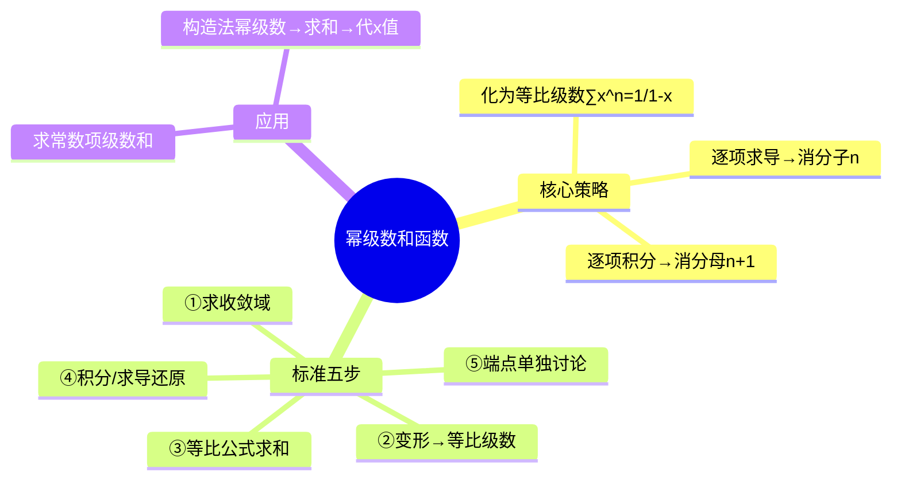

# 高数：幂级数的和函数

> 📌 重构说明：本笔记是幂级数求和函数的完整解题手册。已按「核心思路：化为等比级数（首项÷(1-公比)）→操作策略表（$\frac{1}{n+1}$→逐项积分消分母 / $n$→逐项求导消分子）→标准解题流程五步（求收敛域→变形化等比→等比公式求和→求导/积分还原→端点单独讨论）→完整例题（$\sum\frac{x^n}{n+1}$ 的和函数推导：设 $S(x)$→乘 $x$→求导→等比求和→积分→还原 / $\sum\frac{(-1)^n}{2n+1}=\pi/4$ 的构造法）」的逻辑链重排。完整保留了和函数的逐项操作与等比级数间的转化推导。

## 🧠 思维导图

---

## 一、核心策略

==目标==：把幂级数化简为等比级数 $\sum x^n = \frac{1}{1-x}$（$|x|<1$）。

### 操作选择表

| 级数中出现 | 操作 | 原因 |
|-----------|------|------|
| ==$\frac{1}{n+1}$ 因子== | 逐项积分 | $x^n$ 积分 → $\frac{x^{n+1}}{n+1}$，分母多一个因子 |
| ==$n$ 因子== | 逐项求导 | $x^n$ 求导 → $n x^{n-1}$，分子多一个因子 |

---

## 二、标准五步流程

**例题**：$\displaystyle\sum_{n=0}^{\infty}\frac{x^n}{n+1}$，求 $S(x)$。

| 步骤 | 操作 |
|------|------|
| ① 收敛域 | $R=1$，收敛域 $[-1,1)$（$x=-1$ 条件收敛） |
| ② 变形 | 设 $S(x)=\sum\frac{x^n}{n+1}$ → $xS(x)=\sum\frac{x^{n+1}}{n+1}$ → 求导：$(xS)' = \sum x^n = \frac{1}{1-x}$ |
| ③ 求和 | $\frac{1}{1-x}$ |
| ④ 还原 | $xS(x) = \int_0^x \frac{1}{1-t}dt = -\ln(1-x)$ → $S(x) = -\frac{\ln(1-x)}{x}$（$x\neq0$） |
| ⑤ 端点 | $x=0$ 时 $S(0)=1$；$x=-1$ 时等于交错调和级数 |

---

## 三、求常数项级数的和——构造法

**例题**：$\displaystyle\sum_{n=0}^{\infty}\frac{(-1)^n}{2n+1}$

| 步骤 | 操作 |
|------|------|
| 构造法幂级数 | $\sum\frac{(-1)^n x^{2n+1}}{2n+1}$ |
| 求导 | 得 $\sum(-1)^n x^{2n} = \frac{1}{1+x^2}$ |
| 积分还原 | $\sum\frac{(-1)^n x^{2n+1}}{2n+1} = \arctan x$ |
| 代入 | $x=1$ → $\sum\frac{(-1)^n}{2n+1} = \arctan 1 = \frac{\pi}{4}$ |

---

> 📂 所属分类：

## 📚 核心词条索引

| 知识点链接 | 类别 | 关键词 |
|------|------|--------|
| 等比级数 | 参照级数 | $\sum x^n=\frac{1}{1-x}$（$|x|<1$），幂级数求和的基础 |
| 构造法 | 解题方法 | 构造幂级数求常数项级数的和 |
| 和函数 | 核心概念 | 幂级数的和$S(x)=\sum a_n x^n$ |
| 幂级数 | 核心概念 | $\sum a_n x^n$形式的级数 |
| 收敛域 | 核心概念 | 幂级数收敛的$x$取值范围 |
| 逐项积分 | 操作方法 | $\int\sum a_n x^n dx=\sum\int a_n x^n dx$，消分母因子 |
| 逐项求导 | 操作方法 | $(\sum a_n x^n)'=\sum(a_n x^n)'$，消分子因子 |
