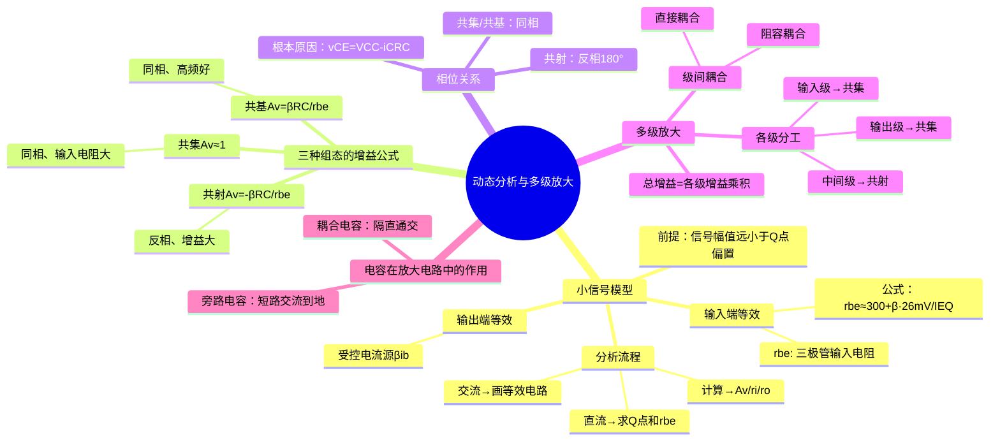

# 电子技术：三极管放大电路——动态分析与多级放大

> 📌 重构说明：本笔记将动态分析（小信号模型、增益计算、输入输出电阻）与三种组态的性能对比、多级放大和耦合/旁路电容的作用整合为放大电路分析的完整后半程。

## 🧠 思维导图

---

## 一、小信号模型——非线性到线性的转化

### 1.1 模型构建逻辑

晶体管是高度非线性的器件，但在==交流小信号条件==下（$V_{sm} \ll V_{BB}$），信号只在Q点附近微小摆动——此时可将三极管的非线性特性在Q点处用==切线==近似，转化为线性模型。

这与 二极管特性与等效模型（$r_d = 26\text{mV}/I_D$）的思路完全一致，只是三极管需要同时对输入端和输出端分别建模。

### 1.2 小信号模型的两个等效元件

**输入端等效——$r_{be}$**：

B-E之间的PN结（发射结）在正偏状态下，其交流等效电阻为：

$$\boxed{r_{be} = r_{bb'} + (1 + \beta) \cdot \frac{26\text{mV}}{I_{EQ}}}$$

展开理解：
- ==$r_{bb'}$==：基区体电阻（半导体材料本身的欧姆电阻），典型值约==$300\Omega$==
- ==$(1+\beta) \cdot 26\text{mV}/I_{EQ}$==：发射结的PN结交流电阻乘以$(1+\beta)$倍（因为在基极回路感受到的发射极交流电阻被放大了$(1+\beta)$倍）

简化公式（考试常用）：

$$r_{be} \approx 300 + (1 + \beta) \cdot \frac{26\text{mV}}{I_{EQ}(\text{mA})}(\Omega)$$

**输出端等效——受控电流源**：

在放大区，$i_C = \beta i_b$，三极管的输出端等效为一个==电流控制电流源（CCCS）==：控制量为基极交流电流 $i_b$，输出为集电极交流电流 $\beta i_b$。

### 1.3 完整分析流程

| 步骤 | 内容 | 方法 |
|:---:|------|------|
| ① | ==直流分析== | 交流源置零→求 $I_{CQ}$→代入求 $r_{be}$ |
| ② | ==交流通路== | 直流源置零（短路）、电容视为短路→画交流等效电路 |
| ③ | ==动态参数计算== | 用 $r_{be}$ + 受控源 + 线性电路分析法求 $A_v$、$r_i$、$r_o$ |

> [!warning] 考点
> ⚠️ $r_{be}$ 公式中用的是 $I_{EQ}$（静态发射极电流），不是 $I_{CQ}$。实际计算中 $I_{EQ} \approx I_{CQ}$（因为 $I_B$ 极小），但严格公式必须用 $I_{EQ}$。

---

## 二、三种组态的增益公式详解

### 2.1 共射极 (CE)

**电压放大倍数**：

$$\boxed{A_v = \frac{v_o}{v_i} = -\frac{\beta R_L'}{r_{be}}},\quad R_L' = R_C \parallel R_L$$

==负号表示输出与输入反相（180°相位差）==。

**反相的根本原因**：

$$v_{CE} = V_{CC} - i_C R_C$$

当 $i_C \uparrow$（输入信号增大引起）→ $i_C R_C \uparrow$ → $v_{CE} \downarrow$。即：输入增大 → 输出减小 = 反相。

**输入电阻**：$r_i = R_B \parallel r_{be}$（中等，典型值约几k$\Omega$）

**输出电阻**：$r_o \approx R_C$（中等，典型值约几k$\Omega$）

### 2.2 共集电极 (CC) / 射极跟随器

**电压放大倍数**：

$$\boxed{A_v = \frac{(1 + \beta) R_L'}{r_{be} + (1 + \beta) R_L'} \approx 1},\quad R_L' = R_E \parallel R_L$$

分子略小于分母 → $A_v$ 略小于 1，但非常接近 1。输出与输入==同相==。

**输入电阻**：$r_i = R_B \parallel [r_{be} + (1+\beta)R_L']$ —— ==非常大==（几十~几百k$\Omega$）

**输出电阻**：$r_o = R_E \parallel \frac{r_{be} + R_S'}{1+\beta}$ —— ==非常小==（几十$\Omega$）

**应用定位**：输入级（高输入电阻不消耗信号源）、输出级（低输出电阻驱动负载能力强）、缓冲级（隔离前后级）。

### 2.3 共基极 (CB)

**电压放大倍数**：

$$\boxed{A_v = \frac{\beta R_L'}{r_{be}}},\quad R_L' = R_C \parallel R_L$$

数值与共射相同，但==无负号——输出与输入同相==。

**输入电阻**：$r_i = R_E \parallel \frac{r_{be}}{1+\beta}$ —— ==非常小==（几十$\Omega$）

**输出电阻**：$r_o \approx R_C$ —— 较大

**应用定位**：高频/宽带放大（共基极的截止频率远高于共射极）。

> [!warning] 考点
> ⚠️ 三种组态增益公式的记忆技巧：共射 = $-\beta R_L'/r_{be}$（"反相放大"），共集 ≈ 1（"跟随"），共基 = $\beta R_L'/r_{be}$（"同相放大"）。共射和共基的增益公式差一个负号，含义完全不同。

---

## 三、多级放大电路

### 3.1 级联的必要性

单级共射极放大电路的增益通常在几十~几百倍。实际应用（如音频放大、仪表放大）往往需要几千~几万倍的增益——通过多级串联实现。

$$\boxed{A_{v,\text{总}} = A_{v1} \times A_{v2} \times \cdots \times A_{vn}}$$

### 3.2 级间耦合方式

| 耦合方式 | 连接形式 | 优点 | 缺点 | 应用 |
|------|------|------|------|------|
| ==阻容耦合== | 电容+电阻 | 各级Q点独立 | 不能放大直流 | 交流放大器主流 |
| ==直接耦合== | 直接相连 | 能放大直流/极低频 | Q点互相牵连 | 集成运放内部 |
| 变压器耦合 | 变压器 | 阻抗匹配好 | 体积大、频率受限 | 射频功放 |

### 3.3 各级的功能分工

| 位置 | 常用组态 | 原因 |
|------|:---:|------|
| ==输入级== | 共集(CC) | 输入电阻大 → 从前级（信号源）提取更多电压 |
| ==中间级== | 共射(CE) | 电压增益大 → 实现主要的信号放大 |
| ==输出级== | 共集(CC) | 输出电阻小 → 驱动后级负载能力强 |

> 📖 直观类比：多级放大的三级分工可以类比为一个乐队：输入级是"麦克风"（高阻抗匹配声源），中间级是"功放"（真正把信号放大），输出级是"音箱"（低阻抗驱动空气）。

---

## 四、电容在放大电路中的角色

### 4.1 耦合电容

串联在信号路径中的电容——功能：==隔直通交==。

- **对直流**：$X_C = 1/(\omega \cdot 0) = \infty$ → 开路，隔离前后级的直流工作点
- **对交流**：在工作频率下 $X_C$ 很小 → 近似短路（理想耦合电容在交流通路中视为短路）

### 4.2 旁路电容

并联在 $R_E$ 两端的电容——功能：为交流信号提供通向地的低阻抗通路。

- **对直流**：开路（$R_E$ 依然起稳定Q点的作用）
- **对交流**：短路（$R_E$ 被旁路掉，增益不被降低）

**关键效应**：有旁路电容时 $A_v = -\beta R_C / r_{be}$（增益高）；无旁路电容时 $A_v = -\beta R_C / (r_{be} + (1+\beta)R_E)$（增益大大降低但更稳定）。

---

## 🔗 知识网络

### 前置依赖
- 三极管放大电路——静态分析 — 静态工作点的计算（动态分析的前提）
- 半导体三极管原理 — 三极管的微变等效模型

### 后续应用
- [[功率放大电路]] — 放大电路的输出功率与效率
- [[反馈放大电路]] — 引入负反馈改善放大电路性能
- [[运算放大器]] — 多级放大电路的集成实现

### 对比辨析
- 共射 vs 共集 vs 共基：共射放大电路既有电压增益又有电流增益（最常用），共集（射极跟随器）电压增益约等于1但电流增益大（用作缓冲），共基高频特性好
- 阻容耦合 vs 直接耦合 vs 变压器耦合：阻容耦合只传交流不传直流（各级Q点独立），直接耦合可传直流（适合集成电路），变压器耦合可实现阻抗匹配

## 📚 核心词条索引

| 词条 | 类别 | 关键词 |
|------|:---:|------|
| [[小信号模型]] | 分析方法 | $r_{be}$、CCCS、线性化 |
| [[rbe公式]] | 核心公式 | $300+(1+\beta)\cdot26\text{mV}/I_{EQ}$ |
| [[电压放大倍数]] | 核心参数 | $A_v$、CE=$-\beta R_L'/r_{be}$ |
| [[输入电阻]] | 核心参数 | $r_i$、CC最大、CB最小 |
| [[输出电阻]] | 核心参数 | $r_o$、CC最小、CB最大 |
| [[相位关系]] | 核心特性 | CE反相180°、CC/CB同相 |
| [[多级放大]] | 电路架构 | $A_{总}=A_1\cdot A_2\cdots$ |
| [[耦合电容]] | 电路元件 | 隔直通交、Q点隔离 |
| [[旁路电容]] | 电路元件 | $R_E$旁路、增益提升 |
| [[射极跟随器]] | 电路组态 | CC、$A_v\approx1$ |
